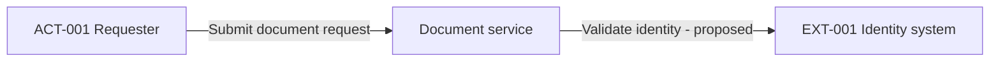

# Diagram Guidelines

Use stable Mermaid `flowchart` and `sequenceDiagram` syntax. Avoid experimental C4 directives, architecture-beta syntax, custom icons, embedded HTML, click actions, remote resources, and initialization directives. Diagrams are architecture proposals, not deployed inventory.

## Common rules

1. Derive nodes from the written entity/component register, not from a generic reference architecture. Every node must exist in the written design; every important written component must appear in the appropriate view or have an explicit omission reason.
2. Use stable readable aliases: CMP-001 becomes `CMP_001`, ACT-001 becomes `ACT_001`. Quote flowchart labels. Keep labels concise and free of personal data, secrets, sensitive endpoints, and confidential identifiers.
3. Label important interactions and show direction. State business meaning first; show protocols only when confirmed or explicitly labeled Proposed. A generic request arrow does not prove a protocol choice.
4. Make the system, deployment, and trust boundaries distinct. Only trust subgraphs represent changes in security assumptions. Explain a boundary even when logical ownership and network placement differ.
5. Prefer no colors. If colors or line styles encode meaning, include an explicit legend; never rely on color alone. In sequence diagrams, explain that solid arrows are requests/actions and dashed arrows are responses; these styles do not alone imply asynchronous delivery.
6. Follow every diagram immediately with a textual explanation, including scope, aliases, relevant trust crossings, omitted details, proposed/confirmed status, and style meanings where used.
7. Keep high-level views readable; split by scope when crowded and maintain the same identifiers. Do not add caches, queues, gateways, databases, or workers unless supported by the design.

## View-specific rules

| View | Include | Exclude |
| --- | --- | --- |
| Context | Subject as one box, human actors, external systems, labeled interactions | Internal stores, modules, replicas, detailed protocols |
| Container | Major applications, services, workers, gateways, databases, caches, queues, external dependencies that actually exist; relevant trust boundaries | Classes, tables, individual endpoints, invented deployment technology |
| Sequence | Critical scenario with named participants, validation, state transitions, sensitivity, retries/timeouts/errors as applicable | Unsupported success guarantees, invented numeric timeout values, secret-bearing payloads |

For a context-only request without a full design, first produce a minimal written actor/system/interaction register. This establishes the authoritative written view without making up internals.

## Syntax and validation procedure

1. Check identifiers, quoted labels, balanced brackets, subgraph/alt/loop endings, participants, and arrow direction against the written design.
2. Parse with the available local Mermaid version. The repository validator checks all fenced Mermaid blocks. Record the parser version and result when actually run.
3. Render and visually inspect when a renderer is available. Parsing alone does not verify layout, readability, semantics, or stakeholder agreement.
4. If parsing fails, simplify to basic nodes and arrows and retry. If valid representation remains unavailable, return a textual view and report the failure; do not present invalid syntax as a finished diagram.
5. If tools are unavailable, perform the syntax checklist and label the result Not parser-validated. Do not claim rendering occurred.

## Minimal context example

Written register: ACT-001 is an authorized requester; EXT-001 is a supplied identity system; the subject is a proposed document service. Identity interaction is conceptual, not a confirmed protocol. No internal components are specified.

The subject is one box. The actor and identity system remain outside it. Arrows show the initiating direction of a conceptual interaction, not a complete authentication sequence; no product or protocol is selected.

## Unsupported representation

Mermaid is not a formal threat model, executable deployment plan, or complete UML/C4 semantic validator. Explain limitations instead of drawing misleading trust guarantees or exact physical topology from missing information.