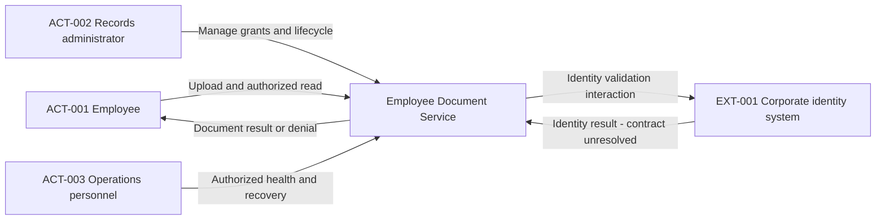
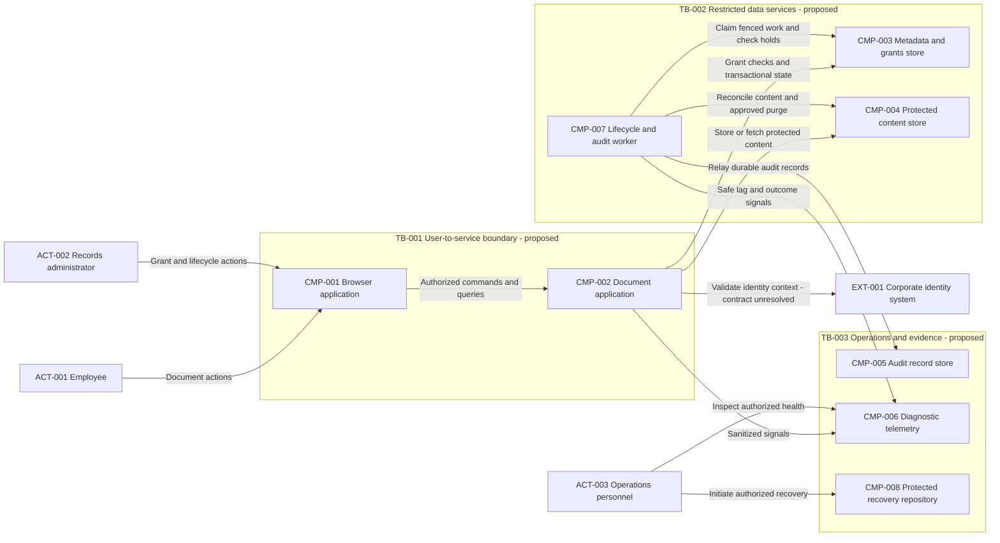
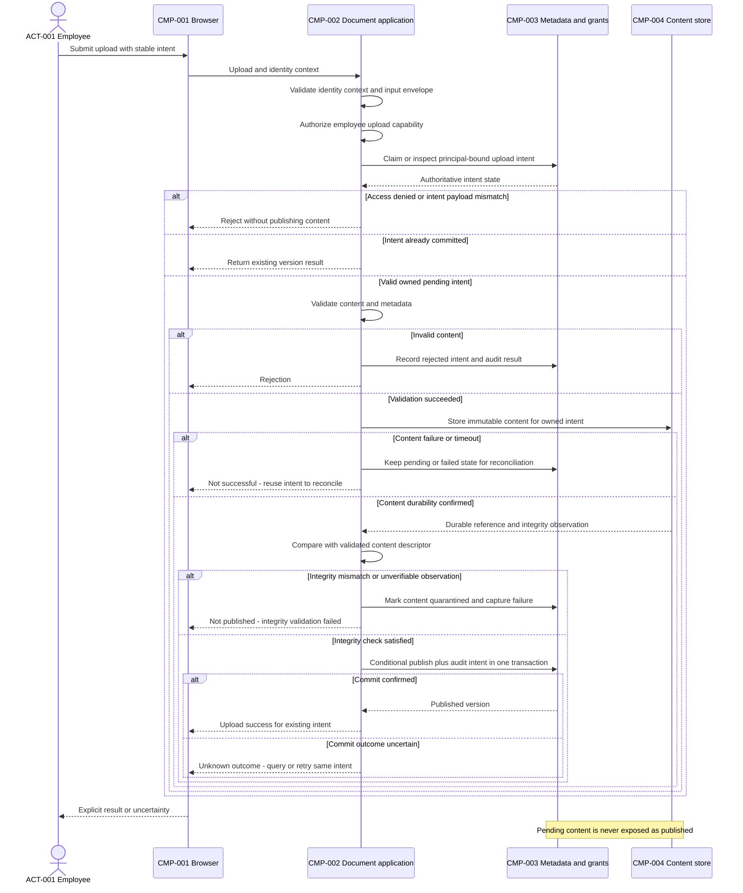
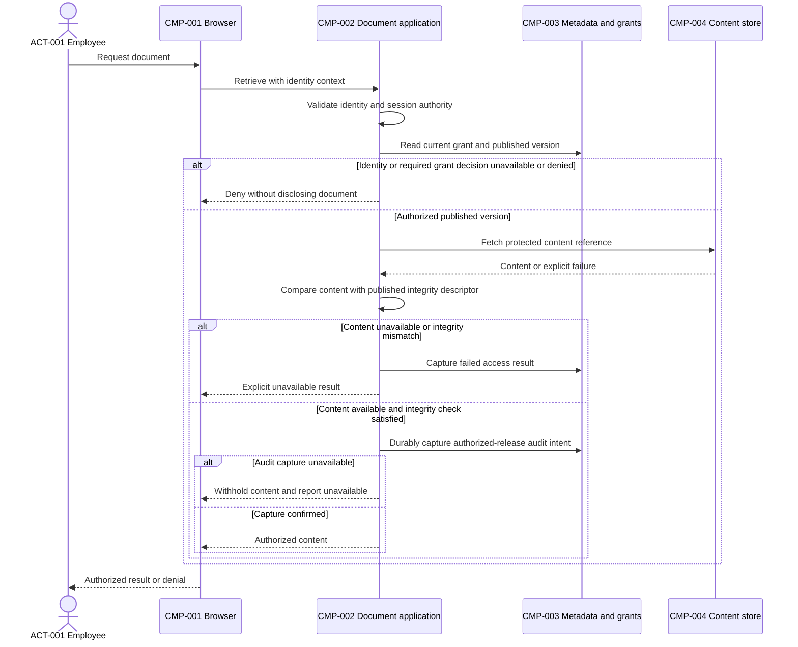
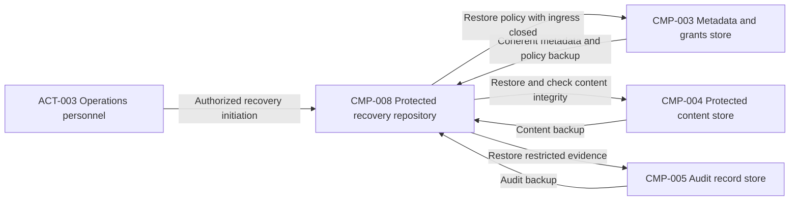

Design ID: EMPLOYEE-DOCS. Contract version: 1.0.0. Artifact: high-level-design-generator — assembled illustrative proposal. Artifact status: Provisional — policy, service objectives, identity contract and implementation evidence remain unresolved. Baseline: SRC-001 version 1.0, [brief](./sample-requirements.md) and [requirements baseline](./sample-structured-requirements.md).

Evidence summary: Confirmed requirements and actor/external-system existence; Inferred driver impact; Assumed ASM-001–ASM-003; Proposed components, mechanisms, controls and decisions; Unresolved Q-001–Q-012. Changed IDs: initial DRV/CMP/TB/DEP/FLW/INT/DEC/ADR/RISK/SEC/REL/OPS registers below. Open questions: inherited unchanged, active batch Q-001–Q-007. Validation: authored example and review synthesis, not a claimed Copilot pipeline execution or runtime test. Diagram validation is recorded by the repository validator when run; do not infer a parser/render pass from this file alone. Next handoff: stakeholder clarification and owner-specific rework under the orchestration runbook.

# High-Level System Design

## 1. Executive Summary

Propose a browser application and modular document application, with explicit authorization, metadata ownership, protected content, durable audit capture, and a background lifecycle/audit worker. The application and worker use coordinated releases under ASM-001; logical modules are not automatically independently owned microservices.

The design favors understandable responsibilities and testable publication semantics before optimizing for an unknown workload. Separating content from transactional metadata introduces a cross-store publication problem that DEC-002 addresses through pending state, immutable content, and a conditional metadata commit. It does not provide an untested distributed transaction guarantee.

The proposal is suitable for discussion, not production approval. Irreversible deletion is blocked by Q-001; identity freshness, numeric quality objectives, placement, audit policy and operating ownership require validation. No product mapping was requested or approved. No security, compliance, availability, performance, recovery, or cost guarantee is made.

## 2. Business Objective

Enable controlled, reliable storage and retrieval of employee work documents within one organization, with explicit grants, attributable actions, lifecycle controls and recoverability. Source: SRC-001 S01–S08. No numeric business success metric, budget, named owner or approval authority is supplied.

## 3. Scope

### In Scope

- Upload, authorized list/retrieval and upload-intent deduplication: FR-001, FR-002, BR-001–BR-003.
- Grant and lifecycle/hold administration without implicit content access: FR-003, FR-004, BR-004.
- Existing corporate identity integration: FR-005.
- Authorized health/recovery operation, protected audit and backups, accessible browser journeys, and compatible changes: FR-006, NFR-001–NFR-006.

### Out of Scope

Confirmed exclusions: public sharing/external tenants (CON-001); content editing, full-text search, OCR, automatic classification and AI extraction (CON-003). There is no source-backed external scanning, notification or analytics integration. Validation inside the document application is Proposed; an external provider cannot be silently added.

Product selection is excluded from this neutral artifact by CON-002. Automated irreversible deletion is not a removed requirement: its policy is Deferred in DEC-005 until Q-001 is resolved. Component design for recording and enforcing holds can continue independently.

## 4. Stakeholders and Actors

The following IDs are inherited from the structured baseline, not new personas or authority assignments.

| Entity ID | Kind | Name | Responsibility or meaning | Source or evidence class | Related requirement IDs |
| --- | --- | --- | --- | --- | --- |
| ACT-001 | Actor | Employee | Upload and read explicitly authorized documents | SRC-001 S01; Confirmed | FR-001, FR-002, BR-001 |
| ACT-002 | Actor | Records administrator | Manage document grants, dispositions and holds; no implicit content privilege | SRC-001 S02, S05; Confirmed | FR-003, FR-004, BR-004 |
| ACT-003 | Actor | Operations personnel | Health inspection and authorized recovery, not document browsing | SRC-001 S07; Confirmed | FR-006, NFR-004 |
| EXT-001 | External system | Corporate identity system | Authenticate supplied roles; document grants remain local | SRC-001 S03; Confirmed existence, integration details Unresolved | FR-005, BR-001, NFR-001 |

Formal stakeholder ownership, incident routing, legal authority, approvers and support hours remain Unassigned or Unresolved. The role names above do not imply permission to accept architectural risk or approve a deletion policy.

## 5. Requirements Summary

The [complete nine-field requirements register](./sample-structured-requirements.md) is the authoritative fixture baseline. This section summarizes every requirement without altering its source-backed meaning; section 27 supplies one traceability row per ID.

### Functional Requirements

| Requirement ID | Summary |
| --- | --- |
| FR-001 | Upload documents and obtain a result. |
| FR-002 | List and retrieve authorized documents. |
| FR-003 | Create/revoke explicit grants without automatic administrative content access. |
| FR-004 | Record retention dispositions and legal-hold state. |
| FR-005 | Use the existing corporate identity system for sign-in. |
| FR-006 | Inspect health and initiate authorized recovery without implicit content browsing. |

### Non-Functional Requirements

| Requirement ID | Summary |
| --- | --- |
| NFR-001 | Protect sensitive content, titles, entitlement links and identity information. |
| NFR-002 | Keep sensitive/personal content and credentials out of diagnostic telemetry. |
| NFR-003 | Maintain attributable, restricted audit evidence for required actions. |
| NFR-004 | Consider protected backups and validate coherent restoration. |
| NFR-005 | Provide accessible employee/administrator browser journeys. |
| NFR-006 | Clear responsibilities and tested compatible changes must preserve access rules. |

Availability, throughput, latency, capacity, RTO and RPO have no supplied numerical values. They remain questions rather than fabricated NFRs or assumed objectives.

### Constraints

| Requirement ID | Summary |
| --- | --- |
| BR-001 | Current document-grant evaluation; deny if the required decision is unavailable. |
| BR-002 | Durable content and metadata publication before success; invalid/incomplete content is unavailable. |
| BR-003 | Repeated upload intent does not publish another version. |
| BR-004 | Legal hold prevents deletion. |
| CON-001 | Single-organization scope; no public sharing or external tenants. |
| CON-002 | Neutral design first; mapping needs a later request and baseline approval. |
| CON-003 | No editing, full-text search, OCR, automatic classification or AI extraction. |

## 6. Assumptions

These inherited premises are not confirmed requirements, policies, approvals or numeric targets.

| Assumption ID | Assumption | Reason | Consequence if false | Validation required | Status | Related IDs |
| --- | --- | --- | --- | --- | --- | --- |
| ASM-001 | Coordinated application releases are acceptable provisionally | No independent-team/release requirement is supplied | Replace the deployment composition if independent ownership or releases are required | Stakeholder confirmation; reconsider DEC-001 alternatives | Proposed | NFR-006, CON-002, DEC-001 |
| ASM-002 | Prototype discussion continues while irreversible deletion is disabled pending authorized rules | Q-001 cannot be answered by design inference | Production may need different lifecycle behavior; this cannot override law or policy | Resolve Q-001 before irreversible deletion or production lifecycle acceptance | Proposed | FR-004, BR-004, NFR-004, DEC-005 |
| ASM-003 | Diagnostic telemetry can fail independently while required audit capture uses a separate durable path | Diagnose without making optional telemetry the evidence authority | Revise audit/access failure behavior if supplied policy requires it | Q-009 and bounded backlog/failure validation | Proposed | NFR-002, NFR-003, FR-006, DEC-004 |

## 7. Open Questions

The [full question ledger](./sample-structured-requirements.md) is inherited without changes. It includes priority, why, answer options, default assumption, affected decisions, status and related requirements. This is the active batch, not a request to answer every queued question at once:

| Question ID | Priority | Decision consequence | Default assumption |
| --- | --- | --- | --- |
| Q-001 | Critical | Approved irreversible-deletion rule and hold-release authority | None — blocked; prototype discussion only under ASM-002 |
| Q-002 | Important | Upload/retrieval workload profile for capacity | Unresolved — no sizing values |
| Q-003 | Important | User-visible latency objective and measurement definition | Unresolved — no latency target |
| Q-004 | Important | Availability objective and measurement scope | Unresolved — no availability percentage |
| Q-005 | Important | Recovery-time objective | Unresolved — no RTO |
| Q-006 | Important | Recoverable-data-loss objective | Unresolved — no RPO |
| Q-007 | Important | Permitted data-placement jurisdictions | Unresolved — no region selected |

Queued, not added to the active batch: Q-008 identity/disable freshness; Q-009 audit policy; Q-010 accessibility acceptance; Q-011 incident/recovery ownership; Q-012 initial document grants. Do not fabricate an answer to a queued question. Critical Q-001 blocks the affected lifecycle decision, not safe independent diagrams or requirement analysis.

## 8. Architecture Drivers

| Driver ID | Driver | Related requirement IDs | Evidence status | Impact rank | Architectural effect | Missing evidence | Validation required |
| --- | --- | --- | --- | --- | --- | --- | --- |
| DRV-001 | Current authorized access distinct from identity and administration | FR-002, FR-003, FR-005, BR-001, NFR-001, CON-001 | Confirmed requirements; impact Inferred | High — confidentiality and boundary correctness | Central application enforcement, authoritative grants, no direct unmediated content access | Q-008 | Negative-access, revocation, identity outage and privilege-separation tests |
| DRV-002 | Truthful, retry-safe durable publication | FR-001, BR-002, BR-003 | Confirmed invariants; mechanism Proposed | High — false success or duplicate content violates core behavior | Durable intent, immutable content, conditional metadata commit, explicit uncertainty | Q-002, Q-003; storage capabilities unselected | Crash/timeout/duplicate/concurrent-intent fault tests |
| DRV-003 | Controlled lifecycle and coherent recovery | FR-004, FR-006, BR-004, NFR-004 | Confirmed requirements; policy Unresolved | High — irreversible loss or resurrection risk | Hold/disposition ledger, guarded lifecycle work, independent protected backups and restore reconciliation | Q-001, Q-005, Q-006, Q-007 | Authoritative policy, restore and deletion/hold race tests |
| DRV-004 | Audit evidence separated from safe diagnosis | NFR-002, NFR-003, FR-006 | Confirmed needs; capture/relay approach Proposed | High — evidence loss or telemetry disclosure | Durable audit intent plus restricted audit store, minimal diagnostic signals | Q-009, Q-011 | Audit backlog/exhaustion, redaction and privileged-query tests |
| DRV-005 | Understandable change and accessible interaction | NFR-005, NFR-006, CON-003 | Confirmed needs; release premise Assumed | Medium — change safety without speculative features | Modular responsibilities, compatible schema changes, accessible browser flows | ASM-001, Q-010 | Contract/migration, keyboard and assistive-technology tests |
| DRV-006 | Unknown workload, objectives and placement | FR-001, FR-002, FR-006, CON-002 | Unresolved targets, not new requirements | Unknown — topology qualification deferred | Keep logical design portable; compare scale/redundancy alternatives before commitment | Q-002–Q-007 | Measured workload, agreed targets and legal/placement constraints |

No driver has an invented weighted score or numeric objective. Cost remains an analysis of resource/operational drivers until evidence permits an estimate.

## 9. Recommended Architecture Style

Proposed baseline: modular document application with layered/hexagonal internal boundaries, a browser application, and a coordinated-release worker. This composition is DEC-001, conditional on ASM-001. It is not an assertion that independently deployable microservices are needed or that every logical component has a separate team.

| Style | Dimension | Applicability | Driver and requirement IDs | Evidence and assumptions | Advantages | Limitations | Operational complexity | Major risks | Select conditions | Avoid conditions | Validation gates |
| --- | --- | --- | --- | --- | --- | --- | --- | --- | --- | --- | --- |
| Modular monolith | Application deployment | Applicable | DRV-001, DRV-002, DRV-005; NFR-006 | ASM-001; cohesive document domain | Local policy/metadata transaction boundaries and coordinated change | Shared release and failure scope | Fewer independent contracts; still needs robust operations | Module coupling and common bottleneck | Coordinated releases acceptable | Essential independent release/isolation unmet | Confirm ASM-001 and workload |
| Layered | Internal organization | Applicable as composition | DRV-005; NFR-006 | Clear request/domain/persistence roles | Understandable responsibility flow | Cross-layer changes may couple releases | Boundary tests, not extra processes | Authorization bypass through careless layering | Policy enforcement cannot be bypassed | Pass-through layers add no value | Negative-path and dependency tests |
| Microservices | Independent deployment | Conditional alternative | DRV-002, DRV-005; NFR-006 | Independent ownership/scale evidence absent | Potential independent evolution and scale | Distributed correctness and contracts | More deployment, telemetry and recovery paths | Duplicated authorization and partial commits | Confirmed independence outweighs coordination cost | Boundaries/operating capacity uncertain | Q-002, ASM-001 and operational evidence |
| Event-driven | Interaction | Applicable to audit/lifecycle work only | DRV-003, DRV-004; NFR-003 | Durable work represented in metadata; no broker selected | Decouples audit delivery from user response after durable capture | Backlog, duplicates, replay | Bounded relay and reconciliation | Lost or duplicated audit effects | Durable capture and idempotent relay validated | Immediate result cannot tolerate deferred completion | DEC-004 fault tests |
| SOA | External business capabilities | Not primary; identity adapter relevant | DRV-001; FR-005 | One supplied external identity system | Explicit interoperability boundary | Broad service layer unnecessary here | Contract/identity ownership needed | Invented shared capabilities | More authorized enterprise integrations emerge | No requirement for extra integration layers | Q-008 and future scope evidence |
| Serverless | Runtime | Deferred, not selected | DRV-006; CON-002 | No runtime platform or payload constraints supplied | Potential reduced host operation | Execution/state/latency limits unverified | Runtime quotas, telemetry and recovery still required | Unsuitable upload duration or coupling | Explicit runtime mapping plus verified fit | Assumed runtime limits conflict with work | Mapping gate; Q-002/Q-003 |
| Hexagonal/clean | Internal dependency direction | Applicable in moderation | DRV-001, DRV-005; NFR-006 | Policy and storage/identity seams | Test policy independently of adapters | Extra indirection | Adapter contracts and tests | Abstractions without benefit | Clear domain seams exist | Simple logic gains no boundary value | Boundary and integration tests |
| Data-centric | Data ownership emphasis | Applicable | DRV-002, DRV-003; BR-002, BR-004 | Durable state and lifecycle dominate | Explicit authoritative ownership | Can create central contention | Data evolution/restore central | Shared-store access bypasses ownership | Access through owned contracts | Uncontrolled direct store consumers | Authorization and migration tests |
| Batch | Processing | Applicable to bounded maintenance only | DRV-003; FR-004, NFR-004 | Maintenance can be separate; schedules unspecified | Explicit reconciliation/restore checkpoints | Delayed work and partial jobs | Checkpoint/restart operation | Deleting held/referenced content | Approved lifecycle rules and fencing | Used to imply delayed interactive upload success | Q-001; hold/race tests |
| Streaming | Processing | Not justified for baseline | DRV-006; CON-003 | No continuous analytics/freshness need | Could support future continuous consumers | Stateful replay/window complexity | Sustained lag and state operation | Speculative infrastructure | Future requirements justify it | Current explicit scope lacks need | New source requirements, not assumption |
| Hybrid | Named composition | Applicable, narrowly defined | DRV-001–DRV-005 | Interactive application plus coordinated worker | Different execution paths for distinct duties | More than one process role | Common release/state compatibility | Ambiguous failure ownership | Boundaries and contracts are explicit | A catch-all hides unsupported choices | DEC-001/DEC-004 validation |

The proposed composition is a reversible discussion baseline. Deferred runtime and redundancy choices have no product or provider winner.

## 10. System Context

The Employee Document Service is one subject system. ACT-001 uses document operations, ACT-002 administers grants and lifecycle state, ACT-003 performs authorized health/recovery operations. EXT-001 is the only supplied external system. Existing identity integration does not imply an identity protocol or document authorization mechanism.

| Entity ID | Kind | Name | Responsibility or meaning | Source or evidence class | Related requirement IDs |
| --- | --- | --- | --- | --- | --- |
| TB-001 | Trust boundary | User-to-service | User input and identity context become application decisions; claims are untrusted until validated | Proposed from DRV-001 | FR-005, BR-001, NFR-001 |
| TB-002 | Trust boundary | Restricted data services | Service-only access to content, metadata, grants and lifecycle data | Proposed from DRV-001/DRV-002 | BR-001, BR-002, NFR-001 |
| TB-003 | Trust boundary | Operations and evidence | Separate permissions for telemetry, audit access and privileged recovery | Proposed from DRV-003/DRV-004 | FR-006, NFR-002, NFR-003, NFR-004 |

These are authorization/ownership boundaries, not invented subnet, region or physical isolation guarantees. Roles share an identity authority but do not share all privileges.

## 11. System Context Diagram

The subject is a single opaque box; no internal stores or modules appear. ACT and EXT underscore aliases map to the written registry. Arrows indicate conceptual business direction, not an OAuth, SAML, or other protocol selection. Identity-result freshness remains Q-008. User/service and operations authorization differ even though this view hides internals.

## 12. Logical Component Architecture

CMP-002 contains document commands/queries, grant checks, publication state and identity/content/metadata adapters. Module boundaries follow domain responsibilities; they are not separately deployed services. CMP-007 runs background reconciliation, policy-approved lifecycle actions and audit relay from the same coordinated application release under ASM-001. Its privileges differ from interactive access.

CMP-003 is authoritative for metadata, grants, intent/state transitions and lifecycle state. CMP-004 owns immutable published/staged content. CMP-005 retains delivered audit evidence. Audit intentions in CMP-003 are durable pending evidence, not diagnostic logs or an independent broker. CMP-006 provides safe logs/metrics/traces as a logical capability; product count is unspecified. CMP-008 holds protected recovery copies, not a live source of business authorization.

Interactive requests are synchronous in the baseline; audit delivery and lifecycle work are asynchronous durable-state processing. If measured upload validation cannot fit the agreed interaction objective, return to BR-002/Q-003 and explicitly distinguish receipt from publication completion before changing the API behavior.

## 13. Container Diagram

All eight CMP nodes, three actors and EXT-001 are registered. Subgraphs indicate proposed permission boundaries, not proven network isolation. CMP-007 is a worker, not a selected broker; no cache or queue product is implied. Initiating directions are shown; ordinary responses are omitted for readability and described in flows. ACT-003 permissions require authentication via the same EXT-001 contract before telemetry/recovery access; the authorization prerequisite is not an unmediated administrative bypass. To avoid overlapping runtime and recovery edges, the backup/restore data movement is shown in the focused recovery view in section 23, using the same CMP IDs.

## 14. Component Responsibilities

All components are Proposed. A store name describes a capability, not a selected datastore product. No replica counts, protocols, regions, capacities or organizational owners are inferred.

| Component ID | Component name | Responsibility | Inputs | Outputs | Dependencies | Data owned | Scaling considerations | Security considerations | Failure considerations | Related requirement IDs |
| --- | --- | --- | --- | --- | --- | --- | --- | --- | --- | --- |
| CMP-001 | Browser application | Present accessible document/admin journeys and explicit result states | ACT-001/ACT-002 actions; CMP-002 responses | Commands/queries; accessible results and denials | CMP-002 | None authoritative; no durable sensitive browser cache proposed | Static delivery and request concurrency to qualify via Q-002 | Browser checks are not authorization; avoid sensitive local persistence | Show failure/uncertainty; reuse upload intent on retries | FR-001, FR-002, FR-003, FR-004, NFR-005, NFR-006, CON-001, CON-002, CON-003 |
| CMP-002 | Document application | Validate identity, enforce grants, manage document state and audit capture | CMP-001 requests and validated identity context | Authorized content/results, durable state/audit intentions, safe signals | EXT-001, CMP-003, CMP-004, CMP-006 | Domain ownership of DATA-002/DATA-003 decisions; authoritative persistence in CMP-003 | Stateless request execution where feasible; bound concurrency and downstream pressure; sizing Unresolved | Recheck authoritative grants; service identities; no public store credentials or content URLs | Fail closed on required auth/state/audit capture errors; ambiguous commit remains uncertain | FR-001, FR-002, FR-003, FR-004, FR-005, BR-001, BR-002, BR-003, NFR-001, NFR-002, NFR-003, NFR-006, CON-001, CON-002, CON-003 |
| CMP-003 | Metadata and grants store | Serialize intent/publication/grant/hold state; persist required audit intentions | Validated state changes and queries from CMP-002/CMP-007 | Authoritative state, conditional commit results and durable work | CMP-008 for independent recovery copies, not live operation | DATA-002, DATA-003, DATA-006; pending DATA-004 audit intentions | Hot intents/grants and transaction contention need measurement; no premature sharding | Service-only writes, least privilege, protected keys; policies cannot be edited via browser store access | Required operation unavailable if authoritative decision/commit cannot be obtained | FR-001, FR-002, FR-003, FR-004, BR-001, BR-002, BR-003, BR-004, NFR-001, NFR-003, NFR-004, CON-001, CON-002 |
| CMP-004 | Protected content store | Persist immutable content and serve it only through authorized application control | Validated content writes/reads; fenced policy-approved purge | Durable content results; content or explicit failures | CMP-008 for recovery copies | DATA-001; staged and published object states linked from DATA-002 | Payload volume and throughput Unresolved; content/metadata capacity can differ | No direct actor access; restricted service identities and protected encryption keys | No publication success on uncertain content durability; orphan cleanup must not delete referenced content | FR-001, FR-002, BR-001, BR-002, BR-003, BR-004, NFR-001, NFR-004, CON-002 |
| CMP-005 | Audit record store | Retain attributable delivered audit evidence and restricted investigation capability | Idempotently relayed DATA-004 from CMP-007 | Restricted evidence and delivery receipts | CMP-008 for recovery copies | Delivered DATA-004; dedupe by audit-record identity | Backlog drain and retention depend on Q-002/Q-009 | Audit purpose/access separated from diagnostic access; protect identity links and integrity | Relay failure leaves durable pending work; no silent loss or unbounded retry | NFR-003, NFR-004, FR-006, CON-002 |
| CMP-006 | Diagnostic telemetry | Collect approved safe logs, metrics and traces; expose authorized health views | Sanitized CMP-002/CMP-007 signals | Health, outcome, lag, capacity and deployment views | Identity/access control using EXT-001 contract; deployment mechanism unselected | DATA-005 only; not a business or audit source of truth | Bounded dimensions and retention/cost questions; no document-ID metric labels | Never ingest document content/titles, personal data, tokens or grant payloads | Telemetry outage affects diagnosis under ASM-003; must not erase audit evidence | FR-006, NFR-002, CON-002 |
| CMP-007 | Lifecycle and audit worker | Reconcile stale intents, relay audit, and execute only approved fenced lifecycle actions | Durable pending work and policy/hold state from CMP-003 | Reconciled states, audit delivery, approved content deletion and safe signals | CMP-003, CMP-004, CMP-005, CMP-006 | No separate authoritative business data; progress/fencing state in CMP-003 | Claim partitioning and bounded work concurrency need evidence; shared release with CMP-002 | Distinct worker privilege; recheck current holds and reference state before destructive actions | Stale leases cannot authorize deletion; terminal work remains inspectable/reconcilable | FR-004, BR-002, BR-003, BR-004, NFR-002, NFR-003, NFR-004, NFR-006, CON-002 |
| CMP-008 | Protected recovery repository | Hold protected coherent recovery copies and support authorized restoration | Backups of CMP-003/CMP-004/CMP-005; ACT-003 authorized recovery request | Recoverable content, policy state, metadata and audit evidence | Source-store backup/restore interfaces; EXT-001-based privileged access contract | Recovery copies of DATA-001–DATA-004/DATA-006, not live authority | Frequency, volume, placement and restore capacity Unresolved | Separate backup/restore permissions and protected keys; no broad content browsing | Restore with ingress closed; reconcile holds/deletions and reference consistency before re-enabling service | FR-006, BR-004, NFR-001, NFR-004, CON-002 |

## 15. Critical Data Flows

| Flow ID | Trigger | Producer | Consumers | Data and classification | Stores | Interaction mode | Validation and transformation | Success and failure paths | Retention and deletion | Related requirement IDs |
| --- | --- | --- | --- | --- | --- | --- | --- | --- | --- | --- |
| FLW-001 | Upload intent | ACT-001 through CMP-001 | CMP-002, CMP-003, CMP-004; actor receives result | DATA-001/content-title sensitivity Confirmed — SRC-001 S06; intent and DATA-004 restricted handling Proposed | CMP-003, CMP-004 | Synchronous publication Proposed; later reconciliation asynchronous | Validate employee upload capability independently of document-read grants; validate payload/integrity; bind intent to principal and request digest | Durable content and matching integrity observation precede conditional publication/audit commit; duplicate returns same outcome; mismatch quarantined; uncertain commit never fabricated success | Unpublished content cannot be served; fenced reconciliation protects references; initial read grants Q-012 | FR-001, BR-001, BR-002, BR-003, NFR-001, NFR-003 |
| FLW-002 | List or retrieve | ACT-001 through CMP-001 | CMP-002, CMP-003, CMP-004 | DATA-001/002/003 sensitive fields Confirmed — SRC-001 S06; DATA-004 restricted handling Proposed | CMP-003, CMP-004 | Synchronous Proposed | Validate identity; query current document grants; compare content integrity; audit authorized release | Deny on identity/grant uncertainty; quarantine mismatches; withhold on mandatory audit failure; never use stale allow state | No sensitive diagnostic/browser cache; initial grant policy Q-012 | FR-002, FR-005, BR-001, NFR-001, NFR-002, NFR-003 |
| FLW-003 | Grant/disposition change | ACT-002 through CMP-001 | CMP-002, CMP-003 | DATA-003 sensitivity Confirmed — SRC-001 S06; DATA-006 and DATA-004 restricted handling Proposed | CMP-003 | Synchronous Proposed | Authorize administration separately from reading; conditional versioned update and audit intent | Commit authoritative policy state or explicit rejection/conflict; no implied content grant | Retain policy history as permitted; duration Unresolved | FR-003, FR-004, BR-001, BR-004, NFR-003 |
| FLW-004 | Pending lifecycle or upload reconciliation work | CMP-003 state | CMP-007, CMP-004 | DATA-001/content-title sensitivity Confirmed — SRC-001 S06; lifecycle/intent metadata handling Proposed sensitive | CMP-003, CMP-004 | Asynchronous/batch maintenance Proposed | Claim with fencing; check state/version/holds; transition to deletion-in-progress before delete; reject stale ownership | Q-001 blocks policy deletion; failures retain inspectable progress and no false completion | Do not purge referenced/published/held objects as orphans; reconcile authoritative tombstones after restore | FR-004, BR-002, BR-003, BR-004, NFR-004 |
| FLW-005 | Pending audit intent | CMP-003 durable audit intentions | CMP-007, CMP-005 | DATA-004 restriction Confirmed need — NFR-003; sensitive-link classification/handling Proposed | CMP-003, CMP-005 | Asynchronous Proposed | Relay by stable audit ID; retain attribution in restricted form; dedupe receipt | Durable capture precedes required success; relay retries bounded, receipt recorded; poison work isolated without losing evidence | Retention/access/outage policy Q-009; no arbitrary expiration | NFR-002, NFR-003, NFR-004 |
| FLW-006 | Approved backup or recovery operation | ACT-003 and source-store backup mechanisms | CMP-008, CMP-003, CMP-004, CMP-005; CMP-007 reconciles | Content/title/identity/grant-copy sensitivity Confirmed — SRC-001 S06; audit/lifecycle-copy handling Proposed restricted | CMP-008 and restored stores | Batch/procedure Proposed | Validate authority, content/manifest integrity, coherent references and authoritative current holds/deletions/grants before reopening | Fail safe with ingress closed on integrity/authority uncertainty; restore success needs observed checks | Recovery copies follow approved policy; no invented region/retention duration; old snapshots cannot override current approved tombstones/holds | FR-006, BR-004, NFR-001, NFR-004 |

### Upload publication sequence

Participants are the registered ACT-001, CMP-001–CMP-004. Identity validation uses FR-005's approved contract when available; no concrete identity exchange is invented. FR-001 supplies employee upload capability: a new upload does not require a pre-existing document-read grant. Authorize that capability using validated employee context; initial document visibility and any automatic uploader grant remain Q-012. Audit intentions are stored transactionally in CMP-003 and delivered by FLW-005 outside this foreground view.

Solid arrows represent requests/actions; dashed arrows represent responses, not asynchronous delivery guarantees. Success follows confirmed durable content and the authoritative publication/audit transaction. A timeout after commit may have succeeded: the same intent must be looked up, not recreated. Concurrent intents need a unique principal/intent binding, payload comparison, conditional state transitions and fencing. Immutable content is not itself a grant. CMP-007 cleanup cannot delete an object that a current publication references; storage and metadata primitives must be validated before claiming this invariant holds.

### Authorized retrieval sequence

This selected view shows ACT-001 and CMP-001–CMP-004. CMP-003 evaluates current grant state at the authorization decision point. The exact identity-disable and in-flight revocation semantics remain Q-008; no stale permission cache or unmediated store download link is assumed.

Solid arrows are requests/actions; dashed arrows are responses. Content reaches the application privately before required audit capture, but is not released to the browser if capture fails. The audit record describes authorization/release intent, not proof that a person viewed every byte. List queries similarly filter by authoritative grants and capture the required access event without emitting titles or principals into diagnostic telemetry. Auth/revocation semantics, streaming/backpressure and failure audit coverage require explicit contract testing; no numeric timeout is invented.

## 16. Integration Design

Conceptual contracts only; detailed endpoint schemas, protocol bindings and infrastructure configuration are not requested. All mechanisms in this table are Proposed unless a source requirement is cited. Internal stores are implementation boundaries, not invented external systems.

| Integration ID | Participants | Purpose | Style | Contract and schema evolution | Authentication and authorization | Timeout and retry ownership | Idempotency and ordering | Rate limits and backpressure | Failure, dead-letter, and reconciliation | Related requirement IDs |
| --- | --- | --- | --- | --- | --- | --- | --- | --- | --- | --- |
| INT-001 | ACT-001/ACT-002, CMP-001, CMP-002 | Document and administrative commands/queries | Request-response; protocol Unresolved | Versioned intent, command, result and uncertainty semantics; compatible evolution | Validate identity context and per-operation grants; admin does not bypass content checks | Browser retries only safe/query operations or same upload intent; service owns downstream retry scope; deadlines Unresolved | Unique principal/intent and payload binding; same intent returns same version; grant version checks | Bound active work and reject/admit explicitly; settings need Q-002/Q-003 | No silent automatic retry of destructive commands; durable state resolves uncertain publication | FR-001, FR-002, FR-003, FR-004, BR-001, BR-002, BR-003, NFR-005, NFR-006 |
| INT-002 | CMP-002 and protected operations access, EXT-001 | Existing identity integration | Conceptual sign-in/validation; protocol Unresolved | Issuer/audience/subject/claim validation and compatible identity contract to establish via Q-008 | Authentication is separate from grants and privileged recovery rights; do not trust caller-supplied roles | Identity adapter owns bounded validation retry only when safe; no guessed token lifetime or grace period | No duplicate user operation caused by authentication retry; replay defenses require verified protocol | Protect dependency and callers; limits unspecified | Fail closed for required identity validation; no invented offline authorization bypass | FR-005, FR-006, BR-001, NFR-001 |
| INT-003 | CMP-002/CMP-007, CMP-003/CMP-004 | State, content and lifecycle boundary | Synchronous state/content operations; background work driven by durable state | Separate immutable content references, intent/hold versions, conditional commits and fenced lifecycle state | Distinct least-privileged app/worker identities; no actor store access | Application or worker owns its bounded attempt budget; never nested unbounded retries | Unique intent, content reference and conditional version/fencing checks; preserve hold ordering | Bound database connections, content streams and maintenance concurrency | Pending/uncertain state is inspectable; stale work cannot publish/purge; reconcile orphan vs referenced objects | FR-001, FR-002, FR-003, FR-004, BR-001, BR-002, BR-003, BR-004, NFR-001, NFR-006 |
| INT-004 | CMP-003, CMP-007, CMP-005 | Durable audit relay | Asynchronous durable work; no broker chosen | Stable audit identity and event type/version; compatible consumers; no raw document payload | Capture attributable evidence in restricted store; diagnostic access does not grant audit access | Worker owns bounded relay retries with delay/jitter; values Unresolved; terminal work retained for review | Idempotent audit append/dedupe and receipt state; ordered evidence where policy requires | Lag/backlog admission and exhaustion policy need Q-009; no unbounded growth claim | Failed/poison records remain restricted inspectable pending state; this is the logical dead-letter function without invented queue infrastructure | NFR-002, NFR-003, NFR-004 |
| INT-005 | CMP-002/CMP-007, CMP-006, ACT-003 | Safe diagnostic signals and health views | Asynchronous signals plus authorized queries | Allowlisted event/metric/trace fields; compatible telemetry evolution | Remove personal/sensitive payloads and credentials before emission; authorize health views | Noncritical diagnostics do not create retry storms or block reads under ASM-003 | Duplicates acceptable for diagnosis if labeled; audit does not depend on this path | Bounded buffering/dimensions; shedding visible through safe health signals | Telemetry loss disclosed, not counted as successful collection; no dead-letter of sensitive payloads | FR-006, NFR-002 |
| INT-006 | ACT-003, CMP-003/CMP-004/CMP-005, CMP-008 | Protected backup and coherent restore | Batch/file or storage-native transfer; mechanism Unresolved | Versioned manifests, compatible restore formats, reference/policy reconciliation before ingress | Separate backup, restore and key privileges; supplied operating role is not blanket data access | Recovery procedure owns attempts; stop on integrity/policy uncertainty | Checkpoint/manifest identity and resumable validation; no mixed-time policy reopening | Transfer/storage/restore capacity requires Q-002/Q-005/Q-006 | Incomplete restore remains isolated; retry from verified checkpoints, reconcile holds/tombstones, preserve evidence | FR-006, BR-004, NFR-001, NFR-004 |

No external API specification, batch partner feed or file-transfer vendor is invented. The applicable batch/file consideration is protected backup transfer, with its mechanism unresolved. Proposed rate limiting, timeout, retry, circuit and retention policies require values and owner validation; "bounded" is a design obligation to implement and test, not evidence of configured bounds.

## 17. Data Architecture

| Entity ID | Authoritative ownership | Classification and purpose | Consistency and lifecycle | Open validation |
| --- | --- | --- | --- | --- |
| DATA-001 | CMP-004 content, referenced by CMP-003 | Sensitive work-document payload; upload/read purpose | Immutable version content; only published authorized references served; protected recovery copies | Q-001/Q-002/Q-007; deletion/hold/reference race tests |
| DATA-002 | CMP-003 | Sensitive title/version metadata; upload-intent/publication bookkeeping Proposed | Unique principal/intent plus payload binding; conditional publication state, no stale read used to authorize success | Storage transaction/durability and uncertain-commit tests |
| DATA-003 | CMP-003; identity authentication remains EXT-001 authority | Sensitive explicit grants and opaque principal links; no directory replacement or stored credentials | Current grant evaluation at each decision; separate admin and content rights | Q-008 identity-disable/in-flight revocation contract |
| DATA-004 | CMP-003 durable pending intentions, then CMP-005 delivered evidence | Restricted attributable audit; no document body copied | Atomic business-change/audit capture; idempotent relay and retained receipt; not diagnostic telemetry | Q-009 purpose, retention, integrity and exhaustion policy |
| DATA-005 | CMP-006, not business/audit truth | Proposed minimal technical outcomes and health; source forbids personal/content data | Best-effort bounded diagnosis under ASM-003; metrics use bounded dimensions | Redaction, access, sampling and cost tests; no invented retention |
| DATA-006 | CMP-003 | Sensitive-by-proposal holds/dispositions/tombstones; lifecycle enforcement | Versioned policy transitions; no hold override from stale worker lease; reconcile after restore | Q-001 authority and deletion policy |

Organizational data owners remain Unassigned. Formal classification taxonomy, permitted geographic placement, retention durations and legal applicability remain Unresolved; conservative handling does not invent policy.

DEC-002 proposes a publication state machine: Pending → Published, or Pending → Rejected/Failed, with uncertainty resolved by reading authoritative state. Conditional ownership/fencing prevents late writers from publishing after abandonment. A separate lifecycle transition reserves deletion against current holds/references before content purge; this must serialize with publication/hold changes and fail safely under races. Q-001 blocks policy-driven purge; no automatic retention duration is inferred.

No relational/NoSQL family is selected. Required transactional, conditional-write, durability, reference and recovery capabilities are criteria to validate, not guarantees attached to a database label. Metadata copies, backup manifests and audit receipts need lineage and version correlation without leaking payloads into logs.

Proposed integrity control: store a restricted descriptor for validated content identity and observed integrity alongside DATA-002, and include it in recovery manifests. Compare authenticated storage observations/content against that descriptor before publication, on retrieval where feasible, and before restoration opens access. A mismatch or unverifiable integrity result moves the version to a nonservable quarantine state in existing metadata; it does not create a new service or authorize deletion. Select the checking method and any algorithm/key policy only with evidence; detection coverage, cost and malicious tampering resistance require validation, not a blanket guarantee.

## 18. Security Architecture

Proposed controls are subject to threat modeling, organizational security/privacy/legal review and implementation evidence. This is not an ASVS certification or a statement that a real system is secure.

| Area | Proposed approach and boundary | Evidence or validation gap |
| --- | --- | --- |
| Identity/authentication | Use EXT-001; validate subject/issuer/audience/session context through an approved contract | FR-005; Q-008, SEC-001 |
| Authorization/least privilege | Enforce current document grants in CMP-002; distinct admin, worker, audit and restore privileges; deny on uncertainty | BR-001, FR-003/FR-006; negative access and privilege tests |
| Network/trust boundaries | Restrict stores to service identities, separate operational evidence privileges; physical network design unselected | TB-001–TB-003; no subnet isolation claim |
| Data classification/privacy | Minimize principal links; protect sensitive content, metadata and audit; no real data in artifacts | NFR-001/NFR-002; Q-001/Q-007/Q-009 |
| Encryption in transit/at rest | Require authenticated protected transport and protected stored copies/keys; algorithms/products policy-gated | Proposed control; organizational cryptographic standard Unresolved |
| Secrets management | Avoid embedded credentials; use protected runtime identity/secret delivery with rotation and restricted access | Proposed logical capability; no secret product/integration assumed |
| Audit logging | Capture required actions durably and relay restricted evidence; separate investigation access from health views | NFR-003; Q-009 and INT-004 |
| Input validation | Validate type, envelope, content and metadata before publication; do not execute uploaded content | BR-002; supported types/size and malicious-content checks require qualified implementation |
| API protection | Authorize each operation, protect session/request integrity, bound abuse/concurrency, reject intent mismatches | Proposed controls, no numeric rate limit invented |
| Tenant isolation | External tenants excluded; enforce document and role boundaries inside the organization | CON-001 does not remove per-document isolation |
| Threat detection | Safe authorization-failure and abnormal-operation signals, restricted audit investigation | No contents/principals as diagnostic labels; ownership Q-011 |
| Backup protection | Separate backup/restore/key privileges; validate isolation and destructive-operation authority | NFR-004; SEC-002, Q-001/Q-007 |
| Software supply chain | Review dependencies, build provenance, release access, signed/verified artifacts where approved, vulnerability response and rollback compatibility | Proposed process, not invented organizational pipeline/policy |
| Regulatory constraints | Establish applicability, location and lifecycle authority before legal/compliance assertions | No specific law, certification or jurisdiction supplied |

| Finding ID | Severity | Finding | Affected component | Reason | Recommended mitigation | Residual risk | Validation required | Related requirement IDs |
| --- | --- | --- | --- | --- | --- | --- | --- | --- |
| SEC-001 | High | Identity-disable and in-flight revocation semantics are unqualified | CMP-002, CMP-003 | Missing contract evidence could permit identity/grant decisions inconsistent with intended revocation; provisional severity, not an observed breach | Resolve Q-008, validate claims and current grants; document decision-time versus in-flight revocation behavior | RISK-001 remains until contract and denial tests exist; authenticated identity alone is insufficient | Identity outage/disable, revoked grant, forged role and administrative read-negative tests | FR-002, FR-003, FR-005, BR-001, NFR-001 |
| SEC-002 | High | Recovery privilege and restored policy consistency lack validation | CMP-008, CMP-003, CMP-004 | A privileged restore can expose sensitive data or restore stale grants/holds; credible design risk, not evidence of deployed access | Separate privileges and isolate restore; reconcile latest authorized policy/deletion evidence before reopening ingress | RISK-003 remains; backup access itself is sensitive and restoration may fail coherence checks | Privileged-access review, held/deleted/revoked-object restore tests and key-recovery test | FR-006, BR-004, NFR-001, NFR-004 |

## 19. Scalability and Performance

Q-002/Q-003 block sizing and performance qualification, not qualitative analysis. CMP-002 can use stateless request execution with state in CMP-003; horizontal replicas require shared intent/grant correctness and bounded connection/content-stream budgets. Vertical scaling may be simpler initially, but no size, number of instances, or elastic cost advantage is assumed.

Load balancing becomes relevant if multiple application instances are selected; it must not introduce a new unprotected single point of failure. A logical routing capability can be proposed during deployment design without pretending a load-balancer product already exists in the neutral component register.

No authorization cache is proposed because current-grant correctness is central and freshness is unresolved. Safe static UI caching may be evaluated, while sensitive responses need explicit cache-control/privacy review. A future content or metadata cache requires invalidation, revocation, warm-up, stampede and stale-read analysis before adding a CMP record.

The durable audit/work state offers load leveling, but it is not infinite buffering. Track oldest pending age, relay throughput, worker saturation and storage growth; apply bounded intake and worker concurrency once policy/target evidence exists. Partitioning metadata early could complicate grant/publication transactions; hot intents, shared grants, large content streams and backup traffic are candidate bottlenecks to measure.

Capacity estimates must use supplied workload, payload/metadata sizes, retention, redundancy and overhead. They are not calculated here because those inputs are absent. Planned tests: representative-load, burst, sustained saturation, duplicate-intent contention, slow identity/content/metadata dependency, backlog drain and restore under controlled load. No test has run and no latency percentile is claimed.

## 20. Availability and Resilience

| Failure scenario | Proposed behavior | Trade-off and validation |
| --- | --- | --- |
| Application process failure | Route away from unhealthy instance if redundant deployment is selected; retry same intent only after authoritative state lookup | Replica count/placement Deferred; a restart cannot reconstruct a result from memory alone |
| Metadata or grant authority unavailable | Deny required reads/admin decisions; no stale allow fallback or false publication success | Confidentiality/correctness over unsupported availability; Q-004 needs this scope |
| Content store failure | No new publication success without durable content; existing unavailable objects return explicit failure | Content/metadata inconsistency and delayed cleanup require reconciliation |
| Unknown publication commit | Preserve uncertainty; query same intent; a retry cannot create a duplicate published version | Unique binding and conditional commits/fencing must be verified |
| Identity dependency outage | Follow approved identity-validation contract; do not invent offline grace periods | Q-008 determines validation dependency and availability impact |
| Audit store unavailable | Keep durable audit intentions and bounded relay retries; mandatory capture itself must not be silently skipped | Backlog exhaustion may force admission control or unavailable responses; Q-009 unresolved |
| Telemetry unavailable | Diagnosis degrades under ASM-003; audit remains distinct | Blindness must be visible after recovery; no claims about lost signal recovery |
| Stale worker or partial purge | Fenced state/hold/reference revalidation prevents obsolete work from acting | RISK-006; hold/publication/deletion race tests required |
| Zone/site/region failure | Evaluate redundant/failover/restore alternatives after objectives and residency are supplied | DEC-006 Deferred; no automatic multi-region recommendation |

Timeouts, circuit breaking, bounded retries with jitter, failure isolation and gradual recovery probes are Proposed at each dependency boundary. One owner must control each retry scope; composed retries must share an end-to-end budget rather than multiply attempts. Numeric settings remain Unresolved. Graceful degradation may preserve health/admin visibility while content is unavailable, but must never preserve access by weakening required grants.

| Finding ID | Severity | Finding | Affected component | Reason | Recommended mitigation | Residual risk | Validation required | Related requirement IDs |
| --- | --- | --- | --- | --- | --- | --- | --- | --- |
| REL-001 | High | Publication and stale-cleanup safety depend on unverified primitives | CMP-002, CMP-003, CMP-004, CMP-007 | Cross-store crash/race scenarios can lose referenced content or create false success; proposed design risk, not measured failure | Implement unique intent binding, conditional publication, immutable references and fenced cleanup as DEC-002 specifies | RISK-002/RISK-006 remain; recovery can still need explicit reconciliation | Crash at each boundary, ambiguous commit, concurrent same-intent, different payload, stale lease and hold/publication race tests | BR-002, BR-003, BR-004 |
| REL-002 | High | Coherent recovery is a proposal without objective or drill evidence | CMP-003, CMP-004, CMP-005, CMP-008 | Restoring inconsistent references/policy can violate durable publication or legal hold; severity based on correctness, not invented downtime | Validate manifests, reference sets, grants/holds and deletion tombstones with ingress closed | RISK-003 remains; no RTO/RPO or restore success can be asserted | Resolve Q-005/Q-006 and perform reference/key/policy restore checks | BR-002, BR-004, FR-006, NFR-004 |

## 21. Observability and Operations

The operating model is Proposed and technology-neutral. CMP-006 contains diagnostic capability, not the restricted audit authority. Opaque request correlation may connect authorized logs/traces, but document/actor identifiers must not become unbounded metric dimensions or personal information in diagnostic output.

| Journey / related IDs | SLI definition and eligible population | Observer / aggregation / missing-data behavior | SLO and window | Source / evidence class | Open question | Validation required |
| --- | --- | --- | --- | --- | --- | --- |
| Upload publication; FR-001/BR-002 | Outcome and elapsed publication time for authorized valid upload intents, distinguishing success, explicit rejection and uncertain outcome | User-facing result plus authoritative intent state; report missing events separately | Unresolved — no target/window supplied | Proposed measurement, not a new NFR | Q-002, Q-003, Q-004 | Correlate uncertain results and recovered intents without double counting |
| Authorized retrieval; FR-002/BR-001 | Successful authorized retrievals and latency for eligible requests; expected denials separate from dependency failures | Application outcome plus synthetic authorized journey; missing telemetry is not success | Unresolved — no target/window supplied | Proposed | Q-003, Q-004, Q-008 | Permission-denied and outage classifications; no content/title/actor fields |
| Audit relay; NFR-003 | Durable pending age, capture failures, relay outcomes, terminal work and receipt reconciliation | CMP-007 safe aggregates; restricted details stay CMP-005/CMP-003 | Unresolved — no audit delivery objective | Proposed | Q-009 | Backlog/exhaustion, duplicate receipt and poison work tests |
| Restore; FR-006/NFR-004 | Observed restore duration, reference/policy integrity and recoverable checkpoint difference during a drill | Authorized recovery procedure with safe evidence; failures visible | RTO/RPO Unresolved | Proposed measurement, not a supplied objective | Q-005, Q-006 | Coherent recovery drill before operational acceptance |

Logs use allowlisted operation kind, result category, safe error classification, component/release identity and opaque correlation where permitted. Metrics cover outcomes, saturation, pending work, content/metadata errors and resource/transfer usage with bounded dimensions. Traces show causal dependencies without payloads or credentials. Sampling can hide rare failures; required audit events must not be sampled as ordinary diagnostics.

Health separates liveness, startup, readiness and end-user probes; a slow dependency must not cause a restart cascade. Dashboards cover user journeys, identity/state/content dependency health, audit lag, deployment version, recovery progress, capacity and cost drivers. Alerts need an actionable symptom, evidence and runbook; paging thresholds, SLO burn rates, escalation chain, support hours and owners are Unresolved, not made up.

| Activity / related IDs | Trigger | Prerequisites and authorized access | Steps and stop conditions | Rollback / recovery and success evidence | Owner, if supplied | Validation required |
| --- | --- | --- | --- | --- | --- | --- |
| Publication uncertainty; FLW-001 | Unknown result or repeated intent | Authorized state-query access, not raw content browsing | Inspect authoritative intent; compare request binding; stop if state/hold/fencing uncertain | Return same committed result or retain explicit unresolved state; do not create replacement intent automatically | Unassigned | Boundary-failure drill and safe diagnostic evidence |
| Audit backlog; FLW-005 | Capture/relay failure or growing pending age | Restricted pending-work operation; no diagnostic copying of audit payload | Isolate terminal work, verify receipt/dedupe, control retries/admission under approved policy | Resume bounded relay with reconciliation; preserve source audit evidence | Unassigned | Q-009/Q-011 and exhaustion/recovery exercise |
| Deployment monitoring; NFR-006 | Application/worker/schema change | Authorized release access and compatible rollback plan | Observe prior/current version, health, failures and pending-state compatibility; stop on invariant regression | Roll back compatible code or roll forward schema safely; restore is separate | Unassigned | Contract, migration, canary/rolling approach qualification; no rollout size invented |
| Incident/recovery; FLW-006 | Observed failure or authorized recovery request | Approved operator assignment, isolated restore target, keys and coherent backups | Triage safely, communicate through supplied channels when known, isolate restore, verify references/policies; stop on uncertainty | Reopen ingress only after authorization/integrity checks; record findings and lessons | Unassigned | Q-001/Q-005–Q-007/Q-011 and restore/key/access drill |
| Capacity/cost; DRV-006 | Workload or utilization change | Safe aggregate data and authorized billing/cost evidence if available | Compare growth, storage/transfer, backlog, telemetry, recovery and idle redundancy costs; stop unsupported estimates | Revisit scaling/retention decisions with sourced inputs and uncertainty | Unassigned | Q-002/Q-007; no budget or unit price supplied |

| Finding ID | Severity | Finding | Affected component | Reason | Recommended mitigation | Residual risk | Validation required | Related requirement IDs |
| --- | --- | --- | --- | --- | --- | --- | --- | --- |
| OPS-001 | Medium | Incident/recovery ownership and audit operating policy are unspecified | CMP-006, CMP-007, CMP-008 | Recoverable faults could remain untriaged and audit work unbounded; missing operating evidence, not an observed outage | Obtain authorized responsibility/policy and exercise bounded backlog, incident and restore procedures | RISK-004/RISK-007 remain; a drafted runbook does not establish staffed operation | Q-009/Q-011, incident simulation, telemetry privacy and audit exhaustion tests | FR-006, NFR-002, NFR-003, NFR-004 |

## 22. Deployment Architecture

Logical roles are mapped below without selecting a provider, physical topology, instance count, network product, container orchestrator or region. CMP-002/CMP-007 may run as separate execution roles of one coordinated release. Technology mapping, if later requested, must preserve these logical IDs or return proposed changes to the HLD owner.

| Deployment ID | Logical component IDs | Execution or storage responsibility | Isolation and placement | Scaling unit | Failure and recovery boundary | Status | Validation required |
| --- | --- | --- | --- | --- | --- | --- | --- |
| DEP-001 | CMP-001 | Browser presentation delivery | User boundary TB-001; hosting location Unresolved | Presentation delivery | Browser/delivery failure independent of authoritative state | Proposed | Accessibility, session/cache/privacy and deployment tests |
| DEP-002 | CMP-002 | Interactive application execution | Service identity across TB-001/TB-002; no location assumed | Request execution with bounded shared-store use | Process failure and compatible code rollback | Proposed | Q-002–Q-004/Q-007/Q-008; release compatibility |
| DEP-003 | CMP-007 | Background execution from coordinated release | Distinct worker permissions across TB-002/TB-003 | Fenced work claims and bounded concurrency | Retry/restart and state reconciliation, not duplicate publication | Proposed | ASM-001, stale-worker and backlog tests |
| DEP-004 | CMP-003, CMP-004 | Authoritative metadata/policy and content capabilities | TB-002; co-location not implied by shared row | Data-specific capacity units, unselected | Coherent state/content durability and recovery | Proposed | Storage primitives, Q-002/Q-005–Q-007, hold/publication races |
| DEP-005 | CMP-005, CMP-006 | Restricted audit and separate diagnostic capabilities | TB-003 with different access/purpose; not one shared permission domain | Audit intake/retention versus bounded signal volume | Audit capture/relay and diagnostic outage differ | Proposed | Q-009, privacy/access and exhaustion tests |
| DEP-006 | CMP-008 | Protected recovery copies and restoration capability | TB-003; separation from live write privileges Proposed; physical placement Unresolved | Backup/restore data movement | Isolated verified recovery before reopening | Proposed | Q-001/Q-005–Q-007/Q-011, key/privilege/restore drill |

Environment separation, least-privileged release access, compatible promotion and controlled rollback are Proposed. Backward-compatible schema evolution must support both interactive and worker versions during a rollout; deploy ordering and pending-work format migrations need tests. DEC-006 defers redundancy: single-site with restore, redundant zones, or regional strategies require supplied objectives, failure independence, policy and cost evidence. No option guarantees availability.

## 23. Backup and Disaster Recovery

This focused recovery view uses existing component IDs only. Separate arrows show backup and restore directions; restoration refers to isolated instances of these same logical responsibilities, not an online overwrite or a new logical service. Privileged initiation and restored data remain subject to TB-003/TB-002 controls and the checks below. CMP-007's later state reconciliation belongs to FLW-004/FLW-006; it is omitted here to keep backup data movement readable. No region, copy count, frequency or failover guarantee is implied.

Back up content, metadata/publication references, grants, intent state, holds/dispositions/tombstones and audit evidence with a coherent manifest/checkpoint approach. CMP-006 diagnostic history is not required authoritative recovery state; whether to retain it is an operating-policy/cost decision, not a substitute for audit backup.

Replication handles some live-failure scenarios; it does not protect against propagated corruption, deletion or compromised write privileges and is not a replacement for independently protected backups. Restore and failover/failback need different evidence. Backup frequency, retention, RTO/RPO, regions and copy count remain Unresolved.

Proposed recovery procedure: authenticate the authorized operator; isolate the restoration target and keep ingress closed; verify backup integrity and recoverable keys; restore a compatible metadata/policy/audit/content set; reconcile published references, intent states, holds, approved deletions and current grants; replay only authorized pending work; exercise denied/allowed access; reopen only with supplied authority and evidence. If authoritative current deletion/hold/entitlement state cannot be established, do not expose restored content by assumption.

Precedence is based on validated authority and version, not wall-clock recency alone. A currently authoritative approved deletion tombstone keeps an older restored version nonservable. A currently authoritative legal hold prevents purge even if an older snapshot marked it eligible; a hold does not itself grant or remove reading rights. Conflicting hold/tombstone evidence or missing current authority keeps restoration isolated and destructive actions blocked until the authorized policy owner resolves Q-001. Older content references cannot silently override those current approved policy records.

Deletion from recovery copies, legal holds and audit retention may conflict. Q-001/Q-009 require authoritative policy; do not promise immediate physical eradication from immutable backups or invent an exception. Rehearse data corruption, missing content reference, stale grant, deleted-document resurrection, unavailable key, partial restoration and stale-worker cases. No drill has executed and no recovery target is claimed met.

## 24. Architecture Decisions

All decisions are Proposed or Deferred. No ADR date, accepted status, named approver or production approval is supplied. The decision and ADR status must agree.

| Decision ID | Decision | Status | Rationale | Alternatives | Trade-offs | Related requirements | Validation required |
| --- | --- | --- | --- | --- | --- | --- | --- |
| DEC-001 | Use a modular document application with internal boundaries and coordinated-release background role | Proposed | DRV-001/DRV-002/DRV-005 and ASM-001 favor cohesive policy and state ownership before distribution | Independent services; single process with embedded maintenance | Fewer distributed contracts versus shared release/failure scope and separate worker-role operation | FR-001, FR-002, NFR-005, NFR-006, CON-001, CON-002, CON-003 | Confirm release premise, workload and module boundary tests; ADR-001 |
| DEC-002 | Separate immutable content from transactional metadata and publish through a durable idempotent state machine | Proposed | BR-002/BR-003 need truthful success despite cross-store uncertainty | Single transactional content/metadata store; independently published objects with stronger coordinated transaction support | Payload separation and explicit state versus reconciliation/fencing complexity | FR-001, BR-002, BR-003, BR-004, NFR-004 | Verify store primitives, duplicate/concurrency/crash/hold races; ADR-002 |
| DEC-003 | Enforce current document grants in the application for every list/retrieval; separate role administration from content access | Proposed | Identity alone cannot establish BR-001/FR-003 rights | External policy service if later justified; direct temporary content links only with approved equivalent revocation semantics | Central enforcement versus critical dependency/latency and in-flight revocation definition | FR-002, FR-003, FR-005, FR-006, BR-001, NFR-001, CON-001 | Q-008, negative access, role separation and identity-failure tests; ADR-003 |
| DEC-004 | Capture required audit intent durably before required success, then relay with stable identity and reconciliation | Proposed | NFR-003 must not depend on best-effort diagnostic telemetry | Synchronous final audit-store write; dedicated durable messaging capability if later justified | Less coupling to final evidence store versus backlog, duplicate handling and capture availability | NFR-002, NFR-003, FR-006 | Q-009, durable capture, dedupe, exhaustion and privacy tests; ADR-004 |
| DEC-005 | Gate irreversible deletion on approved policy and reconcile lifecycle/grants during protected restoration | Deferred | Q-001 lacks authoritative lifecycle rule; proposal cannot approve destruction or stale-policy recovery | Approved automated dispositions; authorized manual disposition workflow; recovery-copy policies after legal review | Prevents unsupported deletion but delays lifecycle completion; retention risk remains unresolved | FR-004, FR-006, BR-004, NFR-001, NFR-004 | Q-001/Q-005–Q-007, authority and coherent restore/deletion tests; ADR-005 |
| DEC-006 | Defer physical redundancy and runtime topology until objectives and placement are supplied | Deferred | No workload, availability, RTO/RPO, region or platform evidence | Single-site restore; redundant failure zones; regional recovery where justified | Different cost, consistency, operational complexity and recovery exposure; no ungrounded winner | FR-001, FR-002, FR-006, NFR-004, CON-002 | Q-002–Q-007 and any later mapping request/approval; ADR-006 |

### ADR-001 — Coordinated modular application

- ADR ID: ADR-001.
- Title: Keep document policy and state ownership cohesive.
- Status: Proposed.
- Context: EMPLOYEE-DOCS needs controlled document access; independent team/release needs are not supplied.
- Decision drivers: DRV-001, DRV-002, DRV-005; ASM-001 is explicit.
- Considered options: modular application plus coordinated worker; independent services with contract/recovery burden; one process with embedded maintenance and shared execution pressure. These are analytical options, not a claimed stakeholder meeting history.
- Decision: The DEC-001 composition is the provisional baseline.
- Rationale: Keep grant/publication rules testable without introducing independent network boundaries from guesswork.
- Positive consequences: Expected cohesive rules and simpler coordinated change, contingent on module enforcement.
- Negative consequences: Shared release/failure scope; worker compatibility and privileged separation still require work.
- Risks: RISK-005 unresolved workload and RISK-007 operating ownership can invalidate the release premise.
- Validation conditions: Confirm ASM-001; test domain boundaries, compatibility, failure isolation and representative workload; reconsider on independent-release evidence.
- Related requirements: FR-001, FR-002, NFR-005, NFR-006, CON-001, CON-002, CON-003.
- Decision ID: DEC-001; no acceptance evidence supplied.

### ADR-002 — Durable publication across stores

- ADR ID: ADR-002.
- Title: Make upload publication explicit and retry-safe.
- Status: Proposed.
- Context: Content and metadata capabilities are separated, but BR-002 requires both durable before success.
- Decision drivers: DRV-002 and DRV-003; false success, duplication and deletion races are correctness failures.
- Considered options: immutable content plus transactional publication state; one transactional content/metadata store with payload trade-offs; stronger coordinated transactions only if verified capabilities justify complexity.
- Decision: Propose DEC-002's intent binding, immutable content, conditional commit and fenced reconciliation.
- Rationale: Make uncertainty visible rather than pretending two separate writes are atomic.
- Positive consequences: Expected repeatable result lookup and protected published references.
- Negative consequences: Pending state, orphan detection, fencing, lifecycle serialization and recovery need careful implementation.
- Risks: RISK-002 and RISK-006 remain until crash/concurrency/hold safety is demonstrated.
- Validation conditions: Verify unique/conditional/durable primitives; fault at every acknowledgement boundary; reuse same intent with same/different payload; test stale writer and deletion/hold races. Reconsider if storage cannot support the invariant.
- Related requirements: FR-001, BR-002, BR-003, BR-004, NFR-004.
- Decision ID: DEC-002; no acceptance evidence supplied.

### ADR-003 — Application authorization boundary

- ADR ID: ADR-003.
- Title: Separate identity, administrative rights and document grants.
- Status: Proposed.
- Context: Existing sign-in is required, but current document grants and administrative privilege separation govern access.
- Decision drivers: DRV-001; Q-008 prevents a verified identity/revocation contract.
- Considered options: application enforcement with authoritative local grants; external policy service only on new evidence; direct temporary links only with equivalent approved revocation semantics, currently unverified.
- Decision: Propose DEC-003; no direct actor store access or implicit admin content privilege.
- Rationale: Keep source-backed access rules at every list/retrieval decision rather than relying on authentication alone.
- Positive consequences: Expected consistent negative-access enforcement and explicit ownership of grant state.
- Negative consequences: Grant/identity validation can reduce availability; current-grant checks add critical-path work; in-flight semantics need definition.
- Risks: RISK-001 and RISK-003 remain for stale identity, restored grants and privileged recovery paths.
- Validation conditions: Q-008; disable/revoke/identity outage/forged role and recovery privilege tests; reconsider boundary only with equivalent validated semantics.
- Related requirements: FR-002, FR-003, FR-005, FR-006, BR-001, NFR-001, CON-001.
- Decision ID: DEC-003; no acceptance evidence supplied.

### ADR-004 — Separate audit capture and diagnosis

- ADR ID: ADR-004.
- Title: Durably capture required evidence before asynchronous relay.
- Status: Proposed.
- Context: NFR-003 needs attributable audit; NFR-002 excludes sensitive diagnostic content.
- Decision drivers: DRV-004; ASM-003 separates diagnostic degradation from audit capture.
- Considered options: state-backed audit intent and idempotent relay; synchronous final-store write with stronger coupling; a dedicated durable messaging capability only if justified by further requirements.
- Decision: Propose DEC-004 and INT-004; no broker or product is selected.
- Rationale: Preserve required evidence on business-state commits and keep diagnosis independent of evidence authority.
- Positive consequences: Expected recoverable audit relay and minimized diagnostic disclosure.
- Negative consequences: Backlog capacity, dedupe, retention, receipt and mandatory-capture outage behavior need explicit policies.
- Risks: RISK-004; a durable-intent design can still exhaust storage or produce ambiguous receipts.
- Validation conditions: Q-009/Q-011; commit/relay crash, poison work, bounded retry/exhaustion and sensitive-field tests; reconsider coupling if approved policy requires it.
- Related requirements: NFR-002, NFR-003, FR-006.
- Decision ID: DEC-004; no acceptance evidence supplied.

### ADR-005 — Lifecycle policy and coherent restore gate

- ADR ID: ADR-005.
- Title: Defer irreversible deletion until authority is supplied.
- Status: Deferred.
- Context: Legal hold is explicit, but retention and hold-release/deletion authority are not; restoring stale policy can resurrect prohibited access or deleted data.
- Decision drivers: DRV-003; Critical Q-001 and recovery/placement questions.
- Considered options: approved automated dispositions; authorized manual disposition procedure; recovery-copy treatment approved by the relevant authority. None is selected as policy here.
- Decision: Defer the irreversible-deletion rule in DEC-005; keep ASM-002's prototype-only blocking posture and proposed isolated restore checks visible.
- Rationale: An architect cannot infer permission to destroy or indefinitely retain sensitive data, or override a hold.
- Positive consequences: Avoids misrepresenting an invented lifecycle policy as authorized.
- Negative consequences: Lifecycle completion and production acceptance remain blocked; unresolved retention exposure persists.
- Risks: RISK-003/RISK-006 and unresolved policy may lead to incorrect deletion, retention or restored access if the gate is ignored.
- Validation conditions: Authoritative Q-001 answer, protected backup policy and coherent hold/tombstone/grant restore tests; reopen only after supplied authority accepts the rule.
- Related requirements: FR-004, FR-006, BR-004, NFR-001, NFR-004.
- Decision ID: DEC-005; no outcome or acceptance fabricated.

### ADR-006 — Physical topology deferred

- ADR ID: ADR-006.
- Title: Keep runtime and redundancy selection evidence-gated.
- Status: Deferred.
- Context: Logical responsibilities are defined, but workload, availability, recovery, region, runtime and budget evidence are not supplied.
- Decision drivers: DRV-006; CON-002 requires neutral-first design.
- Considered options: single-site with tested restore; redundant failure zones; regional strategies only with residence/consistency/operating evidence. Serverless or other runtime mapping remains separate and gated.
- Decision: Defer topology in DEC-006 rather than invent replica counts, a provider or objective values.
- Rationale: More redundancy can add shared-control failures, latency, data-placement and cost complexity without proving the required outcome.
- Positive consequences: Preserves credible alternatives and avoids unsupported product commitments.
- Negative consequences: No resource plan, availability conclusion, recovery-time commitment or price estimate is available yet.
- Risks: RISK-005 remains Unassessed; actual workload and recovery needs may change component grouping or data approach.
- Validation conditions: Q-002–Q-007, measured scenarios and cost inputs; later explicit platform request plus neutral baseline approval before mapping.
- Related requirements: FR-001, FR-002, FR-006, NFR-004, CON-002.
- Decision ID: DEC-006; no acceptance evidence supplied.

## 25. Alternatives Considered

| Alternative | Advantages | Limitations and risks | Operating/cost implications | Select or reverse conditions |
| --- | --- | --- | --- | --- |
| One transactional content/metadata capability | May simplify atomic publication and backup consistency if capabilities fit | Large payload and metadata workloads may interfere; transaction/durability claims still need validation | Potentially fewer stores, but sizing and restore costs unmeasured | Prefer if payload/workload evidence supports required transactions without unacceptable coupling |
| Independent document, policy and lifecycle services | Can isolate independent ownership/releases and scale when justified | Distributed grant/publication/lifecycle invariants, network failure and contract drift | More release, telemetry and recovery coordination; not automatically cheaper | Revisit ASM-001 if real independent-team/release or isolation requirements appear |
| Asynchronous upload receipt plus later completion | Can accommodate longer validation and variable work | Receipt must not be confused with BR-002 publication success; more user-visible states and durable work | Backlog and completion notification/query operation need design; no external notification integration assumed | Consider only after Q-002/Q-003 and source-authorized receipt/completion semantics |
| Synchronous final audit delivery | Reduces separate delivery backlog state | Final audit dependency can block document access; ambiguous outcomes still need dedupe | More coupled availability; fewer relay steps, no cost guarantee | Choose if Q-009 requires it and latency/availability evidence supports it |
| Redundant-zone or regional placement | May reduce specific site failures when independence is real | Consistency, correlated controls, failback, residency and cost risks | Additional copies, networking, operation and drills | Select after DEC-006 gates, never from a generic high-availability slogan |

## 26. Risks and Mitigations

Risk severity is qualitative and scenario-based. High findings above describe proposal risks or missing evidence, not production incidents. No owner or risk acceptance is invented.

| Risk ID | Description | Likelihood | Impact | Severity | Mitigation | Owner, if supplied | Status |
| --- | --- | --- | --- | --- | --- | --- | --- |
| RISK-001 | Stale identity/revocation semantics could disclose documents; CMP-002/CMP-003, FR-002/FR-005/BR-001, SEC-001 | Unknown | High | High | Proposed DEC-003 enforcement and Q-008 contract/negative tests; residual in-flight behavior remains unqualified | Unassigned | Mitigation proposed |
| RISK-002 | Partial publication could report false success or lose referenced content; CMP-002/CMP-003/CMP-004, BR-002/BR-003, REL-001 | Possible | High | High | Proposed DEC-002 state machine, unique intents and immutable references; residual storage/recovery behavior needs proof | Unassigned | Mitigation proposed |
| RISK-003 | Restored data/policy could resurrect deleted content or unauthorized grants; CMP-003/CMP-004/CMP-008, BR-004/NFR-004, SEC-002/REL-002 | Unknown | High | High | Proposed isolated coherent restore and lifecycle reconciliation under DEC-005; residual authority/key/manifest gaps remain | Unassigned | Mitigation proposed |
| RISK-004 | Audit backlog or poison work could lose evidence or stop accepted operations; CMP-003/CMP-007/CMP-005, NFR-003, OPS-001 | Possible | High | High | Proposed durable capture/dedupe/terminal inspection and bounded policies in DEC-004; residual exhaustion policy Q-009 unresolved | Unassigned | Mitigation proposed |
| RISK-005 | Unknown workload/objectives/placement could invalidate capacity, cost and topology; DRV-006, DEC-006, FR-001/FR-002/NFR-004/CON-002 | Unknown | Unknown | Unassessed | Obtain Q-002–Q-007 evidence; preserve alternatives; no quantitative residual-risk assertion possible | Unassigned | Open |
| RISK-006 | Stale worker or concurrent hold/publication changes could authorize incorrect purge; CMP-007/CMP-003/CMP-004, BR-002/BR-004, REL-001 | Possible | High | High | Proposed fenced ownership, serialized lifecycle transitions and current hold/reference checks; Q-001 blocks policy deletion and race validation remains necessary | Unassigned | Mitigation proposed |
| RISK-007 | Unassigned incident/recovery authority could prolong recoverable faults; CMP-006/CMP-008, FR-006, OPS-001 | Unknown | Medium | Medium | Resolve Q-011 and rehearse authorized runbooks; residual staffing/support coverage unknown | Unassigned | Mitigation proposed |

## 27. Requirements Traceability

Covered means represented by the proposal, not implemented, tested or approved. Partial means a material interpretation/policy/acceptance gap remains despite a component/decision path. Every one of the 19 requirements has a row; no synthetic target was added to inflate coverage.

| Requirement ID | Component IDs | Decision IDs | Flow or integration IDs | Validation | Coverage status |
| --- | --- | --- | --- | --- | --- |
| FR-001 | CMP-001, CMP-002, CMP-003, CMP-004 | DEC-001, DEC-002, DEC-006 | FLW-001, INT-001, INT-003 | Upload, duplicate, error and crash tests; Q-002/Q-003 qualify capacity/performance separately | Covered |
| FR-002 | CMP-001, CMP-002, CMP-003, CMP-004 | DEC-001, DEC-003, DEC-006 | FLW-002, INT-001, INT-002, INT-003 | Q-008 and current-grant/list/retrieval negative tests | Partial |
| FR-003 | CMP-001, CMP-002, CMP-003 | DEC-003 | FLW-003, INT-001, INT-003 | Role separation, revoke/concurrent update and unauthorized-read tests; Q-008 | Partial |
| FR-004 | CMP-001, CMP-002, CMP-003, CMP-007 | DEC-005 | FLW-003, FLW-004, INT-001, INT-003 | Q-001; record/hold/release/delete authority and race tests | Partial |
| FR-005 | CMP-002 | DEC-003 | FLW-002, INT-002 | Q-008: approved identity/claim/disable/outage contract | Partial |
| FR-006 | CMP-005, CMP-006, CMP-008 | DEC-003, DEC-004, DEC-005, DEC-006 | FLW-006, INT-002, INT-005, INT-006 | Q-005/Q-006/Q-011 and restricted health/recovery drills | Partial |
| BR-001 | CMP-002, CMP-003, CMP-004 | DEC-003 | FLW-002, FLW-003, INT-001, INT-002, INT-003 | Current grants, identity uncertainty, list filtering, admin denial, in-flight semantics Q-008 | Partial |
| BR-002 | CMP-002, CMP-003, CMP-004, CMP-007 | DEC-002 | FLW-001, FLW-004, INT-003 | Crash/uncertain commit/partial content and stale cleanup tests | Covered |
| BR-003 | CMP-002, CMP-003, CMP-004, CMP-007 | DEC-002 | FLW-001, INT-001, INT-003 | Same-intent same/different payload, concurrent requests and replay tests | Covered |
| BR-004 | CMP-003, CMP-004, CMP-007, CMP-008 | DEC-002, DEC-005 | FLW-003, FLW-004, FLW-006, INT-003, INT-006 | Q-001; hold-versus-delete/publication and restored hold/tombstone tests | Partial |
| NFR-001 | CMP-002, CMP-003, CMP-004, CMP-008 | DEC-003, DEC-005 | FLW-001, FLW-002, FLW-006, INT-002, INT-003, INT-006 | Q-007/Q-008; threat/privacy/privilege/key/restore validation | Partial |
| NFR-002 | CMP-002, CMP-006, CMP-007 | DEC-004 | FLW-005, INT-004, INT-005 | Safe-field, secret/personal/content exclusion, metric cardinality and access tests | Covered |
| NFR-003 | CMP-002, CMP-003, CMP-005, CMP-007 | DEC-004 | FLW-001, FLW-002, FLW-003, FLW-005, INT-004 | Q-009; durable capture, traceable attribution, relay/dedupe/exhaustion/privacy checks | Partial |
| NFR-004 | CMP-003, CMP-004, CMP-005, CMP-007, CMP-008 | DEC-002, DEC-005, DEC-006 | FLW-004, FLW-006, INT-006 | Protected backup/restore design included; Q-001/Q-005–Q-007 and actual drill remain | Partial |
| NFR-005 | CMP-001 | DEC-001 | FLW-001, FLW-002, FLW-003, INT-001 | Keyboard/focus/error feedback/screen-reader tests; Q-010 conformance criterion | Partial |
| NFR-006 | CMP-001, CMP-002, CMP-007 | DEC-001 | INT-001, INT-003, INT-004 | Module, adapter, schema, rolling compatibility and rollback tests; ASM-001 | Covered |
| CON-001 | CMP-001, CMP-002, CMP-003 | DEC-001, DEC-003 | INT-001, INT-002, INT-003 | No public-sharing/external-tenant component; document isolation remains explicit | Covered |
| CON-002 | CMP-001, CMP-002, CMP-003, CMP-004, CMP-005, CMP-006, CMP-007, CMP-008 | DEC-001, DEC-006 | Not applicable — platform selection gate, not a runtime flow | Confirm no product/provider selection; later mapping needs request and baseline approval | Covered |
| CON-003 | CMP-001, CMP-002 | DEC-001 | Not applicable — capability scope exclusion | No editing/search/OCR/classification/AI-extraction component or hidden external integration | Covered |

Backward check: every CMP row links requirements; every DEC links requirements and an ADR with matching status; every FLW/INT participant exists in the actor/external/component registry; every diagram component maps to a registered ID. Excluded features are covered constraints, not silently discarded requirements. These authored checks need independent evaluation; no runtime verification is implied.

## 28. Recommended Next Steps

### Overall assessment

The assembled proposal is coherent enough for a focused stakeholder discussion: it separates current grants, durable publication, audit, diagnosis and protected recovery. It is Provisional because decision authority, objective values, integration details and implementation evidence are incomplete. The following is an authored final-review example, not a claim that a separate Copilot run executed every skill.

### Critical gaps

Q-001/DEC-005 blocks irreversible-deletion policy and production lifecycle readiness. Do not silently pick a retention period, infer hold-release authority, or call ASM-002 an approved production policy. No demonstrated production Critical vulnerability is asserted by this document.

### High-priority improvements

Resolve SEC-001 identity/revocation contract; validate REL-001 publication/fencing/hold races; qualify SEC-002/REL-002 coherent restore; establish DEC-004 audit failure/exhaustion policy. Use synthetic tests and safe evidence, not confidential content in traces. High findings remain open until their mitigation/validation has evidence and appropriate ownership.

### Medium-priority improvements

Resolve OPS-001 operating ownership and runbook authority. Characterize workload and cost drivers, qualify safe telemetry/cardinality, define accessibility acceptance, and test coordinated release/schema compatibility. These improve the proposal without inventing service targets.

### Strengths

All 19 source-backed requirements have explicit traceability. No cloud or numeric objective is selected without evidence. Duplicate/uncertain uploads have visible state semantics; grant checks are separate from sign-in; mandatory audit and protected backups are not confused with best-effort logs or replication. Alternative styles and topology decisions remain conditional and reversible.

### Unresolved decisions

DEC-005 and DEC-006 are Deferred. DEC-001–DEC-004 remain Proposed, not Accepted. Q-001–Q-012 retain their source-linked priorities/defaults and single active batch. No ADR decision date or approval authority is manufactured. Product mapping is Not requested.

### Readiness recommendation

**Not ready** for detailed design or production lifecycle approval while the Critical deletion decision and material identity/recovery evidence are unresolved. Continue independent provisional stakeholder review and validation planning. This recommendation is not certification, risk acceptance, or deployment authorization.

### Dimension matrix

| Dimension | Result | Evidence | Requirement IDs | Component IDs | Decision IDs | Finding / risk links | Validation required |
| --- | --- | --- | --- | --- | --- | --- | --- |
| Requirements coverage | Covered | Section 27 has every baseline requirement, including Partial paths | All 19 baseline IDs | CMP-001–CMP-008 | DEC-001–DEC-006 | Gaps below, not concealed | Independent source/trace audit |
| Internal consistency | Covered | Stable registers and explicit uncertainty | BR-001–BR-004, CON-002 | CMP-002–CMP-008 | DEC-002–DEC-006 | RISK-002/RISK-006 | Semantic reconciliation and state tests |
| Responsibility clarity | Covered | Sections 12/14/22 distinguish logical and deployment roles | NFR-006 | CMP-001–CMP-008 | DEC-001 | RISK-007 | Confirm ASM-001 and ownership |
| Security | Unresolved | Proposed controls; identity/recovery evidence missing | NFR-001, BR-001 | CMP-002, CMP-003, CMP-008 | DEC-003/DEC-005 | SEC-001/SEC-002 | Threat, identity and privilege tests |
| Privacy | Unresolved | Minimization proposed, lifecycle/placement policy absent | NFR-001/NFR-002, FR-004 | CMP-003–CMP-008 | DEC-004/DEC-005 | RISK-003/RISK-004 | Q-001/Q-007/Q-009, data-flow review |
| Availability | Unresolved | Dependency failure behavior stated; SLO missing | FR-001/FR-002/FR-006 | CMP-002–CMP-008 | DEC-006 | RISK-005 | Q-004 and failure tests |
| Reliability | Unresolved | State/invariant approach not implemented | BR-002/BR-003 | CMP-002/CMP-003/CMP-004/CMP-007 | DEC-002 | REL-001 | Boundary/crash/duplicate tests |
| Resilience | Unresolved | Isolation/degradation proposed; recovery unqualified | BR-004, NFR-004 | CMP-003/CMP-004/CMP-007/CMP-008 | DEC-005/DEC-006 | REL-002 | Failure, restore, hold and stale-worker tests |
| Scalability | Unresolved | Qualitative scale paths; no workload | FR-001/FR-002 | CMP-002/CMP-003/CMP-004/CMP-007 | DEC-001/DEC-006 | RISK-005 | Q-002 and measured saturation |
| Performance | Unresolved | No invented latency/throughput objectives | FR-001/FR-002/BR-002 | CMP-001–CMP-004 | DEC-002/DEC-006 | RISK-005 | Q-002/Q-003 and workload-specific tests |
| Maintainability | Covered | Cohesive modules, adapters and compatible changes proposed | NFR-006 | CMP-001/CMP-002/CMP-007 | DEC-001 | ASM-001, RISK-007 | Module/migration/release tests |
| Extensibility | Covered | Adapter seams; speculative features explicitly excluded | NFR-006, CON-003 | CMP-001/CMP-002 | DEC-001 | No new risk inferred | Validate actual change scenarios |
| Interoperability | Unresolved | Identity boundary known, protocol/claim contract absent | FR-005 | CMP-002 | DEC-003 | SEC-001 | Q-008 and contract tests |
| Data management | Unresolved | Authority and lifecycle states explicit; irreversible rule blocked | BR-002/BR-004, FR-004 | CMP-003/CMP-004/CMP-007/CMP-008 | DEC-002/DEC-005 | REL-001/REL-002 | Q-001 and reference/hold/deletion tests |
| Integration | Covered | Six conceptual contracts with error/retry/schema handling | FR-001–FR-006, NFR-003 | CMP-001–CMP-008 | DEC-002–DEC-005 | SEC-001/REL-001 | Verify protocols/capabilities before binding |
| Observability | Covered | Logs/metrics/traces, SLIs and safe signal plan | FR-006, NFR-002 | CMP-002/CMP-006/CMP-007 | DEC-004 | OPS-001 | Privacy/cardinality and missing-signal tests |
| Operability | Gap | Runbooks proposed, ownership/policy absent | FR-006, NFR-003 | CMP-005–CMP-008 | DEC-004/DEC-005 | OPS-001/RISK-007 | Q-009/Q-011 and authorized exercise |
| Testability | Covered | Observable contract, fault, access and restore conditions | BR-001–BR-004, NFR-004/NFR-006 | CMP-001–CMP-008 | DEC-001–DEC-006 | Tests planned, not run | Implement fixtures and capture results |
| Disaster recovery | Unresolved | Coherent restore proposal, targets/evidence absent | NFR-004, FR-006 | CMP-003/CMP-004/CMP-005/CMP-008 | DEC-005/DEC-006 | REL-002/SEC-002 | Q-005/Q-006, key/policy/reference drill |
| Cost awareness | Covered | Storage/transfer/telemetry/backup/operation drivers, no invented prices | CON-002, NFR-004 | CMP-003–CMP-008 | DEC-006 | RISK-005 | Obtain workload, placement, budget and unit-cost evidence |
| Accessibility | Unresolved | User-facing requirement and proposed checks | NFR-005 | CMP-001 | DEC-001 | Q-010 | Keyboard, focus, feedback and assistive-technology tests |
| Compliance and data residency | Unresolved | Applicability/placement/lifecycle authority not supplied | FR-004, NFR-001/NFR-004 | CMP-003–CMP-008 | DEC-005/DEC-006 | Q-001/Q-007/Q-009 | Authorized applicability and placement review; no certification |
| Diagram consistency | Covered | Context opaque; container/sequence participants registered | FR-001–FR-006, BR-001–BR-004 | CMP-001–CMP-008 | DEC-001–DEC-005 | Syntax/layout separate from this authored semantic check | Local parser plus rendered visual/semantic inspection |
| Assumption visibility | Covered | ASM-001–ASM-003 and one Q ledger | NFR-006, FR-004, NFR-003 | CMP-002/CMP-007/CMP-008 | DEC-001/DEC-004/DEC-005 | Critical Q-001 remains blocked | Stakeholder validation without silent promotion |
| Decision traceability | Covered | Six DEC records, six matching ADRs, nineteen trace rows | All 19 baseline IDs | CMP-001–CMP-008 | DEC-001–DEC-006 | Proposed/Deferred, no accepted risk | Independent ID/status/approval audit |

### Low-severity follow-ups

None separately classified in this authored example. Do not invent a Low finding merely to populate a section; refinements can be added with an affected ID, rationale, residual risk and validation when discovered.

### Validation ledger

| Check | Scope / IDs | Method / tool and version | Result | Evidence | Not-run reason and next validation |
| --- | --- | --- | --- | --- | --- |
| Requirement and status consistency | SRC-001, 19 requirements, DEC/ADR records | Authored cross-check, independent automated check available in project validator | Pass for authored example only | Complete source and trace registers; Proposed/Deferred alignment | Independent human review still required; this is not implementation verification |
| Mermaid parsing | Context, container, two sequences and recovery view | Project validator reports installed parser version when run | Not run in this authored fixture | Mermaid source blocks above | Read actual validator output; never infer success from prose |
| Rendered readability/semantics | Five views | Local rendering and human visual inspection | Not run in this authored fixture | Written registers and explanations are available | Run with an authorized local renderer; no remote upload of confidential designs |
| Runtime and negative-path checks | Publication, grants, audit, deletion, recovery and operations | Planned synthetic tests | Not run | Per-section validation plans | No implementation exists in this skills collection |
| Stakeholder/legal/identity approval | Q-001–Q-012, DEC-001–DEC-006 | Authorized stakeholder evidence | Not run | Questions and decisions remain open | Obtain supplied authority and answers; do not invent acceptance |
| Platform mapping | CON-002 | Explicit request/approval gate | Not applicable | Mapping Not requested | A later explicit request and neutral baseline approval are required |

Prioritize Q-001 and the current active batch, then advance queued questions without exceeding seven. Revisit affected owner skills after answers, update the neutral baseline and diagrams, repeat specialist reviews, generate revised ADRs without fabricated acceptance, and rerun final review. Preserve source/ID/status history throughout.