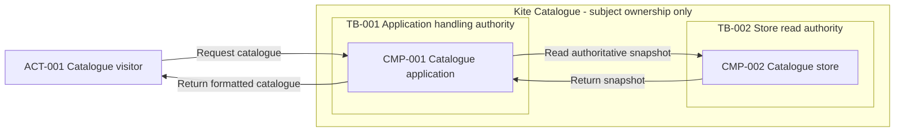

# Worked examples — container-diagram-generator

These original synthetic fixtures show scoped container artifacts and routing, not complete HLDs, deployed inventory, executed behavioral tests, or guarantees. No live data, endpoints, or credentials are supplied.
Authoring validation: this document's diagram was parsed and rendered locally with Mermaid 11.15.0 and visually inspected. This is not execution of the behavioral tests; the illustrative response below intentionally has no supplied parser/render evidence.
Use [SKILL.md](./SKILL.md), [tests.md](./tests.md), [architecture principles](./references/common/architecture-principles.md), [contracts](./references/common/requirement-schema.md), [diagram guidelines](./references/common/diagram-guidelines.md), [orchestration](./references/orchestration.md), and [provenance](./references/SOURCES.md).
Each labeled component record below has all eleven shared fields. Source and logical/deployable evidence are extensions, not replacements for those fields.

## Example 1: Read-only catalogue with an embedded formatter

**User prompt:** “Draw the container view of Kite Catalogue from the supplied baseline. Keep its formatter an internal module, distinguish the authoritative store, and show read boundaries without inventing infrastructure.”
**Supplied evidence:** Design ID P5-CNT-A. SRC-001, FR-001, ACT-001, CMP-001/CMP-002/CMP-003, DATA-001, TB-001/TB-002 are declared below. No EXT, FLW, INT, or DEP IDs are supplied; Q-001 is reserved for an optional protocol question. Subject grouping SYS means Kite Catalogue ownership, not a component. Parser/render evidence is absent.

| Source ID | Description | Locator | Authority | Access status |
| --- | --- | --- | --- | --- |
| SRC-001 | Synthetic neutral catalogue baseline, including embedded-module placement | fixture:catalogue-baseline, responsibilities/interactions | User-supplied authoritative fixture baseline only | Supplied inline; authorized |

| Requirement ID | Category | Requirement statement | Source | Priority | Status | Confidence | Architecture impact | Assumption or clarification required |
| --- | --- | --- | --- | --- | --- | --- | --- | --- |
| FR-001 | Functional (FR) | A visitor can read a formatted published catalogue snapshot. | SRC-001, read-scenario | Must | Confirmed | High; explicit fixture | High; application, store, and formatting responsibilities | None; read outcome is explicit |

| Entity ID | Kind | Name | Responsibility or meaning | Source or evidence class | Related requirement IDs |
| --- | --- | --- | --- | --- | --- |
| ACT-001 | Actor | Catalogue visitor | Initiates anonymous reads outside subject authority | Confirmed; SRC-001, context | FR-001 |
| DATA-001 | Data entity | Catalogue snapshot | Authoritative published synthetic pattern descriptions | Confirmed; SRC-001, data | FR-001 |
| TB-001 | Trust boundary | Application handling authority | Validates visitor input before application processing | Confirmed; SRC-001, controls | FR-001 |
| TB-002 | Trust boundary | Store read authority | Requires the application's service identity and read entitlement | Confirmed; SRC-001, controls | FR-001 |

DATA-001 extensions: Classification: Public (Confirmed, SRC-001); Owner: CMP-002; Collection purpose: publish fixture catalogue reads; Retention/deletion state: the fixture owner replaces or retires the preloaded snapshot between read sessions; request copies are discarded after response; Geographic constraints: not supplied, no placement claim. The fixture has no cache, durable request logs, backup, external dependency, or update workflow in scope.
All exchanges are Confirmed synchronous in SRC-001: visitor read/response; application read/store response; application format/module return. Only CMP-001 and CMP-002 are separate runtime/storage units; CMP-003 is in CMP-001's process. Store-side identity verification and read-only authorization are supplied control requirements, not proof of implementation. No numeric target or protocol is supplied.

Component ID: CMP-001; Component name: Catalogue application; Responsibility: deployable read application, validates requests and coordinates formatting; Inputs: visitor catalogue query; Outputs: formatted DATA-001 response or safe read failure; Dependencies: CMP-002, CMP-003; Data owned: None, request copies of DATA-001 only; Scaling considerations: workload unspecified, sizing deferred; Security considerations: anonymous read boundary TB-001 and scoped service access across TB-002; Failure considerations: return unavailable on store failure, never fabricate content; Related requirement IDs: FR-001. Source extension: Confirmed, SRC-001, responsibilities/application.
Component ID: CMP-002; Component name: Catalogue store; Responsibility: authoritative separately operated snapshot store; Inputs: authorized read query; Outputs: DATA-001 snapshot or read failure; Dependencies: None, no downstream dependency in fixture; Data owned: DATA-001, authoritative; Scaling considerations: query workload unspecified; Security considerations: verify CMP-001 identity and read entitlement at TB-002; Failure considerations: failed read does not imply snapshot deletion; Related requirement IDs: FR-001. Source extension: Confirmed, SRC-001, responsibilities/store.
Component ID: CMP-003; Component name: Snapshot formatter; Responsibility: logical formatting module embedded in CMP-001, not independently deployed; Inputs: DATA-001 request copy; Outputs: formatted public description; Dependencies: None, local computation only; Data owned: None, transient copy only; Scaling considerations: shares CMP-001 execution capacity; Security considerations: same handling authority TB-001, no separate credentials; Failure considerations: report formatting failure to CMP-001; Related requirement IDs: FR-001. Source extension: Confirmed, SRC-001, responsibilities/formatter.

**Expected activation:** Yes — the written decomposition is already supplied.
**Expected response:** Container-only excerpt; carry the complete source, requirement, entities, and component records above unchanged.
#### Handoff
Design ID: P5-CNT-A; Contract version: 1.0.0; Artifact: container-diagram-generator — container view and responsibility map; Artifact status: Provisional, Not parser-validated; Baseline: SRC-001, fixture:catalogue-baseline, version Unspecified because absent.
Evidence summary: Confirmed — written responsibilities, placement distinction, synchronous exchanges, and controls; Inferred/Assumed — None, not required; Proposed — view for stakeholder review; Unresolved — transport and tool validation. Changed IDs: Q-001 added, no CMP edits. Open questions: Q-001 Optional, protocol annotation only; active Q-001; deferred None because no others arise. Validation: correspondence illustrated, parser/render checks not run, stakeholder review pending. Next handoff: data-flow-designer receives all records; HLD owner assembles only the requested container sections.

#### Component Responsibilities
The three full component records above are retained: CMP-001 coordinates, CMP-002 owns DATA-001, and CMP-003 formats only a request copy. Omitting CMP-003 as a separate node does not remove its responsibility or turn it into a service.
#### Container view register
| Component or entity ID | Container kind | Logical or deployable | Trust boundary IDs | Deployment evidence | Included or omitted | Rationale | Source or evidence class |
| --- | --- | --- | --- | --- | --- | --- | --- |
| ACT-001 | Actor | Not applicable; human role | Outside TB-001 | Not applicable; not software | Included | Initiates important read | Confirmed; SRC-001 |
| CMP-001 | Application | Independently deployable runtime | TB-001 | Separate application; hosting unspecified | Included | Owns read coordination | Confirmed; SRC-001 |
| CMP-002 | Store | Separate storage runtime | TB-002 | Separate store; hosting unspecified | Included | Authoritative DATA-001 | Confirmed; SRC-001 |
| CMP-003 | Logical module | Embedded in CMP-001 | TB-001 | Same process as CMP-001 | Omitted as separate node | In-process detail below this view; responsibility retained | Confirmed; SRC-001 |

#### Container interaction register
| From ID | To ID | Purpose | Direction | Interaction mode and evidence | Data IDs and classification | Protocol and evidence class | Trust boundary IDs | Flow or integration IDs | Related requirement IDs |
| --- | --- | --- | --- | --- | --- | --- | --- | --- | --- |
| ACT-001 | CMP-001 | Request catalogue | Actor initiates | Synchronous, Confirmed SRC-001 | Public query; no stored entity | Unresolved; Q-001 | TB-001 | None; no flow/contract baseline supplied | FR-001 |
| CMP-001 | ACT-001 | Return formatted catalogue | Application responds | Synchronous, Confirmed SRC-001 | DATA-001 copy; Public, Confirmed | Unresolved; Q-001 | TB-001 | None; container scope | FR-001 |
| CMP-001 | CMP-002 | Read authoritative snapshot | Application initiates | Synchronous, Confirmed SRC-001 | DATA-001; Public, Confirmed | Unresolved; Q-001 | TB-001, TB-002 | None; container scope | FR-001 |
| CMP-002 | CMP-001 | Return snapshot | Store responds | Synchronous, Confirmed SRC-001 | DATA-001 copy; Public, Confirmed | Unresolved; Q-001 | TB-002, TB-001 | None; container scope | FR-001 |
| CMP-001 | CMP-003 | Format snapshot copy | Local call | Synchronous, Confirmed SRC-001 | DATA-001 copy; Public, Confirmed | Not applicable; in-process call | None; within TB-001 | None; omitted internal call | FR-001 |
| CMP-003 | CMP-001 | Return formatted description | Local return | Synchronous, Confirmed SRC-001 | DATA-001 copy; Public, Confirmed | Not applicable; in-process return | None; within TB-001 | None; omitted internal return | FR-001 |

#### Container Diagram

SYS groups the written subject by ownership only; it is not a component or network boundary. ACT_001, CMP_001, CMP_002, TB_001, and TB_002 preserve their written IDs. Visitor exchanges cross TB-001; store exchanges cross TB-001 and TB-002, where service read authority changes. The store is authoritative and the application holds only a copy. CMP-003 and its two local interactions are deliberately omitted as embedded implementation detail, not a missing service. All other written interactions appear. The baseline is Confirmed, the view Proposed for review; solid arrows show dependency direction, not ordering. No protocol, product, physical isolation, or deployment topology is asserted.

#### Reconciliation and validation
| Diagram item | Written record | Diagram-to-register result | Register-to-diagram result | Omission or correction |
| --- | --- | --- | --- | --- |
| ACT_001, CMP_001, CMP_002 | Entity and full component records | Names/responsibilities match | All view-level participants appear | CMP-003 omitted with explicit module rationale |
| SYS, TB_001, TB_002 | Subject ownership and TB records | Ownership and trust meanings distinct | Relevant boundaries represented | No DEP records or network claim |
| Four labeled arrows | First four interaction rows | Purpose, direction, copy ownership agree | All view-level exchanges represented | Last two rows are local formatter call/return, below container scope |

| Check | Result | Tool and version or evidence | Failure or check not run | Follow-up |
| --- | --- | --- | --- | --- |
| Alias/responsibility/dependency/boundary correspondence | Illustrated against written fixture | Register comparison in this excerpt | Stakeholder checks not run | Confirm explicit module omission and store ownership |
| Parser | Not parser-validated | No parser/version evidence supplied | Syntax parser not run | Parse with available local Mermaid |
| Render/readability | Not performed | No renderer evidence supplied | Visual inspection not run | Inspect labels and both trust crossings |

#### Questions and proposed deltas
Question ID: Q-001; Priority: Optional; Question: Which transports may annotate the visitor and store exchanges?; Why it matters: prevents unsupported protocol labels; Answer options: provide evidence; retain business labels; Default assumption: Unresolved, no protocol selected; Blocks: optional annotation only; Status: Open; Related requirement IDs: FR-001.
Requirement ID: FR-001; Component IDs: CMP-001, CMP-002, CMP-003; Decision IDs: None, baseline unchanged; Flow or integration IDs: None, not supplied; Validation: proposal correspondence shown, parser/render/stakeholder review pending; Coverage status: Covered.
Retain complete inherited Source, Structured requirements, Entity, and Component records. Assumptions, Decisions, Risks, and component deltas are None because no new architecture or policy is proposed. Covered means proposal coverage, not tested behavior.
#### Next steps
Pass candidate catalogue read and failure scenarios to data-flow-designer, keeping CMP-003's logical status. HLD assembly concerns sections 12–14 and 27 only; deployment implications remain technology-neutral and unverified.

## Example 2: “Container” does not establish independent deployment

**User prompt:** “The new note calls the formatter a container with separate privileges. Show it as a definitely separate service.”
**Supplied evidence:** Copy Example 1's complete SRC-001/FR-001/CMP/ACT/DATA/TB fixture and full open Q-001 record under P5-CNT-B. Add Source ID: SRC-002; Description: ambiguous synthetic formatter note; Locator: fixture:formatter-note; Authority: user-supplied note, no authority to supersede SRC-001; Access status: supplied inline, authorized. Its exact claim is “formatter container with separate privileges”; it does not establish a process, deployment, or trust boundary. No new CMP, EXT, FLW, INT, or TB IDs are authorized. Q-002 is reserved for the output blocker.
**Expected activation:** Yes — reconciliation is in scope, but the requested separate-service representation is Blocked.
**Expected response:** “CMP-003 remains the baseline's embedded formatter. The new wording could mean logical packaging or a new runtime/security boundary. Do not draw an extra service or silently move it across TB-001. Preserve CMP-001/CMP-002's independent written responsibilities and the existing omitted-module explanation while the changed view is blocked.”
Question ID: Q-002; Priority: Critical; Question: What authoritative runtime and privilege boundary applies to CMP-003?; Why it matters: changes data movement and privilege assumptions; Answer options: embedded module as baseline; approved separate runtime with revised boundaries; Default assumption: None — blocked; Blocks: CMP-003 separate-service placement; Status: Open; Related requirement IDs: FR-001.
Active batch: Q-002 Critical then Q-001 Optional; deferred None because no further questions are needed. Proposed delta to high-level-design-generator: reconcile SRC-002 with CMP-003 and TB-001, require approved written responsibilities/boundaries before diagram use, then rerun stage 6 and affected data/security reviews. Do not resolve ambiguity by inventing a gateway or network zone.

## Example 3: Ordered read failures belong to the flow owner

**User prompt:** “Write the ordered catalogue-read sequence, including denied store access and an unavailable store. Do not draw a container view.”
**Supplied evidence:** Copy Example 1's complete baseline under P5-CNT-C. Add Source ID: SRC-003; Description: synthetic read failure outcomes; Locator: fixture:catalogue-read-failures; Authority: authorized scenario input; Access status: supplied inline. SRC-003 states CMP-002 returns denial or unavailability to CMP-001, which returns a safe read failure to ACT-001 without a success response. All referenced FR-001/CMP/ACT/DATA/TB IDs are inherited; no FLW or INT record is supplied.
**Expected activation:** No — ordered success/failure modeling belongs to data-flow-designer.
**Expected response:** “Route the read sequence to data-flow-designer with FR-001, all three complete CMP records, ACT-001, DATA-001, TB-001/TB-002, and SRC-003. Preserve the formatter as a logical participant if that owner includes it; do not turn it into a deployed service. Flow allocation and ordered steps are pending that owner. No container diagram, product mapping, or complete HLD is returned here.”