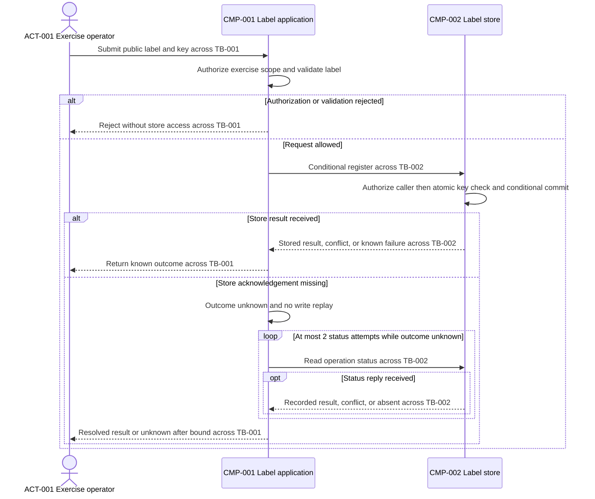

# Worked examples — data-flow-designer

Original synthetic fixtures only. Expected responses are narrow flow excerpts and routing outcomes, not complete HLDs, executed tests, production evidence, or guarantees. Public labels and operation keys below are categories, not actual payloads or credentials.
Authoring validation: this sequence was parsed and rendered locally with Mermaid 11.15.0 and visually inspected. That validates the example's representation, not the behavioral tests or transaction implementation; the hypothetical response below retains its no-tool-evidence condition.
Use [SKILL.md](./SKILL.md), [tests.md](./tests.md), [architecture principles](./references/common/architecture-principles.md), [contracts](./references/common/requirement-schema.md), [diagram guidelines](./references/common/diagram-guidelines.md), [orchestration](./references/orchestration.md), and [provenance](./references/SOURCES.md).

## Example 1: Registration with a lost store acknowledgement

**User prompt:** “Trace Pebble Register's label registration, duplicates, and lost acknowledgement. The application may make at most 2 total status-check attempts per operation, stopping when resolved; it must not automatically replay a write. No numeric timeout is supplied.”
**Supplied evidence:** Design ID P5-FLW-A. SRC-001, FR-001/FR-002, ACT-001, CMP-001/CMP-002, DATA-001, and TB-001/TB-002 are defined below. FLW-001 is the proposed output ID for registration; Q-001/Q-002 are reserved output questions. No EXT or INT IDs, queue, cache, gateway, or backup component exists in this scoped fixture. Parser/render evidence is absent.

| Source ID | Description | Locator | Authority | Access status |
| --- | --- | --- | --- | --- |
| SRC-001 | Synthetic registration, authority, transaction, lifecycle, and failure baseline | fixture:pebble-register, rules | User-supplied fixture authority; not implementation verification | Supplied inline; authorized |

| Requirement ID | Category | Requirement statement | Source | Priority | Status | Confidence | Architecture impact | Assumption or clarification required |
| --- | --- | --- | --- | --- | --- | --- | --- | --- |
| FR-001 | Functional (FR) | An authorized exercise operator can register a validated synthetic shade label under an operation key. | SRC-001, registration | Must | Confirmed | High; explicit fixture | High; state-changing flow | None; capability supplied |
| FR-002 | Functional (FR) | Repeating the same key and label returns the recorded result without an additional state change. | SRC-001, duplicates | Must | Confirmed | High; explicit fixture | High; atomic duplicate handling | None; fixture supplies transaction semantics |

| Entity ID | Kind | Name | Responsibility or meaning | Source or evidence class | Related requirement IDs |
| --- | --- | --- | --- | --- | --- |
| ACT-001 | Actor | Exercise operator | May register and inspect results within the current exercise | Confirmed; SRC-001, authority | FR-001, FR-002 |
| DATA-001 | Data entity | Label operation record | Label, operation key, and recorded outcome in the authoritative store | Confirmed; SRC-001, state | FR-001, FR-002 |
| TB-001 | Trust boundary | Exercise request authority | Application verifies operator identity and exercise entitlement | Confirmed; SRC-001, authority | FR-001, FR-002 |
| TB-002 | Trust boundary | Store mutation authority | Store verifies application identity and scoped register/status permissions | Confirmed; SRC-001, authority | FR-001, FR-002 |

DATA-001 extensions: Classification: Public (Confirmed, synthetic fixture categories only); Owner: CMP-002; Collection purpose: registration and duplicate reconciliation; Retention/deletion state: retain for the exercise, then retire label/key/outcome together; prohibit replay after retirement; discard application/response copies after the operation; Geographic constraints: not supplied, no residency claim. SRC-001 excludes durable payload logging and other copies in this scope.
Component ID: CMP-001; Component name: Label application; Responsibility: deployable registration coordinator and sole status-retry owner; Inputs: operator label and operation key; Outputs: recorded result, safe rejection, or unknown outcome; Dependencies: CMP-002; Data owned: None, transient DATA-001 input/result copies only; Scaling considerations: workload not supplied, capacity deferred; Security considerations: authorize at TB-001 and use scoped service authority at TB-002; Failure considerations: never treat a missing response as rollback or automatically replay the write; Related requirement IDs: FR-001, FR-002. Source extension: Confirmed, SRC-001, application.
Component ID: CMP-002; Component name: Label store; Responsibility: authoritative storage and atomic same-key registration within this fixture; Inputs: authorized conditional register or status query; Outputs: recorded outcome, conflict, known failure, or absent status; Dependencies: None, no downstream component in fixture; Data owned: DATA-001, authoritative; Scaling considerations: operation mix not supplied; Security considerations: enforce current-exercise register/status rights at TB-002; Failure considerations: known failed transaction creates no new effect; acknowledgement loss does not undo commit; Related requirement IDs: FR-001, FR-002. Source extension: Confirmed, SRC-001, store.
SRC-001 explicitly supplies synchronous calls; nonempty-label validation; permanent authorization/validation rejection; an atomic transaction coupling key check, new label, and stored result; same-key/same-label replay returns that result; same-key/different-label conflicts; no cross-key ordering requirement. Store acknowledgement distinguishes stored result from conflict or known transaction failure. Missing acknowledgement means unknown, never rollback. Status can return a matching stored result, conflict, or absent; absent or a missing status reply remains unknown. CMP-001 owns at most 2 total status attempts and no automatic write replay; no other layer retries. Numeric waits and transport remain unspecified. Retirement removes all authoritative operation state together, and retired keys cannot be replayed.

**Expected activation:** Yes — written participants, invariants, outcomes, and bounded failure behavior exist.
**Expected response:** Flow-only excerpt; keep every supplied record unchanged and distinguish source premises from tests still needed.
#### Handoff
Design ID: P5-FLW-A; Contract version: 1.0.0; Artifact: data-flow-designer — critical flows and sequences; Artifact status: Provisional, Not parser-validated and operational wait budget unresolved; Baseline: SRC-001, fixture:pebble-register, version Unspecified because absent.
Evidence summary: Confirmed — fixture participants, atomicity premise, rights, lifecycle, and attempt cap; Inferred/Assumed — None, unnecessary here; Proposed — FLW-001/view for review; Unresolved — Q-001 wait budget, Q-002 transport, parser/render checks. Changed IDs: add FLW-001 and Q-001/Q-002, no CMP changes. Open questions: active Q-001 Important then Q-002 Optional; deferred None because no further questions arise. Validation: written reconciliation illustrated; parser/render/failure experiments not run; stakeholder gates pending. Next handoff: integration-designer receives all records and unverified capability premises.

#### Critical Data Flows
- Flow ID: FLW-001.
- Trigger: ACT-001 submits a synthetic label and operation key during the exercise.
- Producer: ACT-001 through CMP-001.
- Consumers: CMP-001, CMP-002; ACT-001 receives the outcome.
- Data and classification: DATA-001 categories; Public, Confirmed SRC-001.
- Stores: CMP-002 authoritative; no additional persistent copies in this fixture.
- Interaction mode: Synchronous, Confirmed SRC-001; protocol Unresolved, Q-002.
- Validation and transformation: Verify operator/store authority; reject empty labels; compare key and label atomically; no other business transformation supplied.
- Success and failure paths: Stored new result or same-key replay result; permanent input/auth/conflict rejection; known failed transaction; lost acknowledgement triggers bounded status reconciliation, then result or unknown, never blind replay.
- Retention and deletion: Exercise-scoped retention; retire label/key/outcome together; no replay after retirement; transient copies discarded; other persistence Not applicable to this fixture.
- Related requirement IDs: FR-001, FR-002.
Selection rationale: registration is the supplied state-changing correctness scenario. Retirement execution is a separate lifecycle scenario omitted from this sequence, with its supplied semantics retained above; no other candidate flow was supplied.

#### Flow step register
| Flow ID | Step | From ID | To ID | Action and data | Validation or transformation | State transition | Commit or acknowledgement | Branch and outcome | Trust boundary IDs | Source or evidence class |
| --- | --- | --- | --- | --- | --- | --- | --- | --- | --- | --- |
| FLW-001 | 1 | ACT-001 | CMP-001 | Submit public label/key, DATA-001 input | No success implied by submission | Request received | None; receipt is not commit | Begin | TB-001 | Confirmed; SRC-001, registration |
| FLW-001 | 2 | CMP-001 | CMP-001 | Authorize exercise scope and validate label | Identity, entitlement, nonempty label | Allowed or rejected; no durable write | None; local validation | Reject or proceed | None; inside TB-001 | Confirmed; SRC-001, authority/registration |
| FLW-001 | 3 | CMP-001 | ACT-001 | Return safe rejection | No store access for rejected input | Terminal rejection | Not business success | Authorization/validation failure | TB-001 | Confirmed; SRC-001, failures |
| FLW-001 | 4 | CMP-001 | CMP-002 | Conditional register, DATA-001 input | Store authority checked at step 5 | Mutation requested, not yet proven | None; call is not commit | Allowed request | TB-001, TB-002 | Confirmed; SRC-001, state |
| FLW-001 | 5 | CMP-002 | CMP-002 | Authorize caller; atomic key check and conditional write | Same key/label reuses result; different label conflicts | New record committed, existing unchanged, or rejected/failed unchanged | Durable commit only for successful new transaction | New, duplicate, conflict, authorization failure, known transaction failure | None; inside TB-002 | Confirmed premise; SRC-001, authority/state |
| FLW-001 | 6 | CMP-002 | CMP-001 | Return stored result, conflict, or known failure | Distinguish outcome category | No new state | Stored-result response attests durable state; errors do not | Store reply received | TB-002, TB-001 | Confirmed; SRC-001, acknowledgement |
| FLW-001 | 7 | CMP-001 | ACT-001 | Return the known outcome | Preserve store meaning | Terminal known outcome | Business-complete only for matching stored result | Success, conflict, or known failure | TB-001 | Confirmed; SRC-001, acknowledgement |
| FLW-001 | 8 | CMP-001 | CMP-001 | Mark missing store reply unknown | Do not infer rollback or replay write | Outcome unknown | No acknowledgement observed | Lost acknowledgement | None; inside TB-001 | Confirmed; SRC-001, failures |
| FLW-001 | 9 | CMP-001 | CMP-002 | Read operation status; at most 2 attempts while unknown | Scoped status permission, same operation identity | No mutation | Read only, not a new commit | Bounded reconciliation | TB-001, TB-002 | Confirmed; SRC-001, retry cap |
| FLW-001 | 10 | CMP-002 | CMP-001 | If reply received, return recorded result, conflict, or absent | Absent is not proof of rollback | Resolve only a known outcome; otherwise unknown | Evidence of original outcome only | Optional status reply; missing reply remains unknown | TB-002, TB-001 | Confirmed; SRC-001, status |
| FLW-001 | 11 | CMP-001 | ACT-001 | Return resolved result or unknown after the bound | Never turn exhaustion into success | Terminal known or unknown outcome | Unknown is not business-complete | Reconciled or unresolved after cap | TB-001 | Confirmed; SRC-001, failures |

#### State and failure semantics
Flow ID: FLW-001; Transaction boundary and invariant: CMP-002 atomically couples key check, label, and result, with unchanged effects for duplicate/conflict/failure; Durable commit point: step 5 for a successful new record only; Acknowledgement point and meaning: steps 6/7 or 10/11 report matching stored state, while error/unknown responses never mean business-complete; Duplicate handling and ordering: exercise-scoped key plus label, atomic fixture premise, no cross-key ordering; Timeout and retry owner: CMP-001 only, wait budget Unresolved Q-001, no automatic write replay; Retry bound: at most 2 total status attempts, Confirmed SRC-001, stop early when resolved; Terminal error and reconciliation: unchanged invalid/auth/conflicting input is not retried, lost reply requires status evidence, exhausted/absent status remains unknown; Retention and deletion propagation: retire all DATA-001 state together and discard transient copies, no other stores in scope; Validation required: verify authority, atomicity, lost-reply/duplicate/retirement behavior and operational budgets before implementation reliance.

#### Critical flow sequences
FLW-001 — conditional registration and bounded status reconciliation:

ACT_001/CMP_001/CMP_002 are the written ACT-001/CMP-001/CMP-002 participants. Operator exchanges cross TB-001; application/store exchanges cross TB-001 and TB-002, with store authorization enforced before effects. The self-action commits only a permitted new key atomically; duplicates reuse the result and conflicts/known failures do not create a new effect. Missing store acknowledgement is unknown, and missing/absent status preserves that uncertainty; only recorded evidence resolves it. Solid arrows mean requests/actions and dashed arrows responses, not asynchronous delivery. Synchronous behavior and the 2-attempt cap are supplied; no numeric timeout or protocol is inferred. Retirement is explicitly outside this sequence. These fixture-based proposed steps map to rows 1–11, including the optional reply and terminal unknown branch, and are not implementation guarantees.

#### Reconciliation and validation
| Diagram participant, message, or branch | Written record and step | Diagram-to-register result | Register-to-diagram result | Omission or correction |
| --- | --- | --- | --- | --- |
| All participants, validation/rejection, conditional register | ACT/CMP records; FLW-001 steps 1–5 | Roles, authorization, and public movement agree | All entry and state-change actions appear | None; no invented intermediary |
| Known reply branch | Steps 6–7 | Stored versus error meaning retained | Both store and operator responses appear | No success implied for errors |
| Missing reply, bounded loop, optional status reply, final result | Steps 8–11 | Unknown is retained until evidence; bound is sourced | All important reconciliation outcomes appear | Retirement sequence omitted with stated scope reason |

| Check | Result | Tool and version or evidence | Failure or check not run | Follow-up |
| --- | --- | --- | --- | --- |
| Participants, branches, sensitivity, commit/ack semantics | Correspondence illustrated above | Supplied fixture comparison, not runtime evidence | Failure/atomicity experiments not run | Verify each state boundary and failure observation |
| Syntax/parser | Not parser-validated | No parser/version evidence supplied | Parser check not run | Parse the balanced sequence locally |
| Render/readability | Not performed | No renderer evidence supplied | Visual inspection not run | Inspect branch and trust labels separately |

#### Questions and proposed deltas
Question ID: Q-001; Priority: Important; Question: What end-to-end wait budget governs registration and its status checks?; Why it matters: attempt bounds alone do not bound elapsed time; Answer options: supply an authorized budget; retain a gated conceptual flow; Default assumption: Unresolved, no numeric timeout; Blocks: operational timeout configuration; Status: Open; Related requirement IDs: FR-001, FR-002.
Question ID: Q-002; Priority: Optional; Question: Which transports are evidenced for the written calls?; Why it matters: prevents unsupported protocol claims; Answer options: provide evidence; omit protocol labels; Default assumption: Unresolved, business labels only; Blocks: optional transport annotation; Status: Open; Related requirement IDs: FR-001, FR-002.
Requirement ID: FR-001; Component IDs: CMP-001, CMP-002; Decision IDs: None, fixture semantics unchanged; Flow or integration IDs: FLW-001; Validation: state/authority/failure tests and diagram checks pending; Coverage status: Covered.
Requirement ID: FR-002; Component IDs: CMP-001, CMP-002; Decision IDs: None, no delivery guarantee inferred; Flow or integration IDs: FLW-001; Validation: same-key concurrency, atomicity, and retirement tests pending; Coverage status: Covered.
Covered is proposal coverage. Carry all complete inherited Source, Structured requirements, Entity/data extensions, and Component records; Assumptions, Decisions, Risks, and upstream structural deltas are None because no architecture or policy is added here.
#### Next steps
Hand FLW-001, steps, source premises, questions, and actual validation gaps to integration-designer. Detailed contracts and operational budgets remain pending; HLD assembly is limited to the flow/data/trace scope in sections 15, 17, and 27.

## Example 2: An ambiguous receipt cannot establish durable success

**User prompt:** “The revised brief says a receipt means complete, but does not define storage ordering. Show a successful durable registration anyway.”
**Supplied evidence:** Copy Example 1's input and full Q-001/Q-002 records under P5-FLW-B, but replace SRC-001's atomic-write/acknowledgement claims with “application emits a receipt; atomic duplicate handling and commit/receipt ordering are unspecified; status is not proven to attest durability.” Override CMP-002 Responsibility with “authoritative label/result storage; atomic duplicate capability Unresolved, Q-004”, Outputs with “receipt/status categories; durable meaning Unresolved, Q-003”, and Failure considerations with “commit/receipt and duplicate semantics Unresolved, Q-003/Q-004”; its Source extension confirms store existence only, not atomicity. Set Assumption or clarification required to Q-003 for FR-001 and Q-004 for FR-002; both remain desired requirements, not capability proof. Add Source ID: SRC-002; Description: synthetic ambiguous receipt note; Locator: fixture:receipt-meaning; Authority: authorized wording, no durable-success evidence; Access status: supplied inline. ACT/CMP/FR/DATA/TB IDs and reserved FLW-001 are unchanged; no EXT or INT ID is added. Q-003/Q-004 are new output blockers.
**Expected activation:** Yes — flow clarification is in scope; the receipt-to-business-success transition is Blocked.
**Expected response:** “A receipt might mean accepted or durably stored; neither it nor a timeout establishes commit. Authorization and validation can be described independently, but success and duplicate transitions are blocked. No completed-success sequence or atomic deduplication claim is justified.”
Flow ID: FLW-001; Trigger: operator submits label/key in the exercise; Producer: ACT-001 through CMP-001; Consumers: CMP-001, CMP-002, with outcome intended for ACT-001; Data and classification: DATA-001, Public Confirmed SRC-001; Stores: CMP-002, authoritative ownership supplied but atomic capability unresolved; Interaction mode: Synchronous, Confirmed SRC-001; Validation and transformation: authorize and validate nonempty label, atomic duplicate check blocked by Q-004; Success and failure paths: input/auth rejection known, receipt meaning blocked by Q-003, duplicate effect blocked by Q-004, missing reply remains unknown and no write replay allowed; Retention and deletion: supplied exercise retirement and transient-copy disposal retained, replay after retirement prohibited; Related requirement IDs: FR-001, FR-002.
Question ID: Q-003; Priority: Critical; Question: What durable state, if any, must a successful receipt attest?; Why it matters: defines completion and safe reconciliation; Answer options: accepted only; durably stored with evidence; unresolved; Default assumption: None — blocked; Blocks: receipt acknowledgement and FLW-001 success transition; Status: Open; Related requirement IDs: FR-001, FR-002.
Question ID: Q-004; Priority: Critical; Question: What evidence establishes atomic key/effect/result handling in CMP-002?; Why it matters: the duplicate invariant cannot be inferred from a receipt; Answer options: authorized atomicity evidence; leave duplicate transition blocked; Default assumption: None — blocked; Blocks: FLW-001 duplicate state transition; Status: Open; Related requirement IDs: FR-002.
Active batch: Q-003/Q-004 Critical, Q-001 Important, Q-002 Optional; no deferred questions. Trace FR-001/FR-002 as Partial with these blockers. Route receipt meaning to requirement-analyzer and atomic capability gaps to the HLD owner; do not change CMP ownership or grant access through an assumption.

## Example 3: Boundary contract request, not a new sequence

**User prompt:** “Specify the conceptual registration contract, schema evolution, and per-hop authorization. Do not generate another sequence or implementation code.”
**Supplied evidence:** Under P5-FLW-C, supply Example 1's complete input records, full Q-001/Q-002 ledger, and eleven-field FLW-001 with written step/state records as an explicitly proposed baseline; do not import any tool-success claim. Add Source ID: SRC-003; Description: synthetic conceptual-contract request; Locator: fixture:registration-contract-request; Authority: authorized task scope only; Access status: supplied inline. All SRC/FR/CMP/ACT/DATA/TB/FLW IDs are thus declared; no EXT or INT ID exists yet.
**Expected activation:** No — integration-designer owns the requested conceptual boundary contracts.
**Expected response:** “Route the complete registration baseline to integration-designer. Preserve FLW-001's durable-result versus unknown-outcome distinction, the supplied 2-attempt status cap, and Q-001's unresolved wait budget. INT allocation, compatibility, and authorization contract details remain pending that owner; no new sequence, code, platform mapping, or complete HLD is generated by this routing response.”