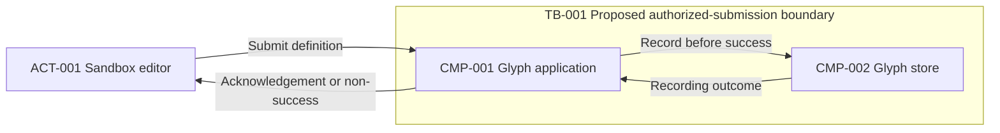

# High-Level Design Generator — Worked Examples

Original synthetic fixtures, not historical skill runs, accepted designs, or executed tests. All sources, roles, data, and IDs are illustrative; no real records, endpoints, organizational policy, or approval is represented. Targets remain Unresolved unless explicitly supplied.
Use [./SKILL.md](./SKILL.md), [./references/common/requirement-schema.md](./references/common/requirement-schema.md), [./references/common/architecture-principles.md](./references/common/architecture-principles.md), and [./references/common/design-output-template.md](./references/common/design-output-template.md). Ownership follows [./references/orchestration.md](./references/orchestration.md).
These are narrowly scoped excerpts, not full HLDs. A full initial assembly must supply all ordered sections and mandatory subheadings, with useful content or reasoned gaps. No next-phase canonical sample is required, read, or asserted to exist by these fixtures.

## Example 1: Assemble a provisional glyph-recording baseline

- User prompt: “Assemble the neutral glyph sandbox from this supplied upstream baseline. Preserve its Proposed style decision, create a traceable component baseline, and identify specialist outputs still pending.”
- Supplied evidence and safe IDs: Design ID GLYPH-SANDBOX; baseline A. SRC-001, the requirement/entity/data/driver records, and DEC-001 below are synthetic upstream input, not a claimed prior execution. CMP, TB, DEP, and Q records below are illustrative proposed assembly output; no FLW/INT/ADR IDs or approvals are supplied.
- Source content: The objective is to record synthetic glyph definitions without misleading success acknowledgements. The sandbox editor is authorized to submit definitions. Must accept individual submissions and report success only after durable recording. Application logic Must remain in exactly one coordinated deployable. External systems, batch/stream processing, real users/data, and product mandates are excluded; retention and quality targets are unspecified.
- Supplied equivalent all-style evidence: Modular monolith fits CON-001; layered organization separates submission and recording responsibilities for BR-001; data-centric emphasis makes authoritative recording explicit; hybrid names these compatible dimensions. Hexagonal/clean is Conditional because adapter-change needs are absent; event-driven is Conditional on preserving BR-001 acknowledgement semantics; serverless runtime fit is unverified and Conditional.
- Supplied equivalent all-style evidence, exclusions: Microservices contradicts the shared application-release constraint; SOA has no external capability in scope; batch and streaming are expressly excluded. These supplied comparative conclusions support DEC-001, not permission for the assembler to select another style or runtime.
- Expected activation: Yes.
- Expected response: Provisional initial assembly with Proposed application/store responsibilities and partial traceability. Keep specialist context, container, flow, integration, security, reliability, operations, ADR and final-review outputs pending; mapping is Not requested. A diagram sketch or proposed coverage is not a completed reviewed HLD or proof of durability.
- Excerpt scope: Core registers, a container sketch, traceability, and handoff only. Missing flow/integration records are explicit pending work, not invented completed contracts. No specialist or parser execution is claimed.

| Source ID | Description | Locator | Authority | Access status |
| --- | --- | --- | --- | --- |
| SRC-001 | Synthetic glyph baseline and supplied neutral style evidence | Inline Example 1: scope, recording, deployment, style evidence | User-authorized fixture input; no approval authority or evidence | Supplied |

| Requirement ID | Category | Requirement statement | Source | Priority | Status | Confidence | Architecture impact | Assumption or clarification required |
| --- | --- | --- | --- | --- | --- | --- | --- | --- |
| FR-001 | Functional (FR) | Accept individual synthetic glyph definitions from the sandbox editor. | SRC-001, scope | Must | Confirmed | High | Medium — submission responsibility | None — actor and capability supplied |
| BR-001 | Business rule (BR) | Report submission success only after its glyph definition is durably recorded. | SRC-001, recording | Must | Confirmed | High | High — acknowledgement and durable-state boundary | None — invariant supplied; implementation unverified |
| CON-001 | Constraint (CON) | Keep application logic in exactly one coordinated deployable. | SRC-001, deployment | Must | Confirmed | High | High — application release boundary | None — fixture constraint supplied |

| Entity ID | Kind | Name | Responsibility or meaning | Source or evidence class | Related requirement IDs |
| --- | --- | --- | --- | --- | --- |
| ACT-001 | Actor | Sandbox editor | Submit synthetic glyph definitions; no decision-approval authority supplied | SRC-001, scope; Confirmed | FR-001, BR-001 |

| Entity ID | Kind | Name | Responsibility or meaning | Source or evidence class | Related requirement IDs | Classification | Classification status | Owner, if supplied | Collection purpose | Retention/deletion state | Geographic constraints |
| --- | --- | --- | --- | --- | --- | --- | --- | --- | --- | --- | --- |
| DATA-001 | Data entity | Synthetic glyph definition | Submitted definition to be durably recorded | SRC-001, scope/recording; Confirmed | FR-001, BR-001 | Synthetic non-personal | Confirmed | Unspecified — no organizational data owner supplied | Record authorized sandbox submissions | Unresolved — Q-001 | Unresolved — none supplied |

| Driver ID | Driver | Related requirement IDs | Evidence status | Impact rank | Architectural effect | Missing evidence | Validation required |
| --- | --- | --- | --- | --- | --- | --- | --- |
| DRV-001 | Durable success boundary | FR-001, BR-001 | Inferred | High — false success changes core correctness | Couple success reporting to authoritative recording outcome | No storage/failure validation supplied | Exercise commit failure and uncertain outcome before confirming the acknowledgement design |
| DRV-002 | Coordinated application release | CON-001 | Inferred | High — splitting release units violates the supplied boundary | Keep logical application responsibilities within the shared deployable | Runtime and operational evidence absent | Check deployment mapping and release semantics without selecting a product |

| Decision ID | Decision | Status | Rationale | Alternatives | Trade-offs | Related requirements | Validation required |
| --- | --- | --- | --- | --- | --- | --- | --- |
| DEC-001 | Modular monolith with layered responsibilities and explicit authoritative-data ownership | Proposed | Supplied composition addresses coordinated application release and truthful durable success | Hexagonal/clean internal organization if adapter-change evidence emerges; event interaction only if success semantics remain intact | Shared release/failure scope; direct recording dependency; no runtime guarantee | FR-001, BR-001, CON-001 | Boundary and acknowledgement tests; runtime/storage evidence; stakeholder validation; no ADR or approval supplied |

### Proposed component and placement excerpt

CMP-001 is an application container, not independently deployed logical layers. CMP-002 is a persistent-store responsibility, not a selected product or an additional application release unit. Store authority is proposed within the design; organizational ownership remains unspecified.

| Component ID | Component name | Responsibility | Inputs | Outputs | Dependencies | Data owned | Scaling considerations | Security considerations | Failure considerations | Related requirement IDs |
| --- | --- | --- | --- | --- | --- | --- | --- | --- | --- | --- |
| CMP-001 | Glyph application | Authorize and validate submissions; report the recording outcome | DATA-001 from ACT-001 | Acknowledgement or non-success outcome to ACT-001 | CMP-002 | None — authoritative DATA-001 belongs to CMP-002 | Workload Unresolved; preserve CON-001 before proposing release changes | Proposed actor authorization and safe input validation; no secret-bearing logs | Do not convert failed or uncertain recording into success; retry/reconciliation details pending | FR-001, BR-001, CON-001 |
| CMP-002 | Glyph store | Maintain authoritative recorded definitions | Validated DATA-001 from CMP-001 | Recording outcome to CMP-001 | None within the component excerpt; storage prerequisites Unresolved | DATA-001 — Proposed authoritative store, not a cache | Volume and recovery objectives Unresolved | Proposed restricted application access and protected recovery copies; mechanisms unselected | Durability and restore require validation; replication is not backup | BR-001 |

| Boundary ID | Boundary meaning | Inside IDs | Outside IDs | Crossing flow IDs | Proposed controls | Source or assumption | Validation required |
| --- | --- | --- | --- | --- | --- | --- | --- |
| TB-001 | Proposed authorized-submission boundary, not a network-placement claim | CMP-001, CMP-002 | ACT-001 | Unresolved — flow IDs pending; FR-001 submission is the textual crossing | Check ACT-001 entitlement before recording DATA-001 | SRC-001 actor entitlement; boundary placement Proposed | Obtain security and flow-owner review; test denied submissions using synthetic inputs |

| Deployment ID | Logical component IDs | Execution or storage responsibility | Isolation and placement | Scaling unit | Failure and recovery boundary | Status | Validation required |
| --- | --- | --- | --- | --- | --- | --- | --- |
| DEP-001 | CMP-001 | Shared application execution | Placement Unresolved; obey CON-001; no provider or region selected | Application execution; instance count Unresolved | Application restart/rollback distinct from data restore | Proposed | Check release mapping and runtime evidence |
| DEP-002 | CMP-002 | Persistent storage responsibility | Placement and storage mechanism Unresolved; not an independent application feature release | Stored state; capacity Unresolved | Independent data recovery evidence required; targets Unresolved | Proposed | Establish lifecycle Q-001 and validate restore/access prerequisites |

### Container sketch — not a specialist-completed view

This Proposed container sketch maps ACT_001, CMP_001, CMP_002, and TB_001 to the registered hyphenated IDs. Arrows show conceptual direction, not a selected protocol or durable-delivery proof. TB-001 marks authorization assumptions, not a subnet; DEP placements and internal logical layers are omitted intentionally. It is Not parser-validated; rendering, semantic specialist review, and runtime validation are Not run. Apply [./references/common/diagram-guidelines.md](./references/common/diagram-guidelines.md) before treating a revised view as checked.

| Requirement ID | Component IDs | Decision IDs | Flow or integration IDs | Validation | Coverage status |
| --- | --- | --- | --- | --- | --- |
| FR-001 | CMP-001 | DEC-001 | Unresolved — submission flow/contract pending | Obtain flow/integration and authorization evidence; no implementation test run | Partial |
| BR-001 | CMP-001, CMP-002 | DEC-001 | Unresolved — durable-success flow/contract pending | Validate commit failure and uncertain outcomes; proposal only | Partial |
| CON-001 | CMP-001 | DEC-001 | Not applicable — release constraint, not a business interaction | Check DEP-001 interpretation and release evidence; not verified | Partial |

Active Batch below; Queued Questions and answered history: None supplied in this excerpt. A full assembly must also disposition other material gaps without exceeding seven active questions across skills.

| Question ID | Priority | Question | Why it matters | Answer options | Default assumption | Blocks | Status | Related requirement IDs |
| --- | --- | --- | --- | --- | --- | --- | --- | --- |
| Q-001 | Important | What lifecycle rule applies to recorded synthetic glyph definitions? | Determines deletion and recovery-copy treatment | Delete at exercise end; supply a retention rule; leave undecided | Unresolved — no retention duration or policy | DATA-001 lifecycle and recovery-copy specification, not independent component assembly | Open | FR-001, BR-001 |

Expected handoff, all required fields: Design ID: GLYPH-SANDBOX; Contract version: 1.0.0; Artifact: high-level-design-generator — component/trace excerpt; Artifact status: Provisional — specialists and evidence pending, not a complete HLD; Baseline: A, SRC-001 upstream fixture; Evidence summary: Confirmed requirements/entities, Inferred drivers, Assumed none, Proposed DEC/CMP/TB/DEP, Unresolved lifecycle/targets/validation; Changed IDs: Added CMP-001, CMP-002, TB-001, DEP-001, DEP-002, Q-001; Open questions: Q-001 Important gates lifecycle; Validation: behavioral, parser, rendering, specialist and final review Not run; Next handoff: context owner, then container/flow/integration and review owners in orchestration order with full relevant registers; mapping Not requested.

Why: The store exists because durable acknowledgement requires authoritative state, not because diagrams conventionally contain databases. Partial traceability and a pending sketch cannot be promoted to completed assembly, reviewed readiness, or production approval.

## Example 2: Block contradictory acknowledgement semantics

- User prompt: “Merge a competing instruction that success must precede durable recording; preserve the baseline and the unanswered lifecycle question rather than silently changing the success arrow.”
- Supplied evidence and safe IDs: Inherit all Example 1 records as GLYPH-SANDBOX baseline B input. SRC-002 and BR-002 below are synthetic upstream delta evidence with no precedence; BR-001 retains its statement, source, priority and impact while its conflict status, confidence rationale and Q link are updated below. Allocate DEC-002 and Q-002; keep DEC-001 Proposed without claiming that the assembler has reselected styles.
- Expected activation: Yes.
- Expected response: Blocked for the success-path merge, not all independent scope work. Preserve both source-backed meanings and the prior Proposed component/view baseline; label it pending revalidation rather than depicting an accepted combined path. Route authority resolution upstream; rerun affected drivers/styles and specialists after the answer changes their conclusions.
- Excerpt scope: Conflict-linked requirements, deferred decision, changed trace rows, and active ledger only; not the complete revised HLD. Unchanged trace rows remain as in Example 1; flows remain explicitly pending.

| Source ID | Description | Locator | Authority | Access status |
| --- | --- | --- | --- | --- |
| SRC-002 | Synthetic pre-recording success instruction | Inline Example 2 | User-authorized fixture input; no precedence over SRC-001 | Supplied |

| Requirement ID | Category | Requirement statement | Source | Priority | Status | Confidence | Architecture impact | Assumption or clarification required |
| --- | --- | --- | --- | --- | --- | --- | --- | --- |
| BR-001 | Business rule (BR) | Report submission success only after its glyph definition is durably recorded. | SRC-001, recording | Must | Conflicted | High — explicit statement, authority unresolved | High — acknowledgement and durable-state boundary | Q-002 |
| BR-002 | Business rule (BR) | Report submission success after validation but before any durable recording. | SRC-002, pre-recording instruction | Must | Conflicted | High — explicit competing statement | High — acknowledgement and durable-state boundary | Q-002 |

| Decision ID | Decision | Status | Rationale | Alternatives | Trade-offs | Related requirements | Validation required |
| --- | --- | --- | --- | --- | --- | --- | --- |
| DEC-002 | Defer success-path assembly until acknowledgement authority is resolved | Deferred | The supplied success conditions cannot describe the same acknowledgement | Post-recording success if BR-001 governs; separately named receipt/result semantics only if authorized revised requirements support them | Durable-result coupling versus receipt semantics; no implicit permission to lose accepted definitions | BR-001, BR-002 | Resolve Q-002 through requirement/source owner; update traceability and regenerate affected flow/view/review outputs |

| Requirement ID | Component IDs | Decision IDs | Flow or integration IDs | Validation | Coverage status |
| --- | --- | --- | --- | --- | --- |
| BR-001 | CMP-001, CMP-002 — prior proposal pending revalidation | DEC-001, DEC-002 | Unresolved — success flow/contract gated by Q-002 | Resolve authority before regenerating the success path and affected reviews | Partial |
| BR-002 | CMP-001, CMP-002 — affected responsibilities, not accepted allocation | DEC-002 | Unresolved — competing success path gated by Q-002 | Obtain authorized interpretation; no implementation verification claimed | Partial |

Active Batch below retains Q-001; Queued Questions: None in this excerpt. No retention assumption bypasses the independent Critical acknowledgement gate.

| Question ID | Priority | Question | Why it matters | Answer options | Default assumption | Blocks | Status | Related requirement IDs |
| --- | --- | --- | --- | --- | --- | --- | --- | --- |
| Q-002 | Critical | Which meaning governs the submission success acknowledgement? | Contradictory meanings change correctness and the response boundary | Authorized precedence; revised distinction between receipt and durable result | None — blocked | DEC-002 and CMP-001 success-path assembly | Open | BR-001, BR-002 |
| Q-001 | Important | What lifecycle rule applies to recorded synthetic glyph definitions? | Determines deletion and recovery-copy treatment | Delete at exercise end; supply a retention rule; leave undecided | Unresolved — no retention duration or policy | DATA-001 lifecycle and recovery-copy specification, not independent component assembly | Open | FR-001, BR-001 |

Why: A Critical interpretation is not a reversible design assumption. The batch stays below seven; authority, topology, lifecycle, and assembly readiness remain separate concerns.

## Example 3: Route a standalone container view

- User prompt: “Redraw only the glyph container view from the existing Proposed register; do not assemble an HLD or add infrastructure.”
- Supplied evidence and safe IDs: Import Example 1's complete ACT-001, CMP-001/CMP-002, TB-001, DEP-001/DEP-002, SRC-001, requirements and DEC-001 as synthetic fixture input, not a historical run. No new components or authority are supplied.
- Expected activation: No.
- Expected response: “Route to container-diagram-generator with the component, boundary, placement, and interaction facts. Reconcile both registered components with the view, explain omissions, and state actual parser/render status. Return a proposed component delta to the HLD owner if a change is needed.”
- Excerpt scope: Routing only, not an assembled or reviewed HLD.
- Why: Standalone view ownership belongs to the diagram specialist; assembly must not be activated solely because component IDs are present.