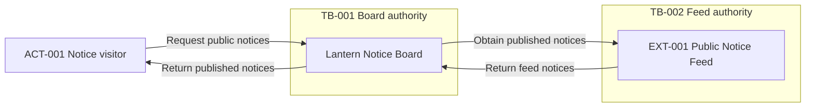

# Worked examples — system-context-diagram-generator

Original synthetic fixtures only; names describe invented roles and systems, not real organizations or people. Each response is a narrow context or routing excerpt, not a complete HLD, implementation claim, or guarantee. Expected responses are illustrations, not executed test results.
Authoring validation: this document's diagram was parsed and rendered locally with Mermaid 11.15.0 and visually inspected. That checks the example only; the hypothetical response below deliberately models a run with no parser/render evidence, and behavioral tests remain unexecuted.
Use [SKILL.md](./SKILL.md), [tests.md](./tests.md), [architecture principles](./references/common/architecture-principles.md), [contracts](./references/common/requirement-schema.md), [diagram guidelines](./references/common/diagram-guidelines.md), [orchestration](./references/orchestration.md), and [provenance](./references/SOURCES.md).
IDs are scoped to the supplied design. Copy the complete fixture when reusing an example; a displayed register always retains all required fields.

## Example 1: Public notice context without an HLD

**User prompt:** “Draw one system-context view of Lantern Notice Board. A visitor reads public notices; the board obtains them from Public Notice Feed. Show the supplied trust boundaries, not internal services. No protocol or numeric target is supplied.”
**Supplied evidence:** Design ID P5-CTX-A. SRC-001, FR-001, FR-002, ACT-001, EXT-001, TB-001, and TB-002 are declared below. There are no supplied CMP, FLW, or INT IDs; fixed alias SYS denotes the subject. Q-001 is reserved for the output's optional protocol question. Parser and renderer evidence is absent.

| Source ID | Description | Locator | Authority | Access status |
| --- | --- | --- | --- | --- |
| SRC-001 | Synthetic authorized notice brief and boundary register | fixture:notice-brief, scope/interactions | User-supplied fixture authority for this design only | Supplied inline; authorized |

| Requirement ID | Category | Requirement statement | Source | Priority | Status | Confidence | Architecture impact | Assumption or clarification required |
| --- | --- | --- | --- | --- | --- | --- | --- | --- |
| FR-001 | Functional (FR) | A visitor can read the board's published public notices. | SRC-001, interactions/read | Must | Confirmed | High; explicit fixture | Medium; human-to-subject interaction | None; capability is explicit |
| FR-002 | Functional (FR) | The board obtains published public notices from Public Notice Feed. | SRC-001, interactions/feed | Must | Confirmed | High; explicit fixture | High; external dependency | Q-001; protocol is nonessential to context |

| Entity ID | Kind | Name | Responsibility or meaning | Source or evidence class | Related requirement IDs |
| --- | --- | --- | --- | --- | --- |
| ACT-001 | Actor | Notice visitor | Initiates anonymous public reads; outside the board's authority | Confirmed; SRC-001, scope | FR-001 |
| EXT-001 | External system | Public Notice Feed | Feed operator owns and returns published public notices | Confirmed; SRC-001, scope | FR-002 |
| TB-001 | Trust boundary | Board authority | Separates visitor/feed input from board-controlled handling | Confirmed; SRC-001, boundaries | FR-001, FR-002 |
| TB-002 | Trust boundary | Feed authority | Feed operator controls the external source, not the board | Confirmed; SRC-001, boundaries | FR-002 |

SRC-001 also supplies: Lantern Notice Board is one subject owned by the board operator; scope is public notice reading only. Visitor queries, returned notices, feed queries, and feed results are Public (Confirmed). Both reads are anonymous. Query/return directions below are explicit; internal storage, identity systems, deployment, and detailed sequences are excluded, not implied absent in a real implementation.
**Expected activation:** Yes — a standalone authorized context brief is sufficient.
**Expected response:** The following context-only excerpt keeps source and requirement rows above unchanged.

#### Handoff
- Design ID: P5-CTX-A.
- Contract version: 1.0.0.
- Artifact: system-context-diagram-generator — system context view.
- Artifact status: Provisional; useful written context, but Not parser-validated.
- Baseline: SRC-001, fixture:notice-brief; version Unspecified because none was supplied.
- Evidence summary: Confirmed — supplied scope/entities/interactions; Inferred and Assumed — None, not needed; Proposed — this view for review; Unresolved — protocol in Q-001 and tool validation.
- Changed IDs: Added Q-001; no source/entity/requirement IDs changed; SYS is an alias, not a new component.
- Open questions: Q-001 Optional; protocol annotation only, no context decision blocked; active batch contains Q-001; deferred None because no others arise here.
- Validation: Written correspondence illustrated below; no parser/version or render evidence supplied; stakeholder review pending.
- Next handoff: container-diagram-generator receives these records and validation gaps after high-level-design-generator supplies the component baseline.

#### System Context
Subject: Lantern Notice Board. Alias: SYS. Purpose: make published public notices readable. Scope: FR-001 and FR-002 only. Boundary and ownership: board operator inside TB-001; ACT-001 outside; EXT-001 under TB-002. Source or evidence class: Confirmed scope, SRC-001; diagram remains a review proposal. The complete entity table is the supplied table above.

#### Context interaction register
| From ID | To ID | Purpose | Direction | Data and classification | Protocol and evidence class | Trust boundary IDs | Source | Related requirement IDs | Flow or integration IDs |
| --- | --- | --- | --- | --- | --- | --- | --- | --- | --- |
| ACT-001 | SYS (declared subject) | Request public notices | Visitor initiates toward board | Notice query; Public, Confirmed | Unresolved; Q-001, no transport evidence | TB-001 | SRC-001, interactions/read | FR-001 | None; no ordered-flow baseline supplied |
| SYS (declared subject) | ACT-001 | Return published notices | Board responds toward visitor | Notice content; Public, Confirmed | Unresolved; Q-001 | TB-001 | SRC-001, interactions/read | FR-001 | None; context-only exchange |
| SYS (declared subject) | EXT-001 | Obtain published notices | Board initiates toward feed | Notice query; Public, Confirmed | Unresolved; Q-001 | TB-001, TB-002 | SRC-001, interactions/feed | FR-002 | None; no integration contract supplied |
| EXT-001 | SYS (declared subject) | Return feed notices | Feed responds toward board | Notice content; Public, Confirmed | Unresolved; Q-001 | TB-002, TB-001 | SRC-001, interactions/feed | FR-002 | None; context-only exchange |

#### System Context Diagram

SYS is the single written subject; ACT_001, EXT_001, TB_001, and TB_002 map to the corresponding hyphenated IDs. The visitor crosses TB-001; both feed directions cross TB-001 and TB-002. These are authority changes, not asserted network isolation. All four public-data arrows are the written interactions; solid arrows indicate direction only, not sequence or transport. Scope is Confirmed by SRC-001; the view is Proposed for review. Internals are intentionally omitted and no protocol is asserted.

#### Reconciliation and validation
| Diagram item | Written record | Diagram-to-register result | Register-to-diagram result | Omission or correction |
| --- | --- | --- | --- | --- |
| SYS, ACT_001, EXT_001 | Subject declaration and ACT-001/EXT-001 | Each has a written meaning | Subject and both surrounding entities appear | None; no internal nodes required |
| TB_001, TB_002 | TB-001, TB-002 | Groupings reflect supplied authority | Both important crossings are shown | No claim about physical placement |
| Four labeled arrows | Four context interaction rows | Purpose/direction agree row by row | Every written interaction appears | None; no ordering is implied |

| Check | Result | Tool and version or evidence | Failure or check not run | Follow-up |
| --- | --- | --- | --- | --- |
| Aliases, scope, boundaries, interactions | Correspondence shown in this excerpt | Written fixture and diagram comparison | Stakeholder validation not run | Review both directions against SRC-001 |
| Mermaid syntax/parser | Not parser-validated | No parser/version evidence supplied | Parser check not run | Parse with an available local version |
| Render/readability | Not performed | No renderer evidence supplied | Visual inspection not run | Render and inspect arrow labels separately |

#### Questions and proposed deltas
| Question ID | Priority | Question | Why it matters | Answer options | Default assumption | Blocks | Status | Related requirement IDs |
| --- | --- | --- | --- | --- | --- | --- | --- | --- |
| Q-001 | Optional | Which transports, if any, may annotate these context exchanges? | Avoid claiming an unsupported protocol | Supply evidence; retain business-only labels | Unresolved; omit protocol labels | Only optional protocol annotation | Open | FR-001, FR-002 |

| Requirement ID | Component IDs | Decision IDs | Flow or integration IDs | Validation | Coverage status |
| --- | --- | --- | --- | --- | --- |
| FR-001 | None; subject has no CMP ID | None; no architecture choice made | None; context scope only | Actor exchange review and diagram checks pending | Covered |
| FR-002 | None; subject has no CMP ID | None; no protocol selected | None; context scope only | External exchange review and diagram checks pending | Covered |

Covered denotes proposal coverage only. Carry the full supplied Source, Structured requirements, and Entity records; Assumptions, Decisions, Risks, and substantive proposed deltas are None because this excerpt changes no architecture or policy.
#### Next steps
Keep parser/render and stakeholder gates visible. Pass context records to the container owner; request components from the HLD owner rather than allocating them here. HLD assembly, if requested, is limited to sections 10, 11, and 27.

## Example 2: Conflicting subject ownership

**User prompt:** “Use the notice fixture, but a second scope note calls Public Notice Feed part of the board. Draw a definite boundary despite the conflict.”
**Supplied evidence:** Copy Example 1's complete SRC-001/FR/entity fixture and its full open Q-001 record under P5-CTX-B. Add the full source record: Source ID: SRC-002; Description: conflicting synthetic scope note; Locator: fixture:notice-scope, ownership; Authority: supplied note, no precedence over SRC-001 authorized; Access status: supplied inline, authorized. SRC-002 says EXT-001 is board-owned and inside TB-001; SRC-001 says independently operated under TB-002. No CMP/FLW/INT IDs exist. Q-002 is the new output question.
**Expected activation:** Yes — context ownership reconciliation is in scope, but the view is Blocked.
**Expected response:** “One subject, Lantern Notice Board, is known. Placement of EXT-001 is contradictory, so no definite complete context diagram is emitted. Keep FR-001's visitor-to-subject textual exchange independently; FR-002's boundary-dependent exchange remains blocked. Neither recency nor an assumption authorizes folding EXT-001 into the subject.”
Question ID: Q-002; Priority: Critical; Question: Which ownership statement for EXT-001 is authoritative?; Why it matters: determines the subject perimeter and trust crossings; Answer options: retain independent feed; approve internal ownership through baseline revision; Default assumption: None — blocked; Blocks: EXT-001 placement and FR-002 crossing; Status: Open; Related requirement IDs: FR-002.
Active questions are Q-002 Critical then inherited Q-001 Optional; deferred None because only these two are needed. Proposed delta: requirement-analyzer and high-level-design-generator must resolve SRC-001/SRC-002 ownership for EXT-001, TB-001, and TB-002, with authorized scope evidence before stage 5 reruns. Retain both sources and mark affected trace coverage Partial; do not manufacture an accepted decision or a rendered view.

## Example 3: Explicit product selection is not context generation

**User prompt:** “Choose Azure products for the notice system, not another context diagram.”
**Supplied evidence:** Copy Example 1's SRC-001, FR-001/FR-002, ACT-001/EXT-001, and TB-001/TB-002 under P5-CTX-C; no CMP/FLW/INT baseline or baseline approval exists. Add Source ID: SRC-003; Description: synthetic explicit mapping request; Locator: fixture:mapping-request; Authority: user request for Azure mapping only; Access status: supplied inline, authorized. No new architecture IDs are introduced.
**Expected activation:** No — explicit mapping is owned by technology-mapper, not this skill.
**Expected response:** “Context generation is Not applicable to this request. Azure mapping has been requested, but the approved neutral component baseline is missing. Request that baseline and approval through high-level-design-generator before technology-mapper can recommend products. Preserve the existing context evidence; no products, components, new diagram, or complete HLD are supplied by this routing response.”