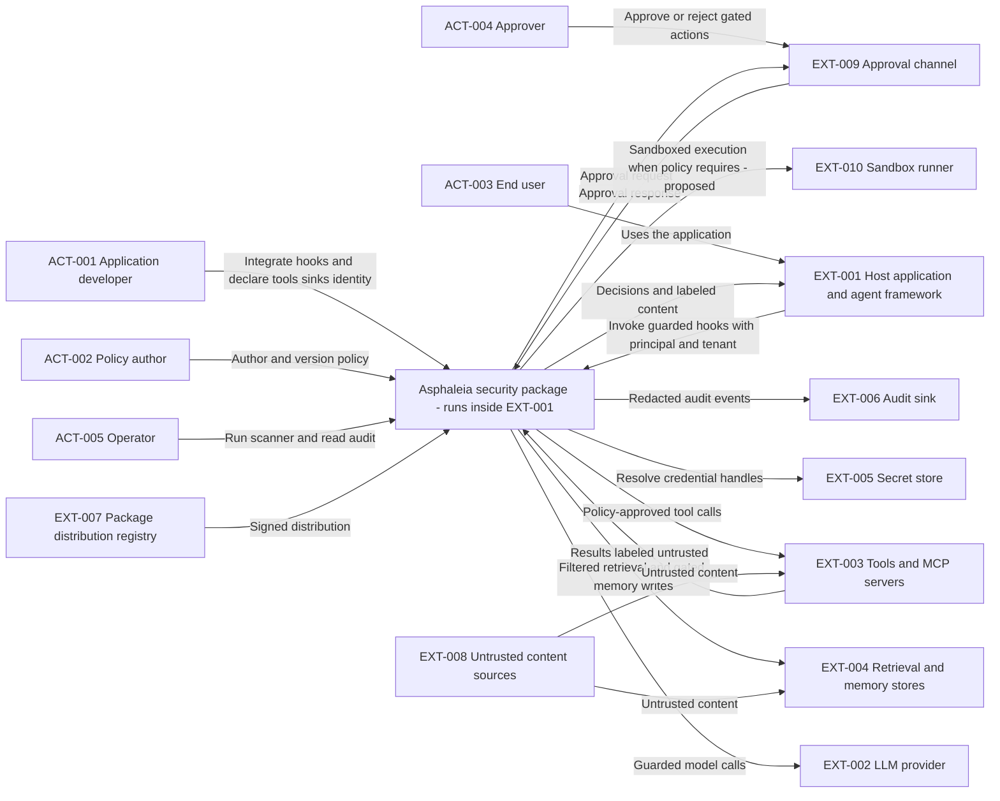
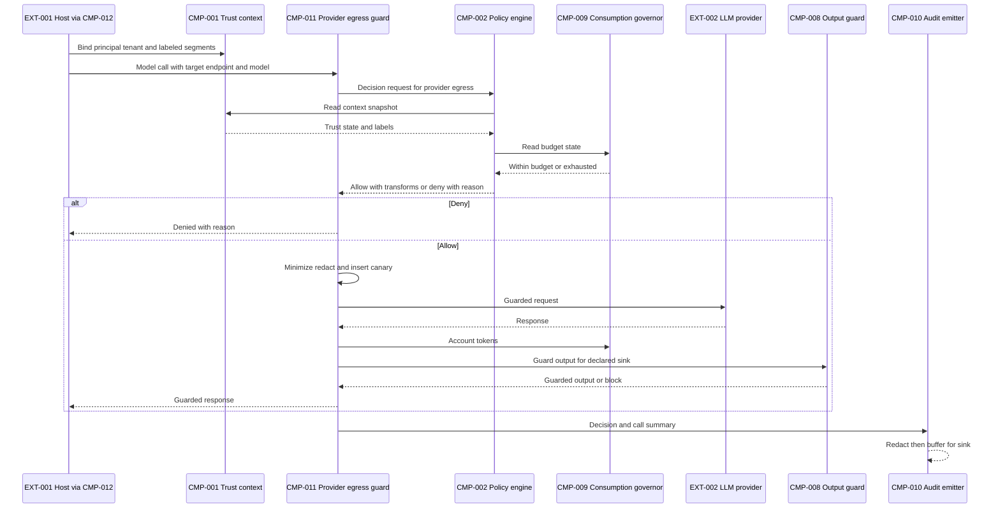
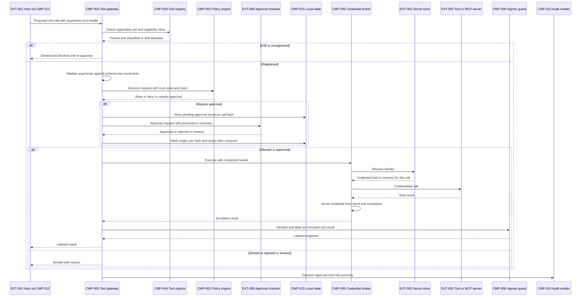
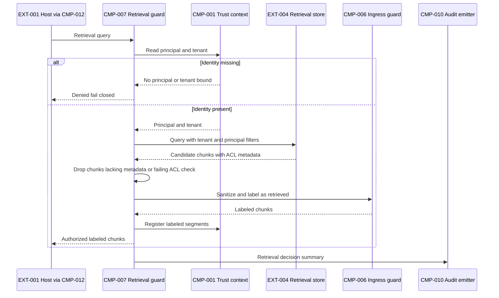

Design ID: ASPHALEIA. Contract version: 1.0.0. Artifact: high-level-design-generator — assembled high-level design for an installable Python security package for AI-enabled applications. Artifact status: Provisional — all 28 sections populated; context, container and flow views are assembled by this owner and parsed with mermaid 12.0.0 (5 of 5 blocks); the security review is merged from [05-security-review.md](05-security-review.md); reliability, observability and final architecture reviews have not been executed as separate specialist passes (their sections carry owner-drafted content marked Proposed). Baseline: [01-requirements-baseline.md](01-requirements-baseline.md), [02-architecture-drivers.md](02-architecture-drivers.md), [03-architecture-style.md](03-architecture-style.md), [00-concern-isolation.md](00-concern-isolation.md).

Evidence summary: Confirmed — CON-001, CON-004 framing, BR-001; Inferred — requirements FR-001–FR-022, drivers, applicability; Assumed — ASM-001–ASM-008; Proposed — every CMP, TB, DEP, FLW, INT, DEC, control and mitigation below; Unresolved — numeric latency, budgets, retention, threat-model boundary (Q-001), framework list (Q-002). Changed IDs: added CMP-001–CMP-015, TB-001–TB-007 (detailed), DEP-001–DEP-004, FLW-001–FLW-007, INT-001–INT-008, DEC-005–DEC-010, DEC-013–DEC-014; merged SEC-001–SEC-009 and RISK-001–RISK-012. Open questions: active batch Q-001–Q-007 unchanged; queued Q-008–Q-015 (Q-015 added by the security review). Validation: register cross-checks by reading; Mermaid parse status in section 28; no benchmark, prototype, or specialist reliability/operations review run. Next handoff: stakeholder validation of Q-001–Q-007 and ADR review ([06-architecture-decision-records.md](06-architecture-decision-records.md)); `architecture-reviewer` final assessment not yet requested.

This design is a proposal for stakeholder validation. It makes no guarantee of security, compliance, availability, performance or cost, and no statement below is a certification.

# High-Level System Design

## 1. Executive Summary

Asphaleia is proposed as a single installable Python package that an AI-enabled application imports to enforce the package-addressable subset of AI-SaaS security concerns identified in [00-concern-isolation.md](00-concern-isolation.md): nine concerns fully addressable, fourteen partially, three as evidence enablers, four not addressable and handed to other owners. The package places deterministic controls at the seven control points a library can own — context assembly, tool invocation, retrieval, memory writes, model output, credential use, and audit emission — and treats text-classification "guardrails" strictly as advisory signals (BR-001).

The core model is provenance labeling of every context segment (CMP-001) feeding a default-deny, versioned policy engine (CMP-002) that decides every tool call (CMP-003), retrieval (CMP-007), output sink (CMP-008) and provider egress (CMP-011). Credentials are brokered so they never enter model context (CMP-005). Tool manifests are pinned and drift-blocked (CMP-004). Consumption is budgeted (CMP-009). Decisions are audited with redaction (CMP-010). Adapters (CMP-012) attach these hooks to frameworks without application rewrite, and a CLI (CMP-014) scans configuration offline and replays policy in dry-run.

Key alternatives: an out-of-process gateway (rejected for this scope — loses in-process control points) and a library-plus-sidecar hybrid (Deferred, DEC-011, pending the threat-model answer Q-001). Confidence is Medium: the control points and the boundary they create are well evidenced by public incident history (SRC-005, SRC-006); numeric targets, framework coverage and the host-compromise boundary are Unresolved. The material limitation is honest and structural: an in-process library is cooperative (CON-003) — it protects only what the host routes through it (SEC-001).

## 2. Business Objective

Give teams building LLM-powered and agentic Python applications an installable control layer that (a) prevents untrusted content from turning into exfiltration or unintended actions, (b) keeps credentials and tenant data out of reach of the model, (c) bounds consumption, and (d) produces auditable decisions — without rewriting the application or mandating a vendor (SRC-001, SRC-007 §4.1). Supplied success criteria: none numeric. Scope owner: requesting user (SRC-001); approval authority not stated.

## 3. Scope

### In Scope

- Provenance labeling and tenant/principal context: FR-001, FR-021, NFR-009.
- Capability policy, trifecta rule, argument validation, approvals: FR-002, FR-003, FR-004, FR-005, BR-001, BR-002, BR-003.
- Tool/MCP trust management: FR-006, FR-007, FR-008.
- Credential brokering: FR-009.
- Ingress sanitization and advisory detection: FR-010, FR-011.
- Retrieval authorization and memory-write gating: FR-012, FR-013.
- Output guard and redaction: FR-014, FR-015.
- Consumption governor: FR-016.
- Audit emission: FR-017, BR-004.
- Provider egress guard: FR-018.
- CLI scanner and dry-run: FR-019, FR-022.
- Framework adapters: FR-020.
- Qualities and constraints: NFR-001–NFR-010, CON-001–CON-005.

### Out of Scope

Confirmed exclusions (CON-004; SRC-007 §4.2): OS-level sandboxing and browser isolation (integration port INT-008 only); network egress enforcement independent of the host process; vendor training terms, sub-processor and indemnity contracts; shadow-AI and fleet discovery; source-system permission hygiene and IdP scope grants; model provenance, training-data poisoning and model robustness; regulatory assessment and certification; factual correctness of model output.

Proposed deferrals (not exclusions): out-of-process strict mode (DEC-011, Deferred on Q-001); bundled ML detector (DEC-012, Deferred on Q-004/Q-007); behavioral evaluation harness for model-change regression (not a requirement; noted in SRC-007 row 29).

## 4. Stakeholders and Actors

Inherited from the baseline without new personas or authority. Stakeholders: requesting user (scope), adopting development teams, security engineering, end users as data subjects, platform/legal/compliance functions owning out-of-scope controls.

| Entity ID | Kind | Name | Responsibility or meaning | Source or evidence class | Related requirement IDs |
| --- | --- | --- | --- | --- | --- |
| ACT-001 | Actor | Application developer | Integrates the package; declares tools, sinks, identity binding | SRC-001; Inferred | FR-020, FR-004, FR-014 |
| ACT-002 | Actor | Policy author | Writes, versions, tests policy; reviews scanner findings | SRC-002; Inferred | FR-002, FR-019, FR-022 |
| ACT-003 | Actor | End user (principal) | Person the application acts for; identity and tenant supplied by host | SRC-002; Inferred | FR-012, FR-021 |
| ACT-004 | Actor | Approver | Approves or rejects gated actions | SRC-004; Inferred | FR-005, BR-003 |
| ACT-005 | Actor | Operator | Runs scanner, consumes audit, tunes budgets | SRC-002 §3; Inferred | FR-016, FR-017, FR-019 |
| EXT-001 | External system | Host application and agent framework | Imports and runs the package in-process | SRC-001; Confirmed existence | FR-020, CON-003 |
| EXT-002 | External system | LLM provider | Model inference endpoint(s), vendor Unresolved | SRC-002 | FR-018, CON-002 |
| EXT-003 | External system | Tools and MCP servers | Functions, MCP servers, external APIs the agent calls | SRC-002 §2 | FR-002–FR-009 |
| EXT-004 | External system | Retrieval and memory stores | Vector stores, indexes, long-term memory | SRC-002 §1 | FR-012, FR-013 |
| EXT-005 | External system | Secret store | Holds real credentials | SRC-002 §2; Inferred | FR-009 |
| EXT-006 | External system | Audit sink | Receives security events | SRC-002 §3; Inferred | FR-017 |
| EXT-007 | External system | Package distribution registry | Source of the installed package | CON-001; Inferred | NFR-002 |
| EXT-008 | External system | Untrusted content sources | Web, email, documents, tickets reaching the model via EXT-003/EXT-004 | SRC-005 | FR-001, FR-003, FR-010 |
| EXT-009 | External system | Approval channel | Console, chat, callback or UI for approvers (Q-005) | FR-005; Inferred | FR-005 |
| EXT-010 | External system | Sandbox runner | OS/container isolation for code/shell tools; port only | CON-004 | FR-002 |

Approval authority, support ownership and legal authority remain Unassigned (Q-014).

## 5. Requirements Summary

The complete nine-field register is [01-requirements-baseline.md](01-requirements-baseline.md); every ID is summarized here and traced in section 27. Priority is Unspecified for all records (Q-009 queued); ASM-007 proposes release tiering.

### Functional Requirements

| Requirement ID | Summary |
| --- | --- |
| FR-001 | Provenance and trust labels on every context segment, propagated through the session |
| FR-002 | Declarative capability policy before every tool/MCP call; default deny |
| FR-003 | Lethal-trifecta rule: untrusted content present blocks or gates external-communication and consequential-write tools |
| FR-004 | Tool-argument validation against schema and policy constraints |
| FR-005 | Human approval gate bound to the exact call, single-use, expiring, showing provenance |
| FR-006 | Tool/MCP manifest pinning and drift blocking |
| FR-007 | Manifest scan for hidden-instruction patterns |
| FR-008 | Toxic tool-combination analysis |
| FR-009 | Credential brokering with opaque handles; secrets never in context, results, or logs |
| FR-010 | Structural sanitization of untrusted content |
| FR-011 | Pluggable advisory injection detectors emitting signals only |
| FR-012 | Retrieval authorization with tenant/principal filters; fail closed |
| FR-013 | Provenance-gated memory writes |
| FR-014 | Sink-aware output guard: encoding, URL allow-list, schema validation |
| FR-015 | Redaction of secrets and sensitive patterns; canary echo detection |
| FR-016 | Budgets for tokens, cost, time, tool calls, iterations; loop detection |
| FR-017 | Structured, redacted, correlated audit events to a sink port |
| FR-018 | Provider egress guard: endpoint/model allow-list, pinning, minimization, retention options |
| FR-019 | CLI scanner for configs, credentials, policy lint |
| FR-020 | Framework adapters attaching without application rewrite |
| FR-021 | Principal/tenant context propagation across sync and async; fail closed |
| FR-022 | Dry-run mode recording would-be decisions |
| BR-001 | Advisory detection is never the sole basis to allow a consequential action |
| BR-002 | Default deny for unregistered tools, undeclared capabilities, unknown sinks, missing identity |
| BR-003 | Approvals single-use, content-bound, expiring |
| BR-004 | No data leaves the process on the package's own initiative |

### Non-Functional Requirements

| Requirement ID | Summary |
| --- | --- |
| NFR-001 | Low hot-path latency overhead; numeric Unresolved (Q-004) |
| NFR-002 | Minimal dependencies, signed releases, SBOM, pinned extras, reproducible build |
| NFR-003 | Fail closed on enforcement-path errors; fail-open only by explicit policy |
| NFR-004 | No credentials, personal data or raw untrusted content in logs, exceptions, telemetry |
| NFR-005 | Sync and asyncio support across the Python range (ASM-001) |
| NFR-006 | Unit-testable policies; conformance and attack-corpus suites |
| NFR-007 | Extension only via documented ports |
| NFR-008 | Deterministic, versioned policy evaluation |
| NFR-009 | Concurrency-safe context propagation |
| NFR-010 | Backward-compatible schema evolution |

No availability, throughput, latency, RTO or RPO values were supplied; they remain Unresolved rather than assumed.

### Constraints

| Requirement ID | Summary |
| --- | --- |
| CON-001 | Installable Python package from a package index |
| CON-002 | Neutral to provider, framework, vector store, secret store, sink |
| CON-003 | Runs in the host process; cannot enforce against the host |
| CON-004 | Out-of-process concerns out of scope; integration points or evidence only |
| CON-005 | No reliance on model-provider behavior guarantees |

## 6. Assumptions

| Assumption ID | Assumption | Reason | Consequence if false | Validation required | Status | Related IDs |
| --- | --- | --- | --- | --- | --- | --- |
| ASM-001 | Python floor 3.10 (planning); commitment Unresolved | Context variables and typing features | Adapter/typing changes; raise floor or add shims | Q-003 | Proposed | NFR-005 |
| ASM-002 | Host process cooperative and uncompromised | A library cannot defend against its host | In-process controls bypassable; adopt strict mode (DEC-011) | Q-001; threat-model review | Proposed | CON-003, FR-009, SEC-001 |
| ASM-003 | Host supplies principal/tenant identity and retrieval ACL metadata | Retrieval authorization needs an entitlement authority | Retrieval guard fails closed; fallback verify-presence mode | Adopter interviews; conformance tests | Proposed | FR-012, FR-021, DEC-007 |
| ASM-004 | Low single-digit ms per hook excluding optional ML is the planning envelope | No latency target supplied | Move detectors asynchronous/sampled | Q-004; benchmark | Proposed | NFR-001, DEC-012 |
| ASM-005 | Multi-tenant hosts in scope | Listed concern | Tenant features become optional | Q-010 | Proposed | FR-021, FR-012 |
| ASM-006 | SRC-002 is an authorized concern inventory | User built SRC-001 on it | Requirement set changes | User review of SRC-007 | Proposed | SRC-002 |
| ASM-007 | Release tiering: enforcement core first (SRC-007 §4.1 items 1, 2, 3, 5, 8, 9, 10, 13), then items 4, 6, 7, 11, 12 | No priorities supplied | Scope reorders; no architectural change | Q-009 | Proposed | All FR |
| ASM-008 | Small pluggable local state with file/embedded default is acceptable | Pins, approvals, counters need persistence | Host-supplied store or stateless re-pin | Adopter feedback; Q-012 | Proposed | CMP-015, DEC-013 |

## 7. Open Questions

Full nine-field records are in [01-requirements-baseline.md](01-requirements-baseline.md). Active batch (seven, unchanged):

| Question ID | Priority | Decision consequence | Default assumption |
| --- | --- | --- | --- |
| Q-001 | Important | Host compromise in threat model decides DEC-011 | Excluded (ASM-002) |
| Q-002 | Important | Framework list sizes CMP-012 | MCP client, provider HTTP, generic function-tool adapters |
| Q-003 | Important | Python floor and sync/async | 3.10+, both (ASM-001) |
| Q-004 | Important | Latency budget decides DEC-012 | Unresolved numeric; ASM-004 planning |
| Q-005 | Important | Approval channel shapes INT-007 | Callback and console adapters |
| Q-006 | Optional | Signing authority for DEC-010 evidence | Unresolved |
| Q-007 | Optional | Bundled versus optional ML detector | Optional extra |

Queued: Q-008 retention and budget defaults; Q-009 priorities; Q-010 multi-tenancy in first release; Q-011 workload envelope; Q-012 multi-process approvals/budgets; Q-013 audit residency; Q-014 ownership and licensing; Q-015 cross-process agent identity (raised by the security review). No Critical question; no decision blocked.

## 8. Architecture Drivers

Full register with quality scenarios and tensions: [02-architecture-drivers.md](02-architecture-drivers.md).

| Driver ID | Driver | Related requirement IDs | Evidence status | Impact rank | Architectural effect | Missing evidence | Validation required |
| --- | --- | --- | --- | --- | --- | --- | --- |
| DRV-001 | Untrusted content steers actions | FR-001–FR-003, FR-010, FR-011, FR-014, BR-001, CON-005 | Pattern Confirmed; impact Inferred | High | Provenance model; enforcement at TB-002/TB-003; detection decoupled | None | Attack-corpus conformance |
| DRV-002 | Attach to any framework without rewrite | FR-020, NFR-005, NFR-007, CON-002 | Inferred | High | Hexagonal core; ports; adapters as extras | Q-002 | Adapter conformance |
| DRV-003 | Deterministic fail-closed enforcement | BR-001, BR-002, NFR-003, NFR-008, FR-011, FR-022 | BR-001 Confirmed | High | Pure versioned policy evaluation; signals only from detectors | None | Fault injection |
| DRV-004 | Credentials unreachable from context | FR-009, FR-015, NFR-004 | Inferred | High | Broker-owned egress; handles; redaction | Q-001 | Canary secrets |
| DRV-005 | Cooperative in-process limit | CON-003, ASM-002 | Inferred | High | Documented boundary; conformance check; Deferred strict mode | Q-001 | Guarded call-site coverage |
| DRV-006 | Hot-path latency | NFR-001, FR-010, FR-011, FR-014 | Target Unresolved | Medium (conditional) | Compiled policy; inline structural checks; async ML | Q-004, Q-011 | Benchmark |
| DRV-007 | Package is a supply-chain item | NFR-002, BR-004, CON-001 | Inferred | High | Minimal deps, signing, SBOM, no default egress | Q-006 | SBOM and egress tests |
| DRV-008 | Tenant/principal correctness under concurrency | FR-012, FR-021, NFR-009 | Inferred | High | Context variables; fail closed | Q-010 | Concurrency tests |
| DRV-009 | Auditability without leakage | FR-017, NFR-004 | Inferred | Medium | Versioned events; redaction before emission | Q-008, Q-013 | Redaction tests |
| DRV-010 | Bounded consumption | FR-016 | Inferred | Medium | Accounting at TB-003/TB-006 | Q-008 | Budget tests |
| DRV-011 | Tool manifest volatility | FR-006–FR-008 | Inferred | Medium | Pinned registry; block-on-drift | Q-012 | Drift tests |
| DRV-012 | Staged rollout | FR-019, FR-022, NFR-006, NFR-010 | Inferred | Medium | Dry-run; CLI; schema versions | None | Dry-run parity |
| DRV-013 | Human approval binding | FR-005, BR-003 | Inferred | Medium | Approval port; hash-bound records | Q-005 | Replay tests |

## 9. Recommended Architecture Style

From [03-architecture-style.md](03-architecture-style.md): Candidate A — a modular-monolith library (deployment), hexagonal core with layered dependency direction (organization), synchronous inline enforcement with in-process event emission for audit only (interaction), batch CLI for scanning and replay (processing); runtime is the host's; data-centric emphasis on provenance without host-data authority. Microservices, SOA, serverless and streaming are Not applicable for a library. Hybrid (library plus strict-mode sidecar) is Deferred (DEC-011). Decisions: DEC-001–DEC-004 Proposed; DEC-011, DEC-012 Deferred.

## 10. System Context

Subject: the Asphaleia package executing inside one host application process (EXT-001), on behalf of the host's principals (ACT-003). It is integrated by ACT-001, governed by policy from ACT-002, consults ACT-004 through an approval channel (EXT-009), and is operated by ACT-005. It mediates the host's interactions with LLM providers (EXT-002), tools and MCP servers (EXT-003), retrieval and memory stores (EXT-004), a secret store (EXT-005), an audit sink (EXT-006), and optionally a sandbox runner (EXT-010). Untrusted content (EXT-008) never reaches the package directly; it arrives as tool results or retrieved documents. The package is installed from a distribution registry (EXT-007).

Trust boundaries crossed: TB-001 untrusted content into context; TB-002 model output into sinks; TB-003 agent into tool execution; TB-004 credentials; TB-005 principal/tenant; TB-006 application to provider; TB-007 host to package (cooperative — the host decides what to route through the package).

## 11. System Context Diagram

The subject is one box; its modules are not shown. Arrows show the initiating direction of a conceptual interaction, not a protocol; no protocol is confirmed for any external system. EXT-008 is drawn feeding EXT-003 and EXT-004 to show that untrusted content enters the subject only through tool results and retrieval. ACT-003 interacts with the host, not the package directly; the host carries principal and tenant into every hook (TB-005). The EXT-010 edge is labeled proposed because the sandbox runner is an integration port only. Parser status: parsed with mermaid 12.0.0 (flowchart-v2); not rendered or visually inspected.

## 12. Logical Component Architecture

Responsibility groupings (all logical modules inside one deployable package, DEC-001; none is an independently deployed service):

- **Domain core** (framework-free): CMP-001 Trust Context, CMP-002 Policy Engine, CMP-005 Credential Broker, CMP-009 Consumption Governor, and the guard logic of CMP-003, CMP-006, CMP-007, CMP-008, CMP-011. Owns provenance labels, decisions, budgets.
- **Registry and configuration**: CMP-004 Tool Registry and Trust Manager, CMP-013 Policy and Configuration Loader, CMP-015 Local State Store. Owns pins, policy versions, approval records, counters.
- **Telemetry**: CMP-010 Audit Emitter. Owns event schema; delivery through INT-005.
- **Adapters**: CMP-012 Framework Adapters bind hooks to frameworks and implement ports INT-002–INT-008 for concrete external systems; shipped as optional extras.
- **Offline tooling**: CMP-014 CLI Scanner reuses CMP-004, CMP-013 and CMP-002 in dry-run.

Interaction is synchronous and in-process for every decision (DEC-003). Audit emission is an in-process event hook with a bounded buffer; it never carries a decision. Dependency direction: adapters depend on hooks, hooks on domain; the domain imports no adapter or framework module (DEC-002). Authoritative data: the package owns only DATA-002, DATA-003 (loaded copy), DATA-006, DATA-007 and transient DATA-001 labels; ACL truth (DATA-009), memory (DATA-010), credentials (DATA-004) and audit retention (DATA-005 after emission) belong to external owners. Logical boundaries do not imply deployment boundaries: everything except CMP-014 runs inside DEP-001.

## 13. Container Diagram

```mermaid
flowchart TB
  subgraph DEP_001["DEP-001 Host application process - EXT-001"]
    HOST["Host code and agent framework"]
    subgraph SYS["Asphaleia package"]
      CMP_012["CMP-012 Framework adapters"]
      CMP_001["CMP-001 Trust context"]
      CMP_002["CMP-002 Policy engine"]
      CMP_003["CMP-003 Tool gateway"]
      CMP_004["CMP-004 Tool registry and trust manager"]
      CMP_005["CMP-005 Credential broker"]
      CMP_006["CMP-006 Ingress content guard"]
      CMP_007["CMP-007 Retrieval and memory guard"]
      CMP_008["CMP-008 Output and redaction guard"]
      CMP_009["CMP-009 Consumption governor"]
      CMP_010["CMP-010 Audit emitter"]
      CMP_011["CMP-011 Provider egress guard"]
      CMP_013["CMP-013 Policy and configuration loader"]
      CMP_015["CMP-015 Local state store"]
    end
  end
  subgraph DEP_002["DEP-002 Operator workstation or CI job"]
    CMP_014["CMP-014 CLI scanner"]
  end
  EXT_002["EXT-002 LLM provider"]
  EXT_003["EXT-003 Tools and MCP servers"]
  EXT_004["EXT-004 Retrieval and memory stores"]
  EXT_005["EXT-005 Secret store"]
  EXT_006["EXT-006 Audit sink"]
  EXT_009["EXT-009 Approval channel"]
  EXT_010["EXT-010 Sandbox runner"]

  HOST -->|Model tool retrieval and output hooks| CMP_012
  CMP_012 -->|Bind principal tenant and labels| CMP_001
  CMP_012 -->|Model call| CMP_011
  CMP_012 -->|Tool call| CMP_003
  CMP_012 -->|Retrieval and memory write| CMP_007
  CMP_012 -->|Model output for a declared sink| CMP_008
  CMP_003 -->|Lookup pin and capability classes| CMP_004
  CMP_003 -->|Decision request| CMP_002
  CMP_003 -->|Account tool call| CMP_009
  CMP_003 -->|Approval request and response| EXT_009
  CMP_003 -->|Execute approved call| EXT_003
  CMP_003 -->|Sandboxed execution when required| EXT_010
  CMP_003 -->|Result to label and sanitize| CMP_006
  CMP_005 -->|Resolve handle| EXT_005
  CMP_005 -->|Credentialed outbound call| EXT_003
  CMP_006 -->|Labeled segments| CMP_001
  CMP_007 -->|Filtered query and gated write| EXT_004
  CMP_007 -->|Decision request| CMP_002
  CMP_011 -->|Decision request| CMP_002
  CMP_011 -->|Minimized model call| EXT_002
  CMP_011 -->|Account tokens| CMP_009
  CMP_008 -->|Decision request| CMP_002
  CMP_002 -->|Context snapshot| CMP_001
  CMP_002 -->|Compiled policy| CMP_013
  CMP_002 -->|Decision records| CMP_010
  CMP_004 -->|Pins| CMP_015
  CMP_003 -->|Approval records| CMP_015
  CMP_009 -->|Counters| CMP_015
  CMP_010 -->|Redact before emit| CMP_008
  CMP_010 -->|Events| EXT_006
  CMP_014 -->|Scan configs lint policy replay dry-run| CMP_013
```

Scope: one host process (DEP-001) containing the package and its logical modules, plus the offline CLI in DEP-002. Aliases map to CMP/EXT IDs with underscores. Trust crossings: every edge leaving SYS to an EXT node crosses a trust boundary (TB-003 to EXT-003/EXT-010, TB-004 to EXT-005, TB-006 to EXT-002, TB-005 into EXT-004 filtering, TB-001 on results returning from EXT-003/EXT-004 which are routed to CMP-006, TB-002 at CMP-008). TB-007 is the HOST to CMP-012 edge: the host decides which calls it routes. Omitted for readability: EXT-001 as a separate node (it is DEP-001), EXT-007 (install-time only), EXT-008 (enters via EXT-003/EXT-004), ACT nodes, and CMP-014's read of tool config files. No cache, queue, database or gateway is added; CMP-015 is a small local state store, not a database service. All components are Proposed. Parser status: parsed with mermaid 12.0.0 (flowchart-v2); not rendered or visually inspected.

## 14. Component Responsibilities

All components are Proposed logical modules within one deployable package (DEC-001). CMP-014 is a console entry point of the same distribution; CMP-015 is a storage responsibility behind a port, not a service.

| Component ID | Component name | Responsibility | Inputs | Outputs | Dependencies | Data owned | Scaling considerations | Security considerations | Failure considerations | Related requirement IDs |
| --- | --- | --- | --- | --- | --- | --- | --- | --- | --- | --- |
| CMP-001 | Trust Context | Hold per-request principal, tenant, session and correlation identifiers; register provenance-labeled segments; derive trust state (untrusted content present, sources); propagate via context variables and explicit copies into executors | Identity binding from CMP-012; labeled segments from CMP-006, CMP-007, CMP-003 | Context snapshot for CMP-002; labels and correlation for CMP-010 | None | DATA-001 labels (transient), correlation IDs | Per-request in-memory; linear in segments | Labels immutable once set; no raw content retained beyond the call; missing context denies (BR-002) | Absent or corrupted context: guarded operations deny; audit records the reason | FR-001, FR-021, NFR-009, BR-002 |
| CMP-002 | Policy Engine | Evaluate compiled, versioned declarative policy over action, capability classes, trust state, principal/tenant, argument constraints, detector signals and budget state; return allow, deny, require-approval or transform with reasons and policy version; dry-run mode | Evaluation requests from CMP-003, CMP-007, CMP-008, CMP-011; signals from CMP-006; budgets from CMP-009; compiled policy from CMP-013 | Decision records to callers and CMP-010 | CMP-001, CMP-013 | Compiled policy (in-memory copy of DATA-003) | Pure evaluation; compile once per version | Default deny; deterministic; policy integrity verified at load; fail closed on error (NFR-003) | Load or evaluation error denies all guarded operations and audits; dry-run never enforces | FR-002, FR-003, FR-022, BR-001, BR-002, NFR-003, NFR-008, NFR-010 |
| CMP-003 | Tool Gateway | Intercept every tool/function/MCP call: check registration and drift (CMP-004), validate arguments (FR-004), request decision (CMP-002), obtain and verify approval (INT-007, DATA-007), account the call (CMP-009), pass credential handles to CMP-005 for credentialed calls, execute via INT-003 or INT-008, route results to CMP-006 | Tool call from CMP-012; approval responses from EXT-009 | Executed or denied call; labeled results; events | CMP-001, CMP-002, CMP-004, CMP-005, CMP-006, CMP-009, CMP-015 | DATA-007 approval records (via CMP-015) | Per-call; approval waits are asynchronous | Enforces TB-003; approval bound to hash of tool, arguments, principal, provenance digest and policy version, single-use, expiring (BR-003); arguments never logged raw | Approval channel timeout denies (numeric Unresolved); registry unavailable denies; execution errors return labeled error to host | FR-002–FR-005, FR-009, FR-016, BR-003 |
| CMP-004 | Tool Registry and Trust Manager | Register tools and MCP servers; compute and pin manifest hash; detect drift and block until re-approval; scan manifests for hidden-instruction patterns; derive capability classes (read, write, external-communication, code-execution) from declarations and policy overrides; analyze toxic combinations | Manifests from CMP-012/EXT-003; overrides from CMP-013 | Pin state, capability classes, scan and combination reports | CMP-013, CMP-015 | DATA-002 pins | Per registration; cached per session | Blocks on drift; scan results are advisory signals to policy (BR-001) | Missing pin store denies newly seen tools; scan failure recorded as signal absent | FR-006, FR-007, FR-008 |
| CMP-005 | Credential Broker | Resolve opaque handles to credentials via INT-004 only inside the outbound call it performs; inject into transport; scrub credentials from responses and exceptions; hold in memory only for the call | Handle and request from CMP-003 or CMP-011 | Response with credentials scrubbed | CMP-008 (scrub), INT-004 | None persisted; DATA-004 transient | Per call | Enforces TB-004; handles are non-secret; never logs headers | Secret store unavailable denies credentialed calls (fail closed) | FR-009, NFR-004, BR-004 |
| CMP-006 | Ingress Content Guard | Sanitize content crossing TB-001 (tool results, retrieved documents, external messages): strip or flag hidden text, invisible characters, homoglyph and encoding tricks; enforce size limits; run advisory detectors via the detector port; label segments with provenance | Raw content from CMP-003, CMP-007, CMP-012 | Sanitized labeled segments to CMP-001; signals (DATA-008) to CMP-002 | CMP-001, detector port | DATA-008 (transient) | Inline structural checks; detectors optional and asynchronous by default (DEC-012) | Never marks content trusted; detector output is a signal only | Detector failure yields signal absent; oversize content truncated or rejected per policy | FR-001, FR-010, FR-011 |
| CMP-007 | Retrieval and Memory Guard | Add principal and tenant filters to retrieval queries; post-filter results against host-supplied ACL metadata (DATA-009); fail closed when identity or metadata is missing; label results; gate memory writes through CMP-002 by provenance | Queries and writes from CMP-012; results from EXT-004 | Filtered labeled results; allowed or denied writes | CMP-001, CMP-002, CMP-006, INT-006 | None (consumes DATA-009, DATA-010) | Per query; post-filter linear in results | Enforces TB-005; does not own ACL truth (DEC-007) | Missing metadata denies retrieval; store unavailable returns error to host | FR-012, FR-013, FR-021, BR-002 |
| CMP-008 | Output and Redaction Guard | Guard model output for a declared sink: encode for HTML/markdown, parameterize for SQL/shell sinks, enforce URL, image and link allow-lists, validate structured output against schema; shared redaction of secrets and sensitive patterns for outputs, tool results and events; detect canary echo | Model output and sink declaration from CMP-012; redaction requests from CMP-003, CMP-005, CMP-010 | Guarded output or denial; redacted text | CMP-002 | Redaction pattern set (from DATA-003) | Linear in output size | Enforces TB-002; unknown sink denies (BR-002) | Schema mismatch denies or requests regeneration per policy | FR-014, FR-015, NFR-004 |
| CMP-009 | Consumption Governor | Account tokens, estimated cost, wall time, tool calls and iterations per request, session and tenant; detect loops (repeated identical calls); signal deterministic termination with reason | Accounting events from CMP-003, CMP-011 | Budget state to CMP-002; termination signal to host | CMP-001, CMP-015 | DATA-006 counters | In-memory hot counters, periodic persistence; multi-process scope Unresolved (Q-012) | Budget bypass possible only via host bypass (SEC-001) | Counter store loss resets budgets — documented degradation | FR-016 |
| CMP-010 | Audit Emitter | Build versioned structured events for decisions, tool calls and result summaries, approvals, budget events, detections, drift blocks; redact via CMP-008; correlate via CMP-001; buffer and deliver through INT-005 with explicit drop or deny semantics | Records from CMP-002, CMP-003, CMP-004, CMP-009 | Events to EXT-006 | CMP-001, CMP-008, INT-005 | Event schema; buffer (transient) | Bounded buffer; asynchronous delivery | Redaction before emission; no outbound path unless a sink adapter is configured (BR-004) | Sink unavailable: buffer, then drop with counter or deny guarded operations per policy | FR-017, NFR-004, NFR-010, BR-004 |
| CMP-011 | Provider Egress Guard | Enforce provider endpoint and model allow-list and pin; alert on model change; apply minimization and redaction transforms; insert system-prompt canary; set retention or training options where the API exposes them; account tokens | Assembled context and target from CMP-012 | Guarded provider request; response to host | CMP-002, CMP-008, CMP-009, INT-002 | None | Per call | Enforces TB-006; provider credentials via CMP-005 | Disallowed endpoint denies; provider error returned to host | FR-018, FR-016, FR-015 |
| CMP-012 | Framework Adapters | Bind hooks into frameworks: generic function-tool wrapper, MCP client wrapper, provider client wrapper, web-framework middleware for identity binding, optional framework callbacks (Q-002); translate framework objects to core types; implement concrete adapters for INT-002–INT-008; warn at startup when a registered framework tool or client is not wrapped (SEC-001 delta D-01) | Framework objects and calls | Core-typed calls into guards; startup conformance warnings | All guards | None | Per framework; separately versioned extras | Adapters must route every call path (SEC-001); no framework type in the domain | Adapter drift detected by conformance suite (RISK-006) | FR-020, NFR-005, NFR-007, CON-002, CON-003 |
| CMP-013 | Policy and Configuration Loader | Load, schema-validate, version and integrity-check policy documents and package configuration; expose compiled policy; support reload with version bump | Policy files and configuration from ACT-002/host | Compiled policy to CMP-002, CMP-004; validation report | None | Loaded copy of DATA-003 | Load once; reload on demand | Explicit path; integrity hash; optional signature (SEC-007) | Invalid policy keeps previous version or denies all if none | FR-002, NFR-008, NFR-010 |
| CMP-014 | CLI Scanner | Inventory tool/MCP configuration and policy files; detect hard-coded credentials and insecure server configuration; lint policy; run dry-run replay over recorded sessions; print combination report; report unguarded model, tool, retrieval and output call sites in the application (conformance check, SEC-001 delta D-01) | Files, recorded sessions and application source paths supplied by ACT-005 | Findings report | CMP-002 (dry-run), CMP-004, CMP-013 | None | Offline batch | Reads only supplied paths; never uploads (BR-004) | Unreadable input reported, not inferred | FR-019, FR-022, CON-003 |
| CMP-015 | Local State Store | Persist pins, approval records and counters behind a store port with a file or embedded default; integrity hash; per-process scope until Q-012 | Writes from CMP-003, CMP-004, CMP-009 | Reads to the same | Store port | DATA-002, DATA-006, DATA-007 | Small; write frequency bounded by tool calls | Integrity hash keyed by host-supplied secret via INT-004 (SEC-005); read-only option | Loss forces re-pin and budget reset; corruption detected denies until repaired | FR-005, FR-006, FR-016 |

## 15. Critical Data Flows

| Flow ID | Trigger | Producer | Consumers | Data and classification | Stores | Interaction mode | Validation and transformation | Success and failure paths | Retention and deletion | Related requirement IDs |
| --- | --- | --- | --- | --- | --- | --- | --- | --- | --- | --- |
| FLW-001 | Host requests a model completion | CMP-012 | CMP-001, CMP-011, CMP-002, CMP-008, CMP-009, CMP-010, EXT-002 | DATA-001 Confidential (Proposed) | None persisted; DATA-005 summary | Synchronous | Labels checked; endpoint/model allow-list; minimization and redaction; canary inserted; output guarded for sink | Success: guarded response to host. Failure: disallowed endpoint deny; budget exhausted deny; output blocked or regenerated; all audited | Context transient; audit summary per Q-008 | FR-001, FR-014–FR-018 |
| FLW-002 | Model proposes a tool call | CMP-012 | CMP-003, CMP-004, CMP-002, EXT-009, CMP-005, EXT-003, CMP-006, CMP-009, CMP-010 | Tool arguments (sensitivity follows content); DATA-004 transient; results as DATA-001 untrusted | DATA-007 in CMP-015; DATA-005 | Synchronous with asynchronous approval wait | Registration and drift check; schema and constraint validation; trifecta rule; approval binding; credential injection at egress; result sanitization and labeling | Success: executed, results labeled untrusted. Failure: deny (unregistered, drift, invalid arguments, policy, budget, approval timeout or rejection); audited | Approval record until expiry plus audit copy | FR-002–FR-009, FR-016, BR-001–BR-003 |
| FLW-003 | Host registers a tool or MCP server, or a session starts | CMP-012 | CMP-004, CMP-015, CMP-002, CMP-010 | DATA-002 Internal | CMP-015 | Synchronous | Hash of name, description, schema; poisoning scan; capability classification; combination analysis | Success: pinned and classified. Failure: drift blocks tool; scan finding routed to policy; audited | Pins until tool removed | FR-006–FR-008 |
| FLW-004 | Host performs retrieval for context | CMP-012 | CMP-007, CMP-001, CMP-002, EXT-004, CMP-006 | DATA-001, DATA-009 | None | Synchronous | Tenant/principal filter added; post-filter on ACL metadata; sanitization; labeling as retrieved | Success: filtered labeled chunks. Failure: missing identity or metadata denies; store error to host; audited | Transient | FR-012, FR-021, FR-010 |
| FLW-005 | Any decision, call, approval, budget or drift event | CMP-002, CMP-003, CMP-004, CMP-009 | CMP-010, CMP-008, EXT-006 | DATA-005 Confidential (Proposed) | Buffer; sink | Asynchronous emission | Redaction; schema versioning; correlation | Success: delivered. Failure: buffered, then drop with counter or deny per policy | Sink-owned (Q-008, Q-013) | FR-017, NFR-004 |
| FLW-006 | Operator runs the scanner | ACT-005 | CMP-014, CMP-013, CMP-004, CMP-002 | Configuration files, recorded sessions | None written except report | Batch | Credential-pattern detection; policy lint; dry-run replay | Report; unreadable input reported | Operator-owned | FR-019, FR-022 |
| FLW-007 | Each model or tool call | CMP-011, CMP-003 | CMP-009, CMP-002, CMP-015 | DATA-006 Internal | CMP-015 | Synchronous accounting | Increment and compare to budgets; loop detection | Within budget: continue. Exhausted: deterministic termination with audited reason | Counters per policy | FR-016 |

Memory writes (FR-013) follow FLW-004 in reverse: CMP-007 requests a decision from CMP-002 using the provenance of the content to be written; untrusted-derived content is denied or gated.

### FLW-001 Guarded model invocation

Solid arrows are requests or actions; dashed arrows are responses; the style does not imply asynchronous delivery. The decision precedes egress; minimization and canary insertion apply only on allow. Token accounting happens after the response so budget exhaustion can terminate the next step deterministically. The audit summary is redacted before buffering (FLW-005). Timeouts toward EXT-002 are owned by the provider adapter; no numeric value is set. Parser status: parsed with mermaid 12.0.0 (sequence); not rendered.

### FLW-002 Guarded tool invocation with approval and brokered credential

Solid arrows are requests, dashed are responses. Registration and drift are checked before any policy evaluation so a rug-pulled tool never reaches the engine. The approval record is bound to a hash of tool, arguments, principal, provenance digest and policy version, stored before the request is sent, and consumed exactly once on verification (BR-003, SEC-002). The credential is resolved only inside CMP-005 for the duration of the outbound call and scrubbed from the result and any exception before returning (TB-004). Results re-enter as untrusted content, which changes the trust state for subsequent decisions (FR-003). Approval timeout duration is Unresolved. Parser status: parsed with mermaid 12.0.0 (sequence); not rendered.

### FLW-004 Authorized retrieval into context

Solid arrows are requests, dashed are responses. Filtering happens twice: as a query constraint (defense against store misconfiguration) and as a post-filter on returned metadata (defense against filter bypass). Chunks without ACL metadata are dropped, not passed through (BR-002, DEC-007). The package does not decide entitlements; it enforces the host-supplied metadata (ASM-003). Parser status: parsed with mermaid 12.0.0 (sequence); not rendered.

## 16. Integration Design

Conceptual contracts only; no detailed API specification was requested.

| Integration ID | Participants | Purpose | Style | Contract and schema evolution | Authentication and authorization | Timeout and retry ownership | Idempotency and ordering | Rate limits and backpressure | Failure, dead-letter, and reconciliation | Related requirement IDs |
| --- | --- | --- | --- | --- | --- | --- | --- | --- | --- | --- |
| INT-001 | EXT-001 ↔ CMP-012, CMP-001 | Host binds identity, declares tools and sinks, routes calls through hooks | Synchronous in-process API (decorators, context managers, middleware) | Semantic versioning of the public API; deprecation windows | Host asserts principal and tenant; package trusts the binding (TB-007) | Host | Not applicable — no delivery | Not applicable | Unguarded call sites reported by conformance check (SEC-001) | FR-020, FR-021, CON-003 |
| INT-002 | CMP-011 → EXT-002 | Guarded model invocation | Synchronous request-response (protocol per adapter, Proposed) | Adapter per provider API version; allow-list of endpoints and models | Provider credential via CMP-005 handle | Adapter owns timeouts and bounded retries; no retry after a deny | Provider calls are not idempotent; retries only on transport failure before response | Adapter surfaces provider limits; budgets in CMP-009 | Provider error returned to host; audited | FR-018, FR-016 |
| INT-003 | CMP-003 → EXT-003 | Execute approved tool or MCP call | Synchronous call (function, MCP client) | Manifest hash pinned (FR-006); schema drift blocks | Tool credential via CMP-005; MCP server authentication via adapter | Adapter owns timeouts; package never retries a consequential call automatically | Tool calls treated as non-idempotent; loop detection in CMP-009 | Per-tool limits Unresolved (Q-008) | Execution error returned as labeled error; audited | FR-002–FR-009 |
| INT-004 | CMP-005, CMP-015 → EXT-005 | Resolve credential handles; obtain integrity key | Synchronous port | Port interface versioned; adapters per store | Store's own authentication, configured by host | Adapter | Read-only | Not applicable | Unavailable store denies credentialed calls | FR-009 |
| INT-005 | CMP-010 → EXT-006 | Deliver audit events | Asynchronous emission through port | Event schema versioned (NFR-010) | Sink credential via CMP-005 if needed | Bounded buffer; adapter retries bounded | Events carry correlation and sequence identifiers; sink deduplicates on identifier if it replays | Buffer size Unresolved; overflow policy: drop with counter or deny (per policy) | Delivery failure counted and surfaced as a health signal | FR-017, BR-004 |
| INT-006 | CMP-007 → EXT-004 | Filtered retrieval and gated memory writes | Synchronous port | Adapter per store; metadata field names configured | Store credential via CMP-005; tenant filter mandatory | Adapter | Reads idempotent; writes gated, not retried | Not applicable | Missing metadata denies | FR-012, FR-013 |
| INT-007 | CMP-003 ↔ EXT-009 | Approval request and response | Asynchronous request with bounded wait | Request carries call hash, provenance summary, expiry | Approver identity asserted by channel adapter; approver role from host (Q-005) | CMP-003 owns the wait timeout (numeric Unresolved) | Single-use by hash; late or duplicate responses rejected | Not applicable | Timeout denies; audited | FR-005, BR-003 |
| INT-008 | CMP-003 → EXT-010 | Run code or shell tools under external isolation when policy requires | Synchronous port | Port interface only; runner is out of scope | Runner configured by host | Adapter | Not applicable | Not applicable | Runner unavailable denies code-execution class tools | FR-002, CON-004 |

## 17. Data Architecture

- Entities and classification: DATA-001–DATA-010 as inventoried in [01-requirements-baseline.md](01-requirements-baseline.md); all classifications Proposed except DATA-009 (follows source, Unresolved). Owners are supplied only as roles (host, policy author, secret store); no organizational owner named.
- Authoritative stores versus copies: the package is authoritative only for DATA-002 pins, DATA-006 counters and DATA-007 approvals (CMP-015) and holds a loaded copy of DATA-003. DATA-001 exists only transiently; DATA-004 is never stored; DATA-009 and DATA-010 are owned by the host and its stores; DATA-005 becomes the sink's after emission.
- Consistency boundaries: approval consume-once is a single-writer check in CMP-015 within one process; cross-process consistency is Unresolved (Q-012). Budget counters are eventually persisted; a crash may under-count, never over-block. Pins are written before a tool is usable.
- Lifecycle: labels die with the request; approvals expire; pins live until removal; counters roll per policy window; events are the sink's responsibility (Q-008, Q-013).
- Lineage: every segment carries origin and the transformations applied (sanitized, redacted, truncated); decision records reference segment identifiers, not content.
- Backups: package state is reconstructible (re-pin, re-approve, reset counters) — see section 23. Policy documents live in the host's version control.
- Privacy: minimization before provider egress; redaction before audit; summaries rather than payloads by default (DEC-008); no personal data in package logs (NFR-004).
- Residency: follows the host and its sink; Unresolved (Q-013). A datastore family choice is not made and would not by itself guarantee consistency.

## 18. Security Architecture

Merged from [05-security-review.md](05-security-review.md). All controls are Proposed.

- Identity and authentication: the package has no identity provider; it trusts the host's binding of principal and tenant (INT-001, TB-007) and the channel adapter's assertion of approver identity (INT-007). Agent hops within the process inherit the bound principal; no separate agent identity is minted (a gap for cross-process agents — out of scope).
- Authorization and least privilege: every action passes CMP-002 with default deny (BR-002); capability classes narrow what a tool may do; the trifecta rule (FR-003) removes external-communication capability once untrusted content is present; retrieval is filtered twice (FLW-004); memory writes are provenance-gated.
- Trust boundaries: TB-001–TB-007 as registered; enforcement points CMP-006 (TB-001), CMP-008 (TB-002), CMP-003 (TB-003), CMP-005 (TB-004), CMP-001/CMP-007 (TB-005), CMP-011 (TB-006). TB-007 is not enforceable by the package (SEC-001).
- Tenant isolation: context variables bound per request with explicit copy into executors; fail closed without tenant (SEC-003).
- Encryption: in transit and at rest are the host's and external systems' responsibility; the package adds no transport of its own except via configured adapters. Local state (CMP-015) carries an integrity hash; confidentiality of the state file is the host's (SEC-005).
- Keys and secrets: only handles in context; resolution inside CMP-005 for the duration of a call; scrubbing of responses and exceptions (SEC-009); integrity key for state via INT-004.
- Input validation: arguments against schema and constraints; content sanitized structurally; detectors advisory (BR-001).
- Audit and detection: FLW-005 events with correlation; denial rates, drift blocks and detector signals as detection inputs for the host's sink.
- API protection: allow-lists for provider endpoints and URLs in output; budgets as abuse limits.
- Privacy: minimization and redaction; summaries by default.
- Supply chain: DEC-010 for the package; FR-006–FR-008 for tools; no runtime downloads (SEC-008).
- Protected backups: not applicable to the package beyond state integrity; see section 23.

Findings (severity per the shared model; provisional where evidence is incomplete):

| Finding ID | Severity | Finding | Affected component | Recommended mitigation | Residual risk |
| --- | --- | --- | --- | --- | --- |
| SEC-001 | High (Provisional) | Cooperative boundary: any call path the host does not route through adapters bypasses every control | CMP-012, TB-007 | Framework-level wrapping that intercepts all call paths; conformance check listing unguarded call sites; explicit documentation; strict mode Deferred (DEC-011) | Host code defects and deliberate bypass remain |
| SEC-002 | High (Provisional) | Approval replay or substitution if approval is not bound to the exact call and consumed once | CMP-003, CMP-015, DATA-007 | Bind to hash of tool, arguments, principal, provenance digest, policy version; store before request; single-use consume; expiry; integrity-hashed state | Approver deceived by a plausible request (RISK-009) |
| SEC-003 | Medium | Tenant or principal context lost or leaked across thread pools and asyncio tasks | CMP-001, TB-005 | Explicit context capture and copy into executors; deny when absent; concurrency tests | Host-created tasks outside the adapters |
| SEC-004 | Medium | Pattern-based redaction misses unknown secret or personal-data shapes | CMP-008, CMP-010 | Summaries by default; configurable patterns; canary tests; length limits on echoed content | Novel formats leak until patterns updated |
| SEC-005 | Medium | Local state tampering hides drift or enables approval replay | CMP-015 | Integrity hash keyed via INT-004; read-only deployment option; audit of state mutations | Attacker with host file access equals host compromise (Q-001) |
| SEC-006 | Medium | Covert exfiltration through arguments of allowed external-communication tools (for example a search query carrying secrets) | CMP-003, CMP-008 | Trifecta rule gates all external-communication tools when untrusted content is present; argument redaction and size limits; allow-lists | Low-bandwidth covert channels via legitimately allowed tools |
| SEC-007 | Low | Policy loaded from a writable or ambiguous path can be altered locally | CMP-013 | Explicit path; integrity hash; optional signature verification | Host compromise |
| SEC-008 | Medium | Optional ML detector extra could download models or dependencies at runtime, violating BR-004 | CMP-006, CMP-012 | No runtime downloads; models bundled in the extra or supplied by explicit path; egress test | Adopter installs an untrusted extra |
| SEC-009 | Medium | Credential material surfaces in exceptions, tracebacks or echoed headers | CMP-005 | Scrub exceptions and responses; never log request headers; canary-secret tests | Provider echoing secrets in unusual fields |

Validation gaps: no penetration test, static analysis or runtime test has been performed; all findings derive from design review. No certification or compliance claim is made.

## 19. Scalability and Performance

- Workload shape: the package adds work per model call (FLW-001), per tool call (FLW-002) and per retrieval (FLW-004) proportional to context segments, rules and output size; it serves no traffic of its own. Volume is the host's (Q-011).
- Scaling: horizontal scaling is the host's; the package is stateless per request except CMP-015. Per-process state means budgets and approvals are per process unless a shared store adapter is configured (Q-012).
- Hot path: compiled policy evaluated in memory; manifest checks cached per session; structural sanitization linear in input; ML detectors optional and asynchronous by default (DEC-012). Redaction runs on outputs and events; event redaction is off the request path (bounded buffer).
- Hot spots: CMP-015 writes on every approval and counter flush — mitigated by in-memory counters with periodic persistence; large retrieved sets post-filtered linearly.
- Capacity inputs and formulas: none supplied; no estimate is presented as a target. Planning envelope ASM-004 only.
- Test plan: benchmark added latency per hook at stated percentiles with and without detectors (Q-004); load test with concurrent tenants (NFR-009).
- Objectives: NFR-001 numeric Unresolved.

## 20. Availability and Resilience

The package has no availability of its own; it inherits the host's. Its resilience concern is how it behaves when its dependencies fail, always preferring deny over silent allow (NFR-003):

| Dependency failure | Behavior (Proposed) | Requirement |
| --- | --- | --- |
| Policy load or evaluation error | Deny all guarded operations; audit; keep last good policy if one is loaded | NFR-003, BR-002 |
| Secret store (EXT-005) unavailable | Deny credentialed tool and provider calls | FR-009 |
| Approval channel (EXT-009) unavailable or timeout | Deny after bounded wait (numeric Unresolved) | FR-005 |
| Audit sink (EXT-006) unavailable | Buffer; then drop with counter or deny per policy; surface health signal | FR-017 |
| Detector unavailable | Signal absent; deterministic rules unaffected; signal-requiring rules deny | BR-001 |
| Retrieval store (EXT-004) unavailable | Error to host; no fallback to unfiltered source | FR-012 |
| Local state (CMP-015) corrupt | Deny drift-sensitive and approval-dependent operations until repaired; budgets reset with audited warning | FR-005, FR-006 |
| Tool or provider (EXT-003/EXT-002) failure | Adapter-owned bounded retries on transport failure only; never retry a denied or consequential call | INT-002, INT-003 |

Single points of failure: CMP-002 and CMP-013 are process-local; their failure is contained to the process. Idempotency: approvals single-use; tool calls not retried by the package. Circuit breaking: adapters may break to external systems; a broken circuit results in deny, not bypass. Graceful degradation: dry-run mode is a deliberate operator choice, never an automatic fallback. Durability of audit events is the sink's; the package guarantees only bounded buffering.

## 21. Observability and Operations

Owner-drafted, Proposed; no `observability-operations-designer` pass has run.

- Logs: package logs are operational only and redacted (NFR-004); security events are separate (FLW-005).
- Events: decision (outcome, rule identifiers, policy version), tool call summary (tool, class, argument digest), approval (request, outcome, approver identifier), budget (counter, threshold, termination), drift block, detection signal summary, retrieval decision, sink delivery failure.
- Metrics: decisions by outcome and rule; denies per tool class; approvals requested, granted, expired; budget exhaustions; drift blocks; detector latency and availability; redaction counts; event buffer occupancy and drops; hook latency histogram.
- Traces: correlation identifier per request propagated in events; no payloads in spans.
- Health: CLI `doctor` command checks policy load, state integrity, adapter presence, sink reachability (offline, Proposed).
- Dashboards and alerts (Proposed): rising deny rate by rule; approval expiry rate; drift blocks; event drop counter greater than zero; detector unavailable.
- SLIs: hook latency; event delivery success ratio; policy load success. SLOs: none supplied (Q-004, Q-008).
- Deployment monitoring: policy version in every event allows diffing decision rates across versions; dry-run parity before enforcing a new version.
- Incident response and runbooks: Proposed runbooks for drift block, approval flood, budget exhaustion, sink outage, state corruption. Ownership Unassigned (Q-014).
- Audit events: as above; retention and residency Unresolved (Q-008, Q-013).
- Cost monitoring: estimated cost counters per tenant surface denial-of-wallet trends; no prices assumed.

## 22. Deployment Architecture

| Deployment ID | Logical component IDs | Execution or storage responsibility | Isolation and placement | Scaling unit | Failure and recovery boundary | Status | Validation required |
| --- | --- | --- | --- | --- | --- | --- | --- |
| DEP-001 | CMP-001–CMP-013 | Imported modules executing inside the host application process | Same trust zone as the host; environments (dev, test, prod) are the host's | The host process | Fails and recovers with the host | Proposed | Import-graph and conformance checks in the host's pipeline |
| DEP-002 | CMP-014 | Console entry point run on an operator workstation or CI job | Operator or CI trust zone; reads supplied paths only | Per invocation | Stateless | Proposed | Scanner integration test |
| DEP-003 | Strict-mode component (not yet a CMP) | Out-of-process credential broker or gateway | Separate process or host | Independent | Independent | Deferred (DEC-011) | Q-001 |
| DEP-004 | CMP-015 | Local state file or host-supplied store | Host file system or store; access limited to the host process | Per process (Q-012) | Reconstructible by re-pin and re-approval | Proposed | Tamper and recovery tests |

Promotion and rollback: package versions pinned by the host; policy versions promoted through dry-run before enforce; rollback is reverting the policy version or package pin. Change compatibility: policy and event schemas versioned (NFR-010). No provider, region, replica count or product is specified.

## 23. Backup and Disaster Recovery

- Backup scope: the package holds little state — pins (DATA-002), approvals (DATA-007), counters (DATA-006). Loss is recoverable by re-pinning (which forces re-approval of tools), expiring approvals and resetting counters, each audited. Policy documents are backed up as source in the host's version control. Audit events after emission are the sink's to protect.
- Protected access: state integrity hash; confidentiality of the state file is the host's.
- Restore validation: `doctor` verifies state integrity and policy load after restore.
- Retention and legal hold: Unresolved for audit (Q-008); no legal hold applies to package state.
- RTO/RPO: Not applicable to the library as a service; the host's objectives apply and are Unresolved.
- Failover/failback: the host's; the package's per-process state does not fail over (documented degradation).
- Drills: include state loss in the host's recovery drill to confirm re-pin behavior. Replication of the state file is not backup.

## 24. Architecture Decisions

ADR records: [06-architecture-decision-records.md](06-architecture-decision-records.md). No decision is Accepted; no approval authority has been supplied.

| Decision ID | Decision | Status | Rationale | Alternatives | Trade-offs | Related requirements | Validation required |
| --- | --- | --- | --- | --- | --- | --- | --- |
| DEC-001 | Single installable in-process package (modular monolith library) | Proposed (ADR-001) | CON-001; in-process placement makes the addressable concerns addressable | Sidecar hybrid; gateway only | Cooperative boundary accepted as limitation | CON-001, CON-003, FR-020 | Import-graph; conformance check |
| DEC-002 | Hexagonal core with ports and adapters; layered dependency direction | Proposed (ADR-002) | Neutrality and testability | Framework-specific core | Indirection; per-adapter tests | FR-020, NFR-006, NFR-007, CON-002 | Dependency lint |
| DEC-003 | Synchronous inline decisions; in-process event emission for audit only | Proposed (ADR-003) | BR-001, NFR-003 | Synchronous audit; asynchronous decisions | Bounded buffer semantics | BR-001, NFR-003, FR-017 | Fault injection |
| DEC-004 | Offline batch CLI for scanning and dry-run replay | Proposed (no ADR — minor) | No hot-path cost | Continuous scanning | Stale findings | FR-019, FR-022 | Dry-run parity |
| DEC-005 | Provenance labels as the core data model; trifecta rule enforced by the policy engine | Proposed (ADR-005) | DRV-001; SRC-005 | Detection-first guardrail | Requires labeling every ingress path | FR-001, FR-003, BR-001 | Attack-corpus tests |
| DEC-006 | Credential brokering with opaque handles and broker-performed egress | Proposed (ADR-006) | DRV-004 | Environment variables read by tools; sidecar broker | Tools must use the broker for credentialed calls | FR-009, NFR-004 | Canary-secret tests |
| DEC-007 | Retrieval authorization fails closed on host-supplied ACL metadata; package never owns entitlement truth | Proposed (ADR-007) | DRV-008; ASM-003 | Verify-presence-only mode; package-owned ACLs | Hosts without metadata cannot use retrieval guard | FR-012, FR-021, BR-002 | Negative retrieval tests |
| DEC-008 | Audit events are redacted summaries by default with versioned schema and bounded buffer | Proposed (no ADR — minor) | DRV-009; NFR-004 | Full payload logging | Less forensic detail | FR-017, NFR-004, NFR-010 | Redaction tests |
| DEC-009 | Default-deny, versioned declarative policy with dry-run mode | Proposed (ADR-009) | DRV-003; BR-002 | Allow-by-default with blocklists | Adoption friction | FR-002, FR-022, BR-002, NFR-008 | Dry-run parity; policy lint |
| DEC-010 | Package supply-chain posture: minimal dependencies, signed releases, SBOM, no default egress | Proposed (ADR-010) | DRV-007 | Bundled full-featured distribution | Feature extras are optional installs | NFR-002, BR-004 | SBOM review; egress test |
| DEC-011 | Out-of-process strict-mode component | Deferred (ADR-011) | Depends on Q-001 | Library only; gateway only | Two forms; divergence | CON-003, FR-009 | Q-001; prototype |
| DEC-012 | Detector placement and packaging | Deferred (ADR-012) | Depends on Q-004, Q-007 | Bundled ML; none | Signal versus latency | FR-011, NFR-001 | Benchmark |
| DEC-013 | Local state through a store port with file default, integrity hash, per-process scope | Proposed (no ADR — minor) | ASM-008; SEC-005 | Stateless re-pin; shared store | Multi-process consistency Unresolved | FR-005, FR-006, FR-016 | Tamper and recovery tests |
| DEC-014 | Out-of-scope concerns handled via integration ports (sandbox runner) and documented residuals | Proposed (no ADR — scope decision) | CON-004 | Extend scope | Residual risks stay with other owners | CON-004 | Stakeholder acknowledgement |

## 25. Alternatives Considered

| Alternative | Advantages | Limitations | Operational complexity | Risks | Reason not selected | Conditions that reverse |
| --- | --- | --- | --- | --- | --- | --- |
| Gateway or proxy only (no library) | Independent of host code; resists host compromise; language-neutral | Sees only network traffic; cannot label provenance, guard retrieval, gate memory or bind approvals to in-process context | High (separate deployment) | Blind to in-process semantics | Contradicts CON-001 and loses the addressable control points | CON-001 withdrawn |
| Library plus strict-mode sidecar (Hybrid) | Credentials leave the host process; defense in depth | Two forms; duplicated policy; new failure mode | Medium to high | Divergence | Deferred pending Q-001 | Q-001 includes host compromise |
| Framework-specific plugin (single framework) | Deep integration; fewer adapters | Vendor lock; excludes other stacks | Low | Framework churn | Violates CON-002 | A mandated single framework |
| Detection-first guardrail (ML classifier as boundary) | Simple mental model; broad coverage claims | Probabilistic; violates BR-001; SRC-005 warns it fails as a boundary | Low | False confidence (RISK-002) | Rejected as boundary; retained as advisory signal | None |
| Shared database for pins, approvals, counters | Cross-process consistency | Adds infrastructure; widens permissions | Medium | Availability coupling | Not evidenced; ASM-008 | Q-012 requires shared consistency |
| Read secrets from environment variables inside tools | Zero integration effort | Secrets reachable by any code path and by prompt-driven tool behavior | Low | Credential exfiltration (row 12) | Fails FR-009 | None |

## 26. Risks and Mitigations

Full register: [02-architecture-drivers.md](02-architecture-drivers.md). Owner Unassigned throughout; no acceptance evidence.

| Risk ID | Description | Likelihood | Impact | Severity | Mitigation | Owner, if supplied | Status |
| --- | --- | --- | --- | --- | --- | --- | --- |
| RISK-001 | Partial integration leaves unguarded call sites (SEC-001) | Likely | High | High | Framework-level wrapping; conformance check; documentation | Unassigned | Mitigation proposed |
| RISK-002 | Detection treated as boundary (BR-001) | Possible | High | High | Signals-only API; policy requires deterministic rules | Unassigned | Mitigation proposed |
| RISK-003 | Latency overhead hampers adoption | Possible | Medium | Medium | Inline structural checks; asynchronous detectors; benchmarks | Unassigned | Mitigation proposed |
| RISK-004 | Over-permissive policy | Likely | High | High | Default deny; lint; dry-run parity; combination report | Unassigned | Mitigation proposed |
| RISK-005 | Credential leakage despite brokering (SEC-009) | Possible | High | High | Scrubbing; canary tests; broker-performed egress | Unassigned | Mitigation proposed |
| RISK-006 | Adapter drift | Likely | Medium | Medium | Separately versioned extras; conformance suite | Unassigned | Mitigation proposed |
| RISK-007 | Package as supply-chain target | Possible | Critical | High | DEC-010 | Unassigned | Mitigation proposed |
| RISK-008 | Missing or wrong host ACL metadata (DEC-007) | Possible | High | High | Fail closed; conformance tests; documentation | Unassigned | Mitigation proposed |
| RISK-009 | Approval fatigue | Likely | Medium | Medium | Provenance shown; approval-rate metrics; dry-run tuning | Unassigned | Mitigation proposed |
| RISK-010 | Incomplete redaction in events (SEC-004) | Possible | Medium | Medium | Summaries by default; patterns; tests | Unassigned | Mitigation proposed |
| RISK-011 | Context leakage across tasks (SEC-003) | Possible | High | High | Explicit context copy; fail closed; concurrency tests | Unassigned | Mitigation proposed |
| RISK-012 | Local state tampering (SEC-005) | Possible | Medium | Medium | Integrity hash; read-only option; audit | Unassigned | Mitigation proposed |

## 27. Requirements Traceability

Covered means covered by this proposal, not verified in an implementation.

| Requirement ID | Component IDs | Decision IDs | Flow or integration IDs | Validation | Coverage status |
| --- | --- | --- | --- | --- | --- |
| FR-001 | CMP-001, CMP-006, CMP-007 | DEC-005 | FLW-001, FLW-002, FLW-004 | Label propagation tests | Covered |
| FR-002 | CMP-002, CMP-003, CMP-004 | DEC-009 | FLW-002, INT-003 | Policy unit tests; default-deny tests | Covered |
| FR-003 | CMP-002, CMP-001 | DEC-005 | FLW-002 | Attack-corpus conformance | Covered |
| FR-004 | CMP-003 | DEC-009 | FLW-002, INT-003 | Schema and constraint tests | Covered |
| FR-005 | CMP-003, CMP-015 | DEC-013 | FLW-002, INT-007 | Replay and expiry tests | Partial — channel and approver role Unresolved (Q-005) |
| FR-006 | CMP-004, CMP-015 | DEC-013 | FLW-003 | Drift tests | Covered |
| FR-007 | CMP-004 | DEC-009 | FLW-003 | Pattern tests | Covered |
| FR-008 | CMP-004, CMP-014 | DEC-005 | FLW-003, FLW-006 | Combination report tests | Covered |
| FR-009 | CMP-005, CMP-008 | DEC-006 | FLW-002, INT-004 | Canary-secret tests | Covered — host-compromise case Unresolved (Q-001) |
| FR-010 | CMP-006 | DEC-005 | FLW-002, FLW-004 | Sanitization tests | Covered |
| FR-011 | CMP-006, CMP-002 | DEC-012 (Deferred) | FLW-002 | Signal-only API tests | Partial — placement Deferred |
| FR-012 | CMP-007, CMP-001 | DEC-007 | FLW-004, INT-006 | Negative retrieval and concurrency tests | Covered — depends on ASM-003 |
| FR-013 | CMP-007, CMP-002 | DEC-007 | FLW-004 (reverse), INT-006 | Gated-write tests | Covered |
| FR-014 | CMP-008 | DEC-005 | FLW-001 | Output-guard tests | Covered |
| FR-015 | CMP-008, CMP-011, CMP-010 | DEC-008 | FLW-001, FLW-005 | Redaction and canary tests | Covered |
| FR-016 | CMP-009, CMP-015 | DEC-013 | FLW-007 | Budget and loop tests | Partial — numeric defaults Unresolved (Q-008); multi-process Unresolved (Q-012) |
| FR-017 | CMP-010 | DEC-003, DEC-008 | FLW-005, INT-005 | Sink-unavailable and redaction tests | Covered — retention Unresolved (Q-008) |
| FR-018 | CMP-011 | DEC-010 | FLW-001, INT-002 | Allow-list and pin tests | Partial — provider option coverage Unresolved |
| FR-019 | CMP-014 | DEC-004 | FLW-006 | Scanner tests | Covered |
| FR-020 | CMP-012 | DEC-001, DEC-002 | INT-001 | Adapter conformance suite | Partial — framework list Unresolved (Q-002) |
| FR-021 | CMP-001, CMP-007 | DEC-007 | FLW-004 | Concurrency tests | Covered |
| FR-022 | CMP-002, CMP-014 | DEC-009, DEC-004 | FLW-006 | Dry-run parity | Covered |
| BR-001 | CMP-002, CMP-006 | DEC-003, DEC-005 | FLW-002 | Fault injection | Covered |
| BR-002 | CMP-002, CMP-001, CMP-007, CMP-008 | DEC-009 | FLW-002, FLW-004 | Default-deny tests | Covered |
| BR-003 | CMP-003, CMP-015 | DEC-013 | FLW-002 | Replay tests | Covered — expiry duration Unresolved |
| BR-004 | CMP-010, CMP-014, CMP-006 | DEC-010 | INT-005 | Egress test | Covered |
| NFR-001 | CMP-002, CMP-006, CMP-008 | DEC-012 (Deferred) | FLW-001, FLW-002 | Benchmark | Partial — target Unresolved (Q-004) |
| NFR-002 | Package build (not a CMP) | DEC-010 | — | SBOM review; signature check | Partial — signing authority Unresolved (Q-006) |
| NFR-003 | CMP-002, CMP-003, CMP-005, CMP-007 | DEC-003, DEC-009 | All FLW | Fault injection | Covered |
| NFR-004 | CMP-005, CMP-008, CMP-010 | DEC-006, DEC-008 | FLW-002, FLW-005 | Redaction and canary tests | Covered |
| NFR-005 | CMP-001, CMP-012 | DEC-002 | INT-001 | Sync and async test matrix | Partial — floor Unresolved (Q-003) |
| NFR-006 | All | DEC-002 | — | Conformance and attack-corpus suites | Covered |
| NFR-007 | CMP-012 | DEC-002 | INT-002–INT-008 | Port conformance | Covered |
| NFR-008 | CMP-002, CMP-013 | DEC-009 | — | Determinism tests | Covered |
| NFR-009 | CMP-001 | DEC-007 | FLW-004 | Concurrency tests | Covered |
| NFR-010 | CMP-013, CMP-010 | DEC-008 | INT-005 | Schema versioning tests | Covered |
| CON-001 | All | DEC-001 | — | Packaging check | Covered |
| CON-002 | CMP-012 | DEC-002 | INT-002–INT-008 | Neutrality review | Covered |
| CON-003 | CMP-012, CMP-014 | DEC-001, DEC-011 (Deferred) | INT-001 | Conformance check (D-01) | Covered as documented limitation — SEC-001 |
| CON-004 | CMP-003 (INT-008 port) | DEC-014 | INT-008 | Stakeholder acknowledgement | Out of scope — by constraint |
| CON-005 | CMP-002, CMP-006 | DEC-005 | — | Design review | Covered |

Backward links: every CMP maps to at least one FR above; DEC-001–DEC-014 map to requirements in section 24; SEC-001–SEC-009 map to components in section 18; no orphan IDs identified by reading.

## 28. Recommended Next Steps

1. Critical clarifications: none Critical. Answer Q-001 (threat-model boundary) first — it decides DEC-011 and the honesty of the credential story; then Q-002 (framework list) and Q-004 (latency).
2. Design changes and prototypes: prototype CMP-001 + CMP-002 + CMP-003 with the generic function-tool and MCP client adapters; run the attack corpus for FR-003 and the replay tests for FR-005; benchmark hook latency (Q-004).
3. Security, privacy and legal review: stakeholder review of SEC-001, SEC-002; confirm the identity/ACL contract (ASM-003); confirm audit retention and residency (Q-008, Q-013).
4. Reliability and operations: run `reliability-scalability-reviewer` and `observability-operations-designer` as separate passes; sections 19–21 are owner-drafted only.
5. Supply chain: decide signing authority (Q-006); produce SBOM and egress test for a default install.
6. ADR approval: review ADR-001–ADR-012 in [06-architecture-decision-records.md](06-architecture-decision-records.md); no decision is Accepted.
7. Final review: request `architecture-reviewer` after items 3–4.

Readiness recommendation (owner's view, not a final review): Ready for stakeholder review with conditions — coherent provisional proposal with explicit gaps and a validation plan; not ready for detailed design until Q-001, Q-002, Q-004 are answered and SEC-001/SEC-002 mitigations are agreed.

Checks actually run: register cross-checks by reading; Mermaid parse of the five diagrams in this file with mermaid 12.0.0 (`mermaid.parse` under jsdom, 2026-09-16) — 5 of 5 blocks parsed (2 flowchart-v2, 3 sequence), 0 failures; rendering and visual inspection were not performed. Not run: benchmarks, prototypes, static analysis, penetration testing, specialist reliability and operations reviews, final architecture review. Accessibility: Not applicable — the package has no user-facing interaction beyond a command-line tool; the CLI's terminal output should remain screen-reader friendly (plain text, no color-only meaning), which is a documentation note rather than a requirement.
